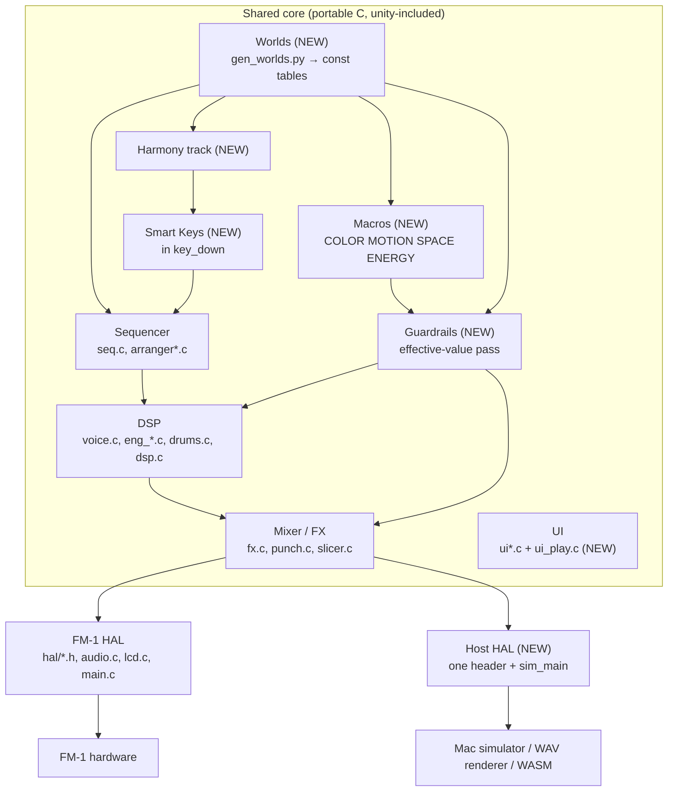
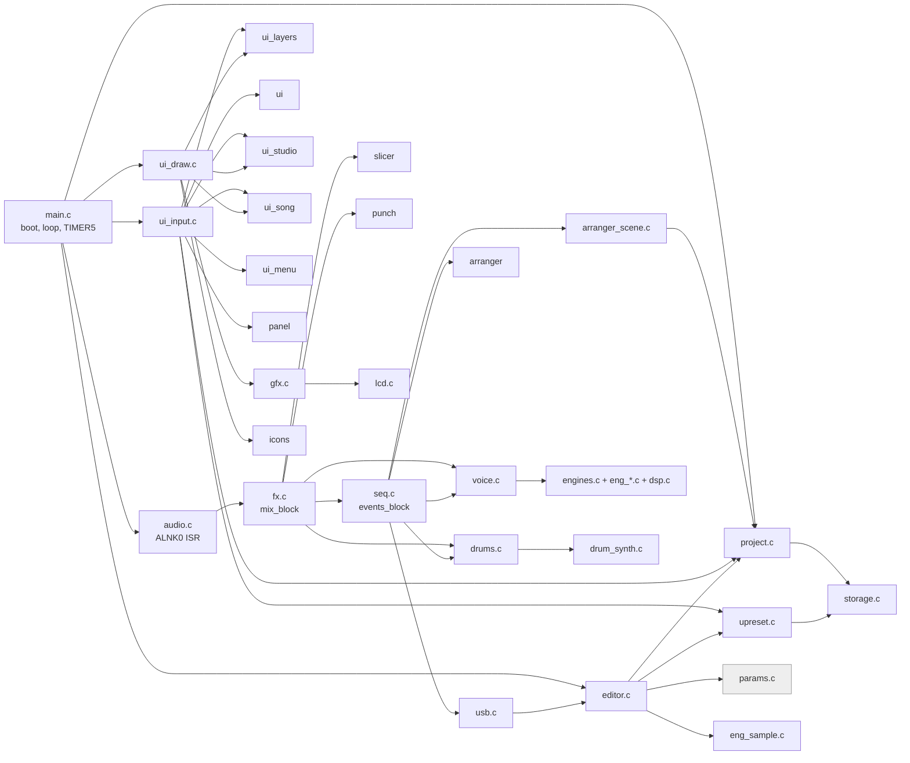

# Phase 0 — Architecture audit of SLOOP for the Musical World firmware

| | |
| --- | --- |
| Repository | `flowstate-fm1`, fork of SLOOP 2.1 (itself a fork of Felucca) |
| Commit audited | `e421e43` (SLOOP 2.1) |
| Date | 2026-10-04 |
| Scope | Read-only audit. No firmware, test or tool file was changed. |
| Verified | `sh build.sh` builds the firmware; `tests/run_tests.sh` passes all 24 groups (details in [§17](#17-verification-log)) |

All `file:line` references are to commit `e421e43`. Paths are relative to the repository root. `src/` means
`firmware/src/` and `hal/` means `firmware/hal/`. Statements marked *(inferred)* were reasoned from the code but not
observed directly.

---

## Contents

1. [Summary](#1-summary)
2. [Architecture](#2-architecture)
3. [Dependency map](#3-dependency-map)
4. [Execution model and audio path](#4-execution-model-and-audio-path)
5. [Sequencer path](#5-sequencer-path)
6. [UI path and physical controls](#6-ui-path-and-physical-controls)
7. [Host-compilable and hardware-bound modules](#7-host-compilable-and-hardware-bound-modules)
8. [Storage, flash and RAM budgets](#8-storage-flash-and-ram-budgets)
9. [Audio and CPU budget](#9-audio-and-cpu-budget)
10. [Smart Key insertion point](#10-smart-key-insertion-point)
11. [Macro architecture](#11-macro-architecture)
12. [Musical Guardrail Engine insertion points](#12-musical-guardrail-engine-insertion-points)
13. [Scenes, variations and Musical World data](#13-scenes-variations-and-musical-world-data)
14. [Simulator recommendation](#14-simulator-recommendation)
15. [Licensing](#15-licensing)
16. [Risks](#16-risks)
17. [Verification log](#17-verification-log)
18. [Phase 1 plan](#18-phase-1-plan)
19. [Answers to the 31 Phase 0 questions](#19-answers-to-the-31-phase-0-questions)

---

## 1. Summary

SLOOP is a small (about 17.5 k lines), tidy, single-translation-unit C firmware. It is fixed-point throughout, with
**no floating point** and **no heap**. Register access is confined to `hal/`, and `tools/build.py` enforces that
(`build.py:256-297`). That discipline is why most of the code already compiles and runs on a Mac: the host tests
`#include` the real engines, sequencer, effects and even the real UI. They render WAV files and screen dumps at
roughly 300× realtime, and their output matches the committed golden hashes bit for bit on arm64.

What matters for the Musical World plan:

**Already in place**
- A sample-accurate sequencer with four tracks: three synth parts and one 16-lane drum track.
- Nine synthesis engines and 34 drum kits.
- Per-track scale and chord transforms.
- Sections A–D that switch on the next bar.
- A free take that infers tempo and loop length from playing.
- 16 bounded punch-in effects and a master limiter.
- A hold-a-button layer UI.
- A SysEx editor protocol.
- Host test doubles for the LCD, the input, the flash and the audio.

**The simulator seam exists and is enforced.** No new synth is needed. The remaining work is a single host HAL
header, a real-time audio backend, and an input and display front end.

**Smart Keys has a single insertion point**, in `key_down` (`src/seq.c:1005-1033`). The per-key note memory already
there guarantees that a held note is never re-pitched. One prerequisite is blocking: voices are keyed by pitch, with
no reference count. If two sources sound the same pitch on one track, releasing one silences the other
([§16 R1](#16-risks)).

**Macros fit as a non-destructive "effective value" pass.** It would run in the audio interrupt at the top of
`mix_block` (`src/fx.c:380`), with the authored sound left untouched in `p[]`. When no macro is active the output can
stay bit-identical to SLOOP, so the existing 83 golden renders remain the regression net. The old Felucca HOME screen
with four per-engine macro knobs is still in the code but unreachable (`src/ui.c:200-212`).

**Hard constraints:**
- About 75 KB of free flash in the app slot, shared between all new code and factory World data.
- About 3.7 KB usable in the audio RAM pool. Static RAM (`.bss`) has about 46 KB free.
- Target CPU headroom is not measured anywhere in the repository.

**What is missing entirely:**
- No notion of a current chord or chord progression.
- No read-only "factory project" source. Sections A–D are the user's own four project slots.
- Nothing that plays audio in real time on the host.

---

## 2. Architecture

### 2.1 What SLOOP is

The FM-1 is a 27-key controller with a JieLi AC79-family MCU (pi32v2 core), 1 MiB SPI NOR flash, 512 KiB SRAM, a
240×240 RGB565 SPI LCD, 14 buttons, 7 detented encoders and a master pot. SLOOP replaces the factory firmware with a
four-track live groovebox:

| Track | Kind | Voices |
| --- | --- | --- |
| 1–3 | synth parts (any of 9 engines, 54 factory presets, 32 user presets) | 8 voices shared by all three parts (`src/core.h:9-13`) |
| 4 | drum track: 16 lanes on the white keys, 5 sampled + 29 synthesised kits | its own 6 voices (`src/drums.c:9`) |

Every function button is a *layer*. Hold it and the keys and knobs change job. Tap it and its parameter pages open.

### 2.2 Layers of the code

```
+---------------------------------------------------------------------------------+
| UI (main loop)  ui.c  ui_input.c  ui_layers.c  ui_draw.c  ui_studio.c  ui_song.c |
|                 ui_menu.c  panel.c  gfx.c  icons.c  splash.c                    |
+-------------------+------------------------------------+------------------------+
| Persistence       | Sequencer / performance (audio ISR) | Remote control          |
| project.c         | seq.c  arranger.c/.h               | usb.c (MIDI, CDC)       |
| upreset.c         | arranger_scene.c                   | editor.c (SysEx)        |
| storage.c         |                                    | console.c  midi_uart.c  |
+-------------------+------------------------------------+------------------------+
| Sound (audio ISR)  voice.c  engines.c  eng_*.c (9 engines)  dsp.c                |
|                    drums.c  drum_synth.c  slicer.c  fx.c  punch.c  params.c      |
+---------------------------------------------------------------------------------+
| Platform   main.c (boot, main loop, TIMER5 ISR)  audio.c (ALNK0 ISR)  lcd.c     |
|            felucca.c (unity root, flash glue)  ota.c  recovery.c  libc.c        |
+---------------------------------------------------------------------------------+
| HAL (header-only, MMIO)  hal/fm1_*.h  hal/*.S        Loader  firmware/loader/  |
+---------------------------------------------------------------------------------+
| Generated (tools/gen_*.py -> build/gen/*.h): tables, ADPCM samples, drum kits,  |
| fonts, icons, logo                                                              |
+---------------------------------------------------------------------------------+
```

### 2.3 Build model

- **Unity build.** `src/felucca.c` `#include`s every `.c` file in a fixed order (`src/felucca.c:4-186`). Almost every
  function and global is `static`. One compile produces the app.
- **Toolchain.** The JieLi clang 4.0.1 for pi32v2 is Linux x86-64 only. On macOS, `tools/build.py` runs each tool in
  a `linux/amd64` `debian:bookworm-slim` Docker container under Rosetta (`tools/build.py:62-83`).
- **Package.** `build/felucca.fwsc` is the app plus the update loader plus three SDK files (`uboot.boot`,
  `cfg_tool.bin`, `eq_cfg_hw.bin`). The app area is SFC-encrypted with the chip key (`tools/fm1pkg_make.py:101-145`).
- **Build checks** (`tools/build.py:220-297`):
  - entry stub
  - `.ram_text` makes no calls
  - image ≤ `0x8DFBC`
  - `.data` + `.bss` ≤ 96 KiB
  - ≥ 8 KiB spare in the 336 KiB pool
  - no MMIO outside `hal/`
- **Options**: `FELUCCA_FLASH`, `FELUCCA_OTA`, `FELUCCA_CDC`, `FELUCCA_UART` and `FELUCCA_SLICE`. The SLICE engine is
  not built by default (`src/core.h:17-20`).

### 2.4 Target architecture mapped onto SLOOP

The plan's architecture maps onto existing files. Everything in the shared core already exists apart from the five
new parts.



---

## 3. Dependency map

### 3.1 Unity include order

Order matters, because later files use the statics of earlier ones (`src/felucca.c`).

```
hal headers (time, sys, irq, guard, input, timer, audio, adc, lcd_hw) + build/gen/felucca_tables.h
 └ libc.c → lcd.c → gfx.c → core.h
   → engines.c (dsp.c, eng_analog, eng_digital, eng_phase, eng_lofi, eng_sample, eng_formant, eng_trio,
                eng_drawbar, eng_grain, [eng_slice])
   → drums.c (drum_synth.c) → params.c → voice.c → slicer.c → fx.c (punch.c)
   → usb.c → [midi_uart.c] → arranger.c → seq.c → audio.c
   → panel.c → ui.c → ui_song.c → ui_studio.c → icons.c → ui_draw.c → ui_layers.c → ui_menu.c → ui_input.c
   → [fm1_flash.h + flash glue + storage.c] → upreset.c → project.c (arranger_scene.c)
   → [ota.c] → [editor.c] → [console.c] → [recovery.c] → splash.c → main.c
```

### 3.2 Module dependencies

Arrows mean "calls into or reads state of".



### 3.3 Key shared state

| State | Where | Written by | Read by |
| --- | --- | --- | --- |
| `track_t trk[4]`: params `p[58]`, engine, voices, 64 steps, runtime | `src/core.h:165-245` | UI (main loop), editor, ISR (scene apply) | ISR (everything) |
| `song_t song`: globals `g[32]`, transport, solo, octave, CPU | `src/core.h:232-243` | UI, ISR | both |
| `clk_beat`, `clk_pos` (clock) | `src/core.h:258` | ISR | ISR, UI |
| `fm1_in` (keys, buttons) | `hal/fm1_input.h` | TIMER5 ISR | audio ISR, UI |
| `proj_slot[4]` (= sections A–D) | `src/project.c:75`, `.noinit` | UI, `section_store` | scene apply |
| Queues `midi_in_q`, `midi_out_q`, `lk_q`, `sx_frame` | `src/usb.c:69-80`, `src/seq.c:82-92` | lock-free with `RING_PUBLISH` | |

---

## 4. Execution model and audio path

### 4.1 Contexts

The MCU has a single core. Three contexts preempt each other by priority (`src/main.c:38-41`):

```
prio  context                         period                  work
----  ------------------------------  ----------------------  ------------------------------------------------
 3    ALNK0 audio ISR                 every 256 frames        8 x mix_block(32): events_block (transport, keys,
      fm1_alnk0_irq  src/audio.c:76   = 5.805 ms @ 44.1 kHz   MIDI in, sequencer, arp, clock) + engines + FX ->
                                                              DMA buffer. Voice shed when a half took > 85 %.
 1    TIMER5 ISR                      100 us (10 kHz)         key/button/encoder matrix scan (1 column per tick,
      fm1_timer5_irq src/main.c:9-35                          full frame ~1.1 ms), USB poll at 2 kHz, fm1_ms
 0    main loop      src/main.c:143   >= 15 ms per frame      watchdog, ADC (master volume, battery), editor and
                                      (<= ~66 fps)            OTA service, CDC console, ui_input, ui_leds,
                                                              ui_draw, autosave_tick, section flush; then spins
                                                              on ui_input/ed_service until 15 ms have passed
```

**Consequences:**
- **Notes, sequencer and arp run inside the audio interrupt.** Key edges are taken once per audio half buffer
  (5.8 ms) *(inferred)*. Everything is processed at 32-sample block granularity (0.73 ms).
- **UI writes reach the DSP within one half buffer.** The main loop stores `int16` values into `p[]` and `g[]`, so a
  change lands within 5.8 ms. Multi-field changes use `fm1_irq_off/on`, which has 22 call sites.
- **A flash erase silences audio** for about 50 ms with IRQs off. That is why saves only happen while stopped
  (`src/felucca.c:88-98`, `src/project.c:362-398`).

### 4.2 Audio format

| Item | Value | Source |
| --- | --- | --- |
| Sample rate | 44 100 Hz (`FS`, generated) | `tools/gen_tables.py:13`, `src/core.h:254-256` |
| DMA | ALNK0 (I2S) double buffer, 2 × 256 stereo frames, `int32` words | `src/audio.c:7-10`, `src/core.h:16` |
| Control block | `CTL` = 32 frames (1378 Hz control rate); hard-wired in several engines | `tools/gen_tables.py:14`, `src/dsp.c:110-118` |
| Internal format | Integer fixed point (Q15 audio, Q24 envelopes, `uint32` phase); no float | `src/core.h:81-98` |
| Output | Q15 stereo `<<7` into 24-bit left-justified words, giving a −6 dBFS ceiling | `src/audio.c:8,32-33` |
| Voices and parts | Mono. The dry mix is stereo through linear one-sided pan; FX returns are mono | `src/fx.c:3-4,247,269-270` |
| Latency | One half buffer renders while the other plays: 5.8–11.6 ms. The manual quotes key-to-sound ≈ 12 ms | `SLOOP.md:129` |

### 4.3 Call chain from interrupt to DAC

```
ALNK0 half-free IRQ (prio 3)
 └ isr_alnk0 (hal/fm1_isr.S:6-20)
   └ fm1_alnk0_irq (src/audio.c:76)
      ├ shed_voice() if the previous half overran (src/audio.c:37-74, 85-88)
      ├ 8 x audio_block(o, 32) (src/audio.c:89-90)
      │   └ mix_block(out, 32) (src/fx.c:374)
      │      ├ events_block(32)  transport, scenes, keys, MIDI, sequencer, arp, clock  (src/seq.c:1466-1560)
      │      ├ duck_block
      │      ├ mix_part x3       track_render -> DIST -> SLICER -> level/mute/duck -> sends -> pan   (src/fx.c:230-274)
      │      ├ drums_mix         (+ slicer_drums)                        (src/drums.c:205-295)
      │      ├ fx_buses          chorus, delay, reverb (mono wet added to L and R)  (src/fx.c:128-185, 387-391)
      │      ├ dust_process -> punch_process -> djf_process              (src/fx.c:392-394)
      │      └ master gain ramp -> master_out (DC block, lowcut, limiter, tanh knee)  (src/fx.c:50-117, 395-405)
      │   └ scope capture, <<7 into abuf
      ├ fm1_audio_ack_half
      └ CPU EMA (song.cpu_q8), shed request when > 85 %, late counter (src/audio.c:93-105)
```

### 4.4 Signal flow

```
 SYNTH PART x3 (mono)
   voices (8 shared) -- engine->render() adds into part_buf (src/voice.c:501-577)
   -> track_dist (P_DIST)  -> slicer_track (P_SLCR) -> x LEVEL x mute/solo fade x DUCK
   -> sends: CHORUS P_CHOR, DELAY P_DLY, REVERB P_REV (post-fader, pre-pan)
   -> pan P_PAN -> mix L/R
 DRUM TRACK (6 voices) -> x G_DRLVL x mute fade -> pan -> mix L/R ;  x G_DRREV -> reverb send
                                                                  (drums: no chorus, delay, DIST or DUCK)
 FX BUSES (mono, always running): chorus | delay (tempo-synced, feedback <= 0.84) | reverb (4 combs + 2 allpasses,
   feedback <= 0.957)  -> wet added equally to L and R
 MASTER: DUST -> PUNCH-IN FX (16) -> DJ FILTER -> x master volume -> DC block -> [low cut]
   -> peak limiter -> tanh knee -> Q15 -> <<7 -> DAC
```

### 4.5 Synth engines

Each engine is a `const engine_t` table of function pointers (`src/core.h:119-139`):
- `note_on` and `render` are required. `render` *adds* one voice into a mono buffer, using a per-block `vmod_t`.
- `amp`, `desc` and `block` are optional.
- Each engine also carries 8 parameter descriptors (`P_E0..P_E7`), its factory presets, and `macro[4]`, the unused
  HOME knobs.
- There are no note-off, parameter-update or init hooks. Engines re-read `t->p[]` every block.
- The table is `ENGINES[]` (`src/engines.c:18-23`).

| # | Engine (file) | What it is | Presets | Voice cap | Host cost per preset, 8 voices *(instr./sample over the 285 idle mix)* |
| --- | --- | --- | --- | --- | --- |
| 0 | ANALOG (`eng_analog.c`) | 2 polyBLEP oscillators, noise, drive, SVF low-pass | 12 | 8 | 826–1214 |
| 1 | DIGITAL (`eng_digital.c`) | 4-operator FM, 8 algorithms | 8 | 8 | 692–755 |
| 2 | PHASE (`eng_phase.c`) | CZ phase distortion (CrispyZebra port) | 5 | 8 | 660–1068 |
| 3 | LOFI (`eng_lofi.c`) | chip voice: pulse/tri/saw/noise/wave RAM, crush | 3 | 8 | 425–484 |
| 4 | SAMPLE (`eng_sample.c`) | IMA-ADPCM multisample from flash | 10 | 8 | 76–655 |
| 5 | VOICE (`eng_formant.c`) | Klatt-style cascade formant | 4 | **4** | 706–742 |
| 6 | TRIO (`eng_trio.c`) | SID-style 3 oscillators, ring/sync, multimode SVF | 5 | 8 | 935–1049 |
| 7 | WHEEL (`eng_drawbar.c`) | 9-partial tonewheel organ, percussion, rotary | 4 | 8 | 668–805 |
| 8 | GRAIN (`eng_grain.c`) | granular over the ADPCM sets, 12 grains per part | 3 | **3** | 553–660 |
| 9 | SLICE (`eng_slice.c`) | ADPCM slicer | — | 8 | not built by default |

### 4.6 Voices

**Budget.** There are 8 voices across all three synth parts (`src/voice.c:58-65`). VOICE and GRAIN are capped lower.

**Stealing.** Preference order: the oldest released voice, then the oldest extra UNISON voice, then the oldest held
voice that is not the lowest held note (`src/voice.c:76-108`). A voice taken from another part fades over 2 blocks.
A voice taken within the same part restarts in place without a click.

**Modes.** POLY, MONO, LEGATO and UNISON. The mono note stack holds 8 entries with LAST/LOW/HIGH priority. Glide is
set as a rate or a time.

**Overload.** If an audio half took more than 85 % of its time, one voice is shed in the next half
(`src/audio.c:37-74`).

**Notes are keyed by pitch.** `voice_alloc` reuses an active voice with the same pitch (`src/voice.c:147-148`), and
`trk_note_off` releases every gated voice on the track with that pitch (`src/voice.c:395-400`). See
[§16 R1](#16-risks).

### 4.7 Effects

**Per-part inserts:**
- DIST: high-pass, drive, asymmetric tanh, low-pass (`src/fx.c:20-48`).
- SLICER: tempo-synced gate or stutter (`src/slicer.c`).

**Global send buses.** One chorus, one delay and one reverb, all mono and all controlled by global parameters
`G_D*`, `G_R*` and `G_C*`. Only the send amounts are per track.

**Master section:**
- DUST: old sampler and vinyl character.
- DUCK: the kick dips the synth parts.
- DJ filter.
- Limiter and tanh knee.

**Punch-in FX.** 16 effects on the master bus, between DUST and the DJ filter (`src/punch.c`):
- LOOP 1/4, 1/8, 1/16 and 1/32; STUTTER; REVERSE; tape STOP; HALF speed
- LPF and HPF sweeps; PHONE; CRUSH; ALIAS; GATE; ECHO; WOBBLE

A 64 KiB ring buffer records the mix continuously so that the loop effects have material.

**Feedback and resonance limits that exist today:**

| Element | Limit |
| --- | --- |
| Delay feedback | ≤ 0.84 |
| Reverb comb feedback | ≤ 0.957 |
| Punch ECHO feedback | ≈ 0.55 |
| ANALOG / TRIO SVF damping | floored |
| DJ filter and punch filters | fixed resonance |

These limits hold only because every writer clamps to the descriptor ranges. The DSP multiplies raw values: for
example, `G_RSIZE` above about 154 would give a reverb comb gain ≥ 1 *(inferred)*.

---

## 5. Sequencer path

### 5.1 Model

**Clock.** The clock is a sample-accurate counter, not a PPQN grid. One unit is one sample at 1 BPM, so a beat is
`BEAT_U = FS*60` units. The position is `clk_beat` + `clk_pos` (`src/core.h:248-260`).
- Every division (1/4, 1/8, 1/16, 1/32, 8T, 16T) divides `BEAT_U` exactly, so the clock never drifts.
- Events are dispatched once per 32-sample block, so they may be up to 0.7 ms late.
- There is no external MIDI clock sync *(inferred)*.

**Patterns.** Each track has a fixed array of 64 steps. There is no event list.

| Step type | Size | Contents | Source |
| --- | --- | --- | --- |
| Synth `step_t` | 10 B | up to 4 absolute MIDI notes; TIE/REST; accent/slide; velocity; a 2-bit level and 2-bit ratchet per note | `src/core.h:142-163` |
| Drum `dstep_t` | 10 B | 16 lane bits; a 2-bit level and 2-bit ratchet per lane | same |

**Per-track playback parameters:**
- Length `P_SLEN` 1–64 steps, which allows polymeters.
- Division `P_SDIV`.
- Swing: MPC-style 50–75 %, track swing plus global swing.
- Gate `P_SGATE`.

### 5.2 Data path

```
events_block(32)  src/seq.c:1466   (inside mix_block, audio ISR)
 ├ transport_req → seq_start / seq_stop
 ├ rec_wait → rec_begin ; ft_block (free take)
 ├ song mode: arr_next → arrangement_apply(scene) + seq_reset_tracks  │  loop mode: live_block (A–D on next bar)
 ├ engine_block (engine crossfades), panic
 ├ keyboard_block → key_down / key_up → input_on / input_off   ◄── SMART KEYS GO HERE (§10)
 ├ MIDI-in queue → input_on / input_off (raw notes, no scale mapping)
 ├ for each track: seq_tick
 │     abs = grid position (division, swing); idx = abs % P_SLEN
 │     synth: rec_hold (ties) → seq_step(step[idx]) → trk_note_on ...
 │     drums: drum_step(dstep[idx], lane masks) → drum_on
 │     seq_ratchets
 ├ click_tick, roll_block, arp_tick x3
 └ clk_pos += 32*BPM → clk_beat ; arr_elapse
```

### 5.3 Recording

**REC.** Recording targets the selected track.
- While stopped, REC arms. The first note then starts the transport and becomes step 1.
- While playing, REC records immediately.

**The input funnel.** Every live note goes through `input_on` (`src/seq.c:761-778`):
- keys, chords, MIDI in, arp output and rolls on the synth tracks;
- drum hits through `drum_input` → `rec_hit`.

**Quantisation.**
- Always 100 % to the track's step grid; no sub-step timing is stored.
- `REC_LAT` = 512 samples (≈ 11.6 ms) moves the step decision boundary to compensate for latency
  (`src/seq.c:236-250`).

**Overdub.** Notes merge into the step up to 4 notes (`step_add`, `src/seq.c:254-278`). A duplicate note only updates
its level. `rskip` stops a note that was just recorded live from being re-triggered.

**Note length.** Lengths are whole steps. While a recorded note is held it writes TIE steps, and releasing it early
restores the last tie step (`src/seq.c:327-366`).

### 5.4 Free take

`src/seq.c:387-557` handles REC-armed recording on an **empty** project.

**Capture.** Up to 192 events within 24 s, timed in 32-sample blocks.

**Close.** Pressing REC closes the take.
- It fits 1, 2 or 4 bars of 4/4 between 40 and 240 BPM, keeping the current tempo if it is within 3 %.
- It sets all tracks to the same length at 1/16 and places each note at `round(t*len/T)`.
- The REC press itself becomes the downbeat.

**Limits:** one track only, an empty project only, 1/16 only, 1, 2 or 4 bars only.

### 5.5 Undo

There is one level of undo, for one track: its step array and `P_SLEN` (652 B, `src/seq.c:213-231`). One recording
pass is one undo step. A free take or a new project is only partly undoable, and editor writes skip undo entirely.

### 5.6 Arp and roll

**Arp** (per synth track, `src/seq.c:617-737`):

| Setting | Values |
| --- | --- |
| Modes | UP, DOWN, UP/DOWN, RANDOM. Mode "ORD" behaves like UP. |
| Octaves | 1–4 |
| Rate | the six divisions |
| Other | gate, swing, probability, HOLD |

While playing the arp is locked to the grid. A new chord fires immediately unless the key arrives in the last
quarter of an arp step.

**Roll** (ARP layer): note repeat at 1/8 to 1/64, locked to the grid. It ignores swing, which contradicts
`SLOOP.md:164`.

### 5.7 Scales and chords

**Representation.** Key and scale are *per-track* parameters: `P_ROOT`, `P_SCALE` (16 scales), `P_QUANT`
(OFF/SNAP/WHITE), `P_TRANS` and `P_CHORD`.
- The SCL layer writes ROOT and SCALE to all three synth tracks together (`src/ui_layers.c:247-252`).
- **Scales:** CHR, MAJ, MIN, DOR, MIX, PEN, MPEN, HARM, PHRY, LYD, LOC, MEL, BLUES, WHOLE, DIMHW, DIMWH
  (`src/seq.c:22-39`).

**Key → note: `kb_map(t,k)`** (`src/seq.c:97-142`). The 27 keys run F3..G5 (`k` = 0..26).

| Mode | Mapping |
| --- | --- |
| OFF | chromatic; ROOT is ignored |
| SNAP | rounds the note down into the scale, so two keys can give the same pitch |
| WHITE | white key *w* = scale degree *w* − 4; **black keys are silent** |

**Chords** (`src/seq.c:146-176`). One key gives a TRIAD, 7TH, 9TH, SUS4 or POWER chord. Chords are built from
**scale degrees**, so they are diatonic; POWER is a fixed 0/+7/+12.
- Voicing: root position, close.
- No inversions and no voice leading.
- Known quirks: SUS4 on degree IV of major gives F–B–C, and POWER on degree vii leaves the scale.

**No harmony track.** There is no current chord or chord progression. `P_CHORD` is a chord *type*, and its root is
whichever key is pressed.

### 5.8 Sections A–D and song mode

**A section is a whole project slot,** `proj_slot[0..3]` (`src/project.c:75`). It holds all track parameters,
engines, presets and steps.

**Live switching.** SAVE + key 1–4 while playing sets `live_req`. `live_block` applies it on the next 4/4 bar,
restarts every track at step 0 and keeps the sub-bar remainder, so nothing drifts (`src/seq.c:1176-1238`).

**What a switch does** (`arrangement_apply`, `src/arranger_scene.c:14-27`, ISR):
- **releases every held note**;
- drops the arp latch;
- stops recording;
- applies only the drum level and drum reverb from the section's globals.

While stopped, a section load applies **all** globals, including BPM. The two paths are inconsistent.

**Song mode.** A chain of up to 16 entries {scene, bars} (`src/arranger.h`). SONG REC writes the order you play. The
chain is stored in settings, not in projects. Its `loop` flag is never set by any UI.

### 5.9 Projects

**`project_t` "FUN4"** is 3112 B (`src/project.c:35-41`):
- magic, size
- `g[32]`, `sel`
- 4 tracks × {`p[58]`, engine, preset, `step[64]`}
- FNV-1a checksum

**Compatibility.** FUN1–FUN3 are read and converted. The size must match `sizeof(project_t)` exactly, so any new field
needs a new magic and a converter.

**Storage.**
- Four slots live in `.noinit` RAM and are mirrored to flash objects with A/B copies.
- An autosave is written when stopped and idle (`src/project.c:364-398`).

---

## 6. UI path and physical controls

### 6.1 Display and drawing

**Display.** ST7789V-class 240×240 RGB565, write-only over 12 MHz SPI with DMA (`src/lcd.c`). It has no tear-effect
(TE) sync *(inferred)*.

**No full framebuffer.**
- A single 240×124 canvas (`cv_px`, 59,520 B in the pool) is drawn into and then DMA-blitted.
- Each band caches a signature and is redrawn only when it changes.
- A full-screen transfer takes ≈ 77 ms *(inferred from SPI rate)*, so screen switches flash black.

**Fonts.** Terminus 8×16 (Latin-1), and the same font at 2× for capitals and digits only. 86 icons of 12×12 px.

**Drawing primitives:**
- `cv_*`: rect, line, text, icon.
- "TE-style" widgets: `te_header`, `te_dials`, `te_digit`, `tiles_draw`, `layer_title`.
- A horizontal gauge in `draw_column` (`src/ui_draw.c:160-166`), the starting point for the macro bar.

### 6.2 Input path

```
TIMER5 (10 kHz): matrix scan, debounce (~3.3 ms), quadrature decode → fm1_in.{notes, buttons}, encoder counts
 ├─ audio ISR: keyboard_block → key_down/key_up → layer_now() routes keys by the held function button
 │             (src/seq.c:69-80, 937-1079); layer keys for the UI go through lk_q
 └─ main loop: ui_input (src/ui_input.c:595-730), precedence:
       HOME hold → menu → layers_input (hold = layer, tap = pages) → holds (REC) → song / drum page handlers
       → button switch → encoders (panel_enc → page/layer knob handlers)
     ui_leds  (src/ui_input.c:121-151) → fm1_led[], fm1_led_dim[]
     ui_draw  (src/ui_draw.c:918-1007): layer/hold screen → REC → SONG → menu → TRACKS → DRUMS → generic page
```

**Layer state** is a single `ui` struct (`src/ui.c:45-84`). There are 29 parameter pages in 11 families
(`src/params.c:265-305`).

**Long-press detection that exists:**

| Gesture | Detail | Source |
| --- | --- | --- |
| `btn_hold` | 700 ms, used only for HOME | `src/ui_input.c:393-408` |
| Layer tap / hold | tap < 450 ms, layer shown after 140 ms, tracks whether anything was "used" | `src/ui_input.c:463-539` |
| REC hold-to-clear | ring display, 0.7 s + 1.3 s | `src/ui_layers.c:729-770` |
| OCT− + OCT+ | 5 s → update mode | `src/main.c:164-189` |

### 6.3 Physical controls and their PLAY MODE roles

**The hardware:**
- 14 buttons, 27 keys (16 white, 11 black, F3–G5) and 7 encoders, all on one diode matrix (`hal/fm1_input.h:5-64`).
- **Keys have no velocity** (fixed 100) and no aftertouch.
- **K1–K4 are endless detented encoders, not potentiometers**, so there is no pickup or jump problem. Values must be
  shown on screen.
- **No encoder has a push switch.**
- Every button and key has a single-colour LED with three states: off, dim, on.

**Calibration.** A power-on calibration can remap labels to matrix positions, so code must always go through
`panel.btn[B_*]` and `panel.enc[EN_*]` (`src/panel.c`).

| Control | SLOOP today | PLAY MODE role | Fit |
| --- | --- | --- | --- |
| PRESETS encoder | browse presets / drum kit | WORLD | Yes. No push, so confirm by rest timeout, PLAY or next bar (Phase 9 decision). |
| SELECT encoder | **tempo, always** (`src/ui_input.c:626-629,708-711`) | SCENE | Yes. Tempo moves to Advanced Mode or GLO tap tempo. |
| ALGORITHM encoder | select track 1–4 | VARIATION | Yes |
| KNOB 1–4 | page / layer parameters | COLOR / MOTION / SPACE / ENERGY | Yes. Endless, so absolute value is kept in software. |
| PLAY | start / stop | PLAY / STOP | Yes |
| REC | arm / record / free take; long hold clears | REC / overdub | Yes |
| ARP | hold: roll layer; tap: ARP pages | PULSE | Yes |
| SEQ | hold: step layer; tap: SEQ pages | BEAT | Yes |
| FX | hold: punch layer (16 FX); tap: FX pages | LIVE FX | Yes. The punch layer can be reused. |
| ENV | tap: ENV pages | SOUND SHAPE | Yes |
| LFO | tap: LFO pages | MOVEMENT | Yes |
| EDIT | hold: erase layer (+ undo/redo); tap: EDIT pages | 2 s hold → ADVANCED | Feasible. Needs a 2 s "nothing touched" detector; in Advanced Mode EDIT hold is already the erase layer. |
| HOME | tap: TRACKS; hold 0.7 s: menu | spare (natural "home") | — |
| SAVE | hold: song layer A–D; tap: SONG | spare ("save my World") | — |
| SCL / GLO | key layer / mix layer (mute, solo, tap tempo) | spare | — |
| OCT− / OCT+ | octave ±3; drum ghost/hard; undo/redo with EDIT | octave | Reserved: both held 5 s = update mode; power-on combos |
| MASTER pot | hardware volume | volume | unchanged |

### 6.4 Where PLAY MODE plugs in

- Add `ui.mode` and intercept at the top of `ui_input`, `ui_leds` and `ui_draw`, the way the menu already does
  (`src/ui_input.c:603-619`, `src/ui_draw.c:941-990`).
- Put the new screens in a new `ui_play.c`, included in `felucca.c` after `ui_input.c`.
- Add a `play_layers_init()` next to `layers_init` (`src/ui_layers.c:28-37`). It sets the `ly_bit` layer masks that
  the audio interrupt uses to route keys, so FX-hold-and-key still works in PLAY MODE.
- Advanced Mode is the existing SLOOP UI, unchanged.

---

## 7. Host-compilable and hardware-bound modules

### 7.1 How the host tests compile firmware code

The host tests `#include` firmware `.c` files directly, after defining stubs. `tests/hostsim.c:19-46`:
- does `#define __attribute__(x)`, which removes the `.pool` and `.noinit` section attributes that Mach-O rejects;
- renames `memset`, `memcpy` and `memcmp` around `libc.c`;
- defines `fm1_in`;
- makes `fm1_irq_off/on` and `fm1_delay_ms` no-ops.

Other tests reuse it with `#define main hostsim_main` + `#include "hostsim.c"`. There is no shared host HAL header:
each test re-declares its own stubs.

### 7.2 Modules that compile and run on the host today

| Area | Modules | Exercised by |
| --- | --- | --- |
| DSP | `dsp.c`, `engines.c`, all `eng_*.c` (`eng_slice` with `FELUCCA_SLICE=1`), `voice.c`, `drums.c`, `drum_synth.c`, `slicer.c`, `fx.c`, `punch.c`, `params.c`, `libc.c`, `core.h` | `hostsim`, `regress` (83 golden renders), `drumkit_test`, `punch_test`, `slicer_test` |
| Sequencer | `seq.c`, `arranger.c`, `arranger.h`, `arranger_scene.c` | `seq2_test`, `scale_test`, `studio_drums_test`, `song_audio_test`, `arranger_test`, `soak_test` |
| UI | `gfx.c`, `panel.c`, `icons.c`, `splash.c`, `ui.c`, `ui_draw.c`, `ui_input.c`, `ui_layers.c`, `ui_menu.c`, `ui_song.c`, `ui_studio.c` | `ui_pages_test` (27 screen dumps, 20,000-frame fuzz with audio), `song_ui_test` |
| Storage | `storage.c`, the host parts of `project.c` (`PROJ_HOST`) and `upreset.c` (`UP_HOST`) | `storage_test`, `project_test`, `upreset_test` (fake NOR flash with torn writes) |
| Update / MIDI | `ota.c`, `loader/ldr_core.c`, `recovery.c` (mocked), `usb.c` (queues and parser only), `midi_uart.c` | `ota_test`, `ldr_test`, `recovery_test`, `midi_uart_test` |

**Measured on this Mac:**
- A 16 s four-track render takes 70–95 ms (≈ 200× realtime).
- The worst mix costs 131 ns per sample.
- Output is deterministic and matches `tests/golden.txt` on arm64.

### 7.3 Hardware-bound modules

| Module | Why it is hardware-bound |
| --- | --- |
| `hal/*.h`, `hal/*.S` | MMIO registers, vectors, ISR wrappers |
| `src/main.c` | boot, TIMER5 ISR, fault screen, main loop |
| `src/audio.c` | ALNK0 ISR and voice shedding (the shedding logic is portable but sits in this file) |
| `src/lcd.c` | SPI LCD driver |
| `src/felucca.c` | unity root and the flash glue (`st_read`, `st_erase`, `st_prog`) |
| `src/console.c` | CDC console (`memr`, `flr`) |
| `src/editor.c` | flash paths |
| `project.c` / `upreset.c` | the flash halves |
| `firmware/crt0.S`, `firmware/app.ld`, `firmware/loader/*` | boot code, linker script, update loader |

### 7.4 Gaps for a native simulator

**Blockers.** Two code problems, plus three hardware-file problems:
1. **A 64-bit bug at `src/eng_sample.c:89`.** User-sample-slot offsets are computed as `uint32_t` pointer differences.
   This works on the device and on 32-bit WASM, but on a 64-bit host it depends on memory layout.
2. **The C library clash.** `libc.c` defines `memset`, `memcpy` and `memcmp` with `unsigned` sizes, which clash with
   the system C library. They are currently renamed by macro.
3. `usb.c`, `midi_uart.c` and `eng_sample.c` include HAL headers that contain fixed hardware addresses. These compile
   on the host, but the code paths that use them must never run there.
4. `editor.c` needs the OTA SysEx plumbing.
5. `editor.c` needs flash access.

**Structural limits:**
- All state is global and static, and the order of the unity includes matters. That means one instance per process,
  and resetting it means forking or restarting.
- There is no API. Every consumer recreates the include order and its own stubs.

**Missing pieces.** The audio interrupt, the TIMER5 tick and the main loop have no host equivalent.

---

## 8. Storage, flash and RAM budgets

### 8.1 Flash map

1 MiB SPI NOR, JEDEC `0x856014` (`src/project.c:444`).

| Range | Size | Contents | Written by |
| --- | --- | --- | --- |
| `0x000000–0x003FFF` | 16 KiB | header, JLFS entries, SDK SPL, key | never by the app |
| `0x004000–0x00411F` | 288 B | app area head | loader |
| `0x004120–0x0920DB` | 581,564 B | **app slot** (XIP `0x02000120`, encrypted): **506,248 used, 75,316 free** | loader |
| `0x0920DC–0x092FFF` | 3,876 B | SDK `cfg_tool.bin` + EQ cfg | loader |
| `0x093000–0x096FFF` | 16 KiB | **unused** | — |
| `0x097000–0x09EFFF` | 32 KiB | projects = sections A–D (4 objects, A/B) | app |
| `0x09F000` | 4 KiB | autosave copy A | app |
| `0x0A0000–0x0DBFFF` | 240 KiB | user sample slots 1–3 (80 KiB each, read through XIP) | editor |
| `0x0DC000–0x0DFFFF` | 16 KiB | user presets (2 objects, A/B, 32 records) | app |
| `0x0E0000–0x0E4FFF` | 20 KiB | OTA staging and update record | app |
| `0x0E5000–0x0FBFFF` | 92 KiB | **unused** | — |
| `0x0FC000–0x0FDFFF` | 8 KiB | settings, panel table, song order | app |
| `0x0FE000` | 4 KiB | autosave copy B | app |
| `0x0FF000–0x0FFFFF` | 4 KiB | SDK `key_mac` | never |

Sources: `tools/fm1pkg_make.py:101-145`, `src/storage.c:19-60`, `src/eng_sample.c:37-45`, `src/upreset.c:3-5`,
`src/ota.c:24-26`, `hal/fm1_flash.h:49,215-226`.

**Storage objects** (`src/storage.c:5-155`):
- Each object is a pair of 4 KiB sectors.
- A save erases the older copy, writes the payload, then writes a CRC'd header last as the commit.
- At boot the valid copy with the highest sequence number wins, so a torn write keeps the old copy.
- The maximum payload is **3,840 B**; `project_t` is 3,112 B.

**What fills the app image.** Code is ≈ 116 KB and constants ≈ 379 KB:

| Constant data | Size |
| --- | --- |
| ADPCM samples (`SMP_DATA`) | 291,326 B |
| Fonts | 46 KB |
| `PITCH_INC` table | 8 KB |
| Drum kits | 5.2 KB |
| Logo | 4.7 KB |
| Icons | 3.1 KB |

**Flash available for factory Worlds:**
- **75,316 B** in the app slot, shared with all new code.
- The two unused regions (16 KiB + 92 KiB) are not written by the `.fwsc` package, because the loader writes only
  `[0x4000, 0x93000)`. The app cannot write them either (`FL_STORE_OK`).

**Flash available for user Worlds.** Every writable window is fully allocated. Options:
- repurpose one 80 KiB sample slot (10 A/B objects);
- widen `FL_STORE_OK` to cover `0xE5000–0xFBFFF`.

### 8.2 RAM

512 KiB SRAM. Section sizes are from this build (`firmware/app.ld`, `tools/build.py` output):

| Region | Size | Used | Free |
| --- | --- | --- | --- |
| RAMTEXT `0x01C00000` | 24,576 | `.ram_text` 2,888 (flash driver) | 21,688 |
| RAM `0x01C08000` (`.data` + `.bss`) | 98,304 | 51,920 | **46,384** |
| POOL `0x01C20000` | 344,064 | 332,144 | 11,920. The build requires 8,192 spare, so **3,728 usable**. |
| user stack / sys stack | 24,320 / 7,936 | not measured | — |
| NOINIT `0x01C7C000` | 15,696 | 12,648 (`proj_slot[4]` 12,448) | 3,048 |

**Pool contents:**

| Buffer | Size (B) |
| --- | --- |
| Delay line | 131,072 |
| Punch ring | 65,536 |
| LCD canvas | 59,520 |
| SLICER buffers | 32,768 |
| GRAIN state | 21,060 |
| Reverb | 11,868 |
| Chorus | 4,096 |
| Song backup | 3,112 |
| Autosave buffer | 3,112 |

**Largest `.bss` items:**

| Item | Size (B) |
| --- | --- |
| `trk` | 6,512 |
| User preset bank | 6,160 |
| Audio DMA buffer | 4,096 |
| Storage buffer | 3,840 |
| Project temp | 3,112 |

**Heap:** none.

**Consequence.** New state of a few KB (Smart Keys, harmony, macros, guardrails) fits easily in `.bss`. New large
audio buffers (stereo reverb, longer delay, sample RAM) do not fit without shrinking an existing buffer.

### 8.3 Storage budget of a Musical World *(estimate)*

| Item | Raw today | Compact target |
| --- | --- | --- |
| One scene as a full `project_t` | 3,112 B | — |
| Four scenes stored raw | 12,448 B | — |
| One World (base project + scene/variation diffs + macros + harmony + guardrails) | — | ≈ 1.5–2.5 KB |
| 4 demo Worlds (Phase 5) | — | ≈ 10 KB (fits) |
| 30 factory Worlds (Phase 18) | — | ≈ 45–75 KB (**does not fit** alongside new code without reclaiming flash) |

---

## 9. Audio and CPU budget

**Time budget.** One audio half buffer is 5.805 ms. Above 85 % (4.93 ms), `shed_voice` drops a voice
(`src/audio.c:96-97`).

**CPU clock.** Not configured in the repository: the boot ROM or loader sets the PLL *(inferred)*. **Absolute target
headroom is unknown.** On the device, `song.cpu_q8` (GLO › SYSTEM › CPU) and the USB console `status` command report
CPU load; there are no recorded device numbers.

**Host cost (instructions per sample, `tests/regress.c`):**

| Case | Instructions / sample |
| --- | --- |
| Idle mix (FX buses and master always run) | 285 |
| Idle + drums | 572 |
| 3 parts (DIGITAL 8 voices + PHASE 8 + VOICE 4, shared budget 8) + drums | 1,876 |
| Heaviest single part (ANALOG FUNK BASS, 8 voices) | 1,499 (1,214 over idle) |

**The CPU regression gate is mostly inactive.** `tests/cpu_baseline.txt` still holds Felucca preset names, so this run
reported **51 per-preset entries with "no baseline"**. Only the mixes and a few presets are checked, at ±25 %. The two
mixes have grown 16–20 % since the baseline.

**Target-cost gate.** `tests/target_budget.py` counts static loop instructions in the pi32v2 disassembly for the
engine render functions, `drums_mix` and the ISR. It passes (exact match). It does **not** cover `fx_buses`,
`mix_part`, `master_out`, DUST, punch or the DJ filter.

**Costs that switch on in steps** (zero at 0, per-sample work above it):
- DIST on each part
- DUST
- DJ filter
- SLICER stutter
- an active punch effect
- UNISON and GRAIN density
- the limiter's per-sample divide while it is limiting

ENERGY and MOTION must be designed with these in mind.

**Voice limits:**
- 8 synth voices shared by all parts, plus 6 drum voices.
- VOICE engine ≤ 4, GRAIN ≤ 3.
- One new step per track per block.

---

## 10. Smart Key insertion point

### 10.1 Where

The synth branch of the play layer in `key_down`, `src/seq.c:1005-1033`:

```c
uint32_t n = kb_map(t, k);                 /* ← replace with smart_map(t, k, harmony_now, kb_nt[k]) */
...
kb_kind[k] = KS_NOTE;
if (t->p[P_CHORD]) kb_n[k] = chord_notes(t, n, kb_nt[k]);   /* ← SMART CHORDS lives here too */
else { kb_nt[k][0] = n; kb_n[k] = 1; }
for (i = 0; i < kb_n[k]; i++) input_on(t, kb_nt[k][i], 100);
```

### 10.2 Why held notes are already safe

`key_down` stores what it sounded per physical key: `kb_kind[k]`, `kb_trk[k]`, `kb_nt[k][≤4]` and `kb_n[k]`
(`src/seq.c:47`). `key_up` releases exactly those notes, whatever happened since (`src/seq.c:1036-1079`):
- the chord changed;
- the scale, octave or transpose changed;
- the layer or the selected track changed.

This is tested in `tests/scale_test.c:113-132`. A held note is therefore never re-pitched, as long as Smart Keys
writes its result into the same per-key memory.

### 10.3 Prerequisite: pitch reference counting

`trk_note_off(t, note)` releases **every** voice of that pitch on the track (`src/voice.c:395-400`), and
`voice_alloc` reuses a same-pitch voice (`src/voice.c:147-148`). The sequencer audit reproduced all three of these
with a scratch probe:
- two keys mapping to the same note: releasing one silences the other;
- two overlapping chords that share notes;
- the sequencer's gate cutting a live-held note of the same pitch.

Smart Keys maps 27 keys onto a few chord tones, so it would hit this constantly. **Fix first:** add per-track
reference counting of sounding pitches in `input_on/input_off` (`src/seq.c:761-792`) or in `trk_note_on/off`. A note-off
should release only when the count reaches zero.

### 10.4 Callers to keep consistent

- The erase layer (`src/seq.c:976-983`).
- SEQ step entry (`src/ui_input.c:368`).
- Key-tile labels (`src/ui_layers.c:512,618`).
- **MIDI in**, which skips `kb_map` entirely (`src/seq.c:1536-1544`). In PLAY MODE it should be mapped too, with the
  sounded note stored per channel and note, as `midi_sel_on` already does.

### 10.5 Harmony source

A new `harmony` runtime is evaluated once per block in `events_block`, before `keyboard_block` (`src/seq.c:1528`). It
is indexed by bar (`clk_beat / 4`), which `seq_reset_tracks` zeroes at every section start. It reads a per-scene
progression from World data.

Readers:
- Smart Keys;
- the PULSE arp (`arp_next`, `src/seq.c:648`);
- optionally recorded patterns at trigger time (`seq_step`, `src/seq.c:1326-1339`; `seq_notes[]` already records
  what sounded).

### 10.6 Open design decision for Phase 6

How to map 27 keys (16 white, 11 black) to a five- or seven-note scale.
- Today's WHITE mode silences the black keys, and SNAP produces duplicates.
- One option: map white keys to scale degrees and black keys to chord tones or safe passing notes, so that every key
  sounds and is musically useful.

---

## 11. Macro architecture

### 11.1 Constraints from the code

| Constraint | Detail |
| --- | --- |
| Base values | `p[]` and `g[]` are 7-bit-range `int16`s. They are saved in projects, scenes, autosave and user presets, are diffed by the web editor, and are keyed by count in old formats. **Do not write macro results into them.** |
| Engine parameter meaning | `P_E0..P_E7` mean different things per engine: E4 is cutoff on ANALOG but FM index on DIGITAL. Brightness, resonance and drive live in different slots per engine, so **curves must be authored per engine role**. |
| Smoothing | Engines re-read parameters every block. Most parameters, including cutoff and resonance, are stepped per block without smoothing (zipper risk). |
| High-resolution modulation | A per-voice modulation bus already exists: `vmod_t` cutoff/shape in Q8, pitch, amplitude (`src/voice.c:528-567`). Every engine consumes it. |
| Global FX | Reverb size, damping, delay time and feedback are *global*, and FX returns are mono. SPACE is therefore partly global; only sends are per track. |
| Structural parameters | Engine, voice mode, sample set, grain source, delay time, BPM and arp mode cause voice releases, index rebuilds or delay jumps. **Never put them on a continuous macro.** |

### 11.2 Proposed architecture

```
 K1..K4 delta (main loop, ui_play.c)
   └► macro_pos[4]  0..1000                     World runtime state (NOT p[] / g[])
        └► macro_eval()  on change, main loop
             for each World mapping {macro, target, track/role, curve LUT, out_min, out_max}
             + cross-macro rules {if A > a and B > b: scale target T by k, gain compensation}
             └► targets[] → publish (single-word stores, or a batch under fm1_irq_off)
 Audio ISR, top of mix_block after events_block (src/fx.c:380-382):
   current[] ramps toward targets[] (per-block smoothing)
   effective = GUARD( base p[]/g[]  ⊕  current[] )   per-param clamp, per-engine role table, invariants
   → t->pe[P_COUNT] (effective track params), g_eff[] (effective globals), vmod Q8 offsets
 Engines, voice.c and fx.c read pe[] / g_eff[] instead of p[] / g[]
   (mechanical: each engine reads through one local `const int16_t *p = t->p;`)
```

### 11.3 Properties

**Non-destructive.** The authored sound stays in `p[]`, so Advanced Mode, presets, projects, the editor and autosave
keep working unchanged.

**Testable.** With no World active, `pe[] == p[]`, and the output must stay **bit-identical** to SLOOP. The existing
83 golden hashes enforce that through the refactor.

**Cheap.** About 58 parameters × 4 tracks are evaluated per 32-sample block, with a few hundred bytes of state in
`.bss`.

**Continuous targets go through `vmod`.** COLOR and MOTION should prefer the Q8 `vmod` path, which has finer
resolution than the 128-step parameters and avoids zipper noise.

**ENERGY is not only sound.** It mostly drives arrangement runtime masks ([§12](#12-musical-guardrail-engine-insertion-points)), not parameters.

**Precedents in the code:**
- The master-volume path: a main-loop target with an ISR ramp (`src/main.c:155-163` → `src/fx.c:395-399`).
- The engine-crossfade swap of `p[E0..E7]` (`src/voice.c:514-518`).
- The unused `engine_t.macro[4]` and the old HOME screen (`src/ui.c:350-368`).

---

## 12. Musical Guardrail Engine insertion points

| Area | Hook | Location |
| --- | --- | --- |
| **Notes:** key, scale, chord, range | `smart_map` in `key_down` | `src/seq.c:1005-1033` |
| Notes: MIDI in | map before `input_on` | `src/seq.c:1536-1544` |
| Notes: recording | the funnel `input_on` (polyphony cap, dedupe); `rec_target` (quantise window); `step_add` (merge rules) | `src/seq.c:761, 243, 254` |
| Notes: same-pitch safety | pitch reference counting (§10.3) | `src/seq.c:761-792` or `src/voice.c:318-401` |
| **Sound:** parameter ranges, feedback, resonance, gain | the effective-value pass at the top of `mix_block`. It sees **every** writer (UI, editor, presets, projects, scene apply inside the ISR) and is non-destructive. | `src/fx.c:380-382` |
| Sound: hard invariants independent of writers | clamp delay and reverb feedback, DIST and resonance where they are read | `src/fx.c:131-136`, `src/fx.c:25` |
| Sound: loudness | level and send compensation per macro rule; inputs `t->peak`, `drums.peak`, the limiter envelope | `src/fx.c:246-272`, `src/fx.c:50-117` |
| Sound: CPU | `song.cpu_q8`; limit voices, grain density and active stages per World | `src/audio.c:93-105` |
| **Arrangement:** layers in and out | a runtime mute mask OR'd into `trk_silent`. This gives note blocking and the 8-block fade for free; it never touches the saved `P_MUTE`. | `src/core.h:270-274` |
| Arrangement: hat density, fills | a drum lane mask in `drum_step` and the drum ratchet path | `src/seq.c:1347, 1359-1361` |
| Arrangement: synth density | a skip mask before `seq_step`; step probability after `idx` | `src/seq.c:1411, 1424-1433` |
| Arrangement: scene timing | `live_req` → `live_block` (next bar today; phrase boundaries to add) | `src/seq.c:1176-1209` |
| Arrangement: fills on phrase ends | `clk_beat` (bars since section start) | `src/seq.c:1229` |

**Organisation.** The Guardrail Engine should be one module, `guard.c`, unity-included before `fx.c`. It reads rule
tables from World data, with a built-in default rule set used when no World is loaded. Notes, sound and arrangement
are three entry points into the same module.

---

## 13. Scenes, variations and Musical World data

### 13.1 Scenes

Sections A–D already switch on the next bar without drift. They cannot be used directly as World scenes, because:
1. **They are the user's four project slots.** Applying a World into `proj_slot` would overwrite the user's work, and
   autosave and section-store would persist World state. A World scene needs its own read-only source: an
   `arrangement_apply` variant that decodes const World data into `trk[]` without touching `proj_slot`.
2. **A switch kills performance state.** It releases held keys, drops the arp latch and stops recording. PLAY MODE
   needs held notes and loops to continue across scenes.
3. **Missing per-scene data:** chord progression, macro offsets, ENERGY layer tables, transition length.
4. **The two apply paths disagree.** A stopped load and a live switch apply different globals.

### 13.2 Variations

Usable structures in the current format:
- **Unused steps** beyond `P_SLEN` in the 64-step array. With a per-track base offset this gives up to 4 × 16-step
  alternates without a format change *(inferred)*.
- **(parameter, value) extra pairs**, as `preset_t.x` already does (`src/core.h:110-116`).
- **Preset switching.**

Variations should live in World data as diffs from the base, applied at a bar boundary.

### 13.3 Recommended factory World representation

```
worlds/factory/<id>.world (human-readable source; TOML or JSON, decided in Phase 5)
   └► tools/gen_worlds.py  validate, then compile (like gen_drumkits.py)
        └► build/gen/felucca_worlds.h   static const world_t WORLDS[]  (XIP flash, read by pointer)
```

**Contents of a `world_t`:**
- metadata: numeric ids plus a short display name and category
- BPM, root, scale
- a harmony progression per scene
- 4 track slots: engine, preset index, parameter diffs, role
- patterns: sparse step encoding
- 4 scene diffs
- N variation diffs
- macro mappings: target, curve id, min/max
- cross-macro rules
- guardrail limits
- performance defaults

**Loading.** Decode into `trk[]` / `song.g[]` under `fm1_irq_off`, at a bar boundary or while stopped. Never write
factory data.

**User Worlds.** "Save as user World" becomes a new storage object (§8.1 options), and "reset World" re-decodes the
factory data.

**Format.** The project format FUN4 and the user preset format stay as they are for Advanced Mode. World runtime state
(selected World, scene, variation, macro positions) needs its own small storage object, or a settings bump.

---

## 14. Simulator recommendation

### 14.1 Native first, WebAssembly second

| | Native (C + SDL2 + CoreMIDI) | WebAssembly (AudioWorklet in the web editor) |
| --- | --- | --- |
| Reuse | Everything except the HAL already compiles on the Mac and is checked against golden hashes | The same host HAL compiled for 32-bit wasm (also sidesteps the `eng_sample.c:89` bug) |
| Toolchain | Apple clang; **SDL2 and PortAudio already installed via Homebrew** | emscripten or llvm + lld: **not installed** |
| Debugging | lldb, AddressSanitizer, UBSan | browser devtools; harder |
| Audio | SDL audio callback drains a FIFO filled by a firmware thread | a 128-frame quantum = 4 firmware blocks; 44.1 kHz context |
| UI | SDL window: 240×240 LCD, virtual panel, computer keyboard | canvas, plus the existing editor UI |
| Risk | Low | Safari AudioWorklet behaviour, storage, GitHub Pages cannot send the COOP/COEP headers that SharedArrayBuffer needs |
| Effort *(estimate)* | Renderer CLI ≈ 1 day; real-time simulator ≈ 3–5 days | ≈ 4–7 days after the native host HAL |

**Recommendation:** go native first. Build the WAV renderer CLI (Phase 2), then the SDL simulator (Phases 3–4). Port
to WASM later, reusing the same host HAL. The web editor's `?mock=1` hook (`web/editor.html:1231`) is the natural
place to plug in a WASM "device".

### 14.2 Execution model on the host

**Do not run the firmware on two threads.** It assumes single-core interrupt preemption, `fm1_irq_off/on` are no-ops
on the host, and `mix_block` is not reentrant.

Instead, a single **firmware thread** runs the lockstep loop already used by `ui_pages_test`:
1. `mix_block` × N blocks.
2. Then `ui_input` / `ui_draw`.
3. `fm1_ms` and `fm1_ticks` are derived from the number of rendered samples.

The firmware thread writes into a lock-free FIFO, and the SDL audio callback only reads from it.

### 14.3 Minimal host HAL

One header, plus `sim_main.c`.

| Group | What it provides |
| --- | --- |
| Critical sections | `fm1_irq_off/on` (no-op in lockstep), `irq_save/restore` |
| Time | `fm1_ticks` (24 MHz), `fm1_ms`, `fm1_delay_ms`, `fm1_wdt_feed` |
| Audio | replaces `audio.c`: `mix_block(out, 32)` per block, `scope_buf`, `song.cpu_q8`; optional voice shedding |
| Display | `lcd_init`, `lcd_blit`, `lcd_fill`, `lcd_sync` → a 240×240 RGB565 framebuffer |
| Input | `fm1_in.notes` (27 bits), `fm1_in.buttons` (14 bits), `fm1_input_edges`, `fm1_input_note_edges`, `fm1_enc_take` (7 encoders), `fm1_adc_read` |
| LEDs | `FM1_KEYMAP` (the real one, so LEDs are faithful), `fm1_led[]`, `fm1_led_dim[]` |
| MIDI | push to `midi_in_q`; drain `midi_out_q`; SysEx through `sysex_byte` → `ed_service`, so the real web editor can drive the simulator over a virtual CoreMIDI port |
| Flash | `st_read`, `st_erase`, `st_prog` with NOR semantics over a memory-mapped 1 MiB file; `fl_*` shims; `SMP_USER_XIP` pointing into the same image |
| Boot | `sim_boot()` mirroring `fm1_main` without hardware; `sim_frame()` mirroring the main-loop body |

### 14.4 Fidelity notes

- Host renders are about 6 dB hotter than the device, which shifts its output down by 6 dB.
- Voice shedding is not modelled.
- CoreAudio often runs at 48 kHz: open the device at 44.1 kHz or resample.
- The host builds with `-O2` and the target with `-Os`. There is no host-versus-target bit-exactness check.

---

## 15. Licensing

*This section is not legal advice; it records what the tree says.*

### 15.1 Code

**GPL-3.0-only**, with SPDX headers in 128 files (`LICENSE`, `LICENSING.md`).

Everything we distribute is a derivative work and must stay GPL-3.0-only with complete corresponding source. That
includes the firmware, the simulator, the renderer and any WASM build, together with the build scripts and
generators.

A GPL simulator cannot ship on the Mac App Store *(inferred)*.

### 15.2 Hügelton "all rights reserved" assets

Their licence terms are "to be published later", and the GPL §7 additional permission requires following those
unpublished terms. Two of them end up in the firmware image:

| Asset | What it is | Effect if replaced |
| --- | --- | --- |
| `assets/icons.png` | 86 icons, 3,096 B | The firmware builds without icons. README credits "Icons: Fukiai", which contradicts LICENSING.md. |
| The drum one-shots generated by `tools/gen_waves.py` (the "Hügelton Sample Pack") | 74,417 B of the PERC sample set; used by the 5 sampled drum kits and the GM KIT preset | The default kit is synthesised, so it is unaffected. The golden hashes change. |

`docs/panel.jpg` is listed as reserved but is not in the tree. `tools/gen_waves.py` itself carries a GPL header,
which contradicts LICENSING.md.

**Recommendation:** replace both before distributing a derivative firmware, or obtain written terms.

### 15.3 Third-party material

| Material | Licence | Where it ends up | Note |
| --- | --- | --- | --- |
| Instrument samples (Versilian VSCO-2 CE / VCSL) | CC0 | firmware | Keep the attribution files. |
| Terminus font | OFL 1.1 | firmware, as rendered bitmaps | Ship the licence. Do not call a modified version "Terminus". |
| Fukiai icon font | MIT | web editor only | |
| CrispyZebra port (`eng_phase.c`) | GPL-3.0 | firmware | compatible |
| JieLi AC79 SDK: `uboot.boot`, `cfg_tool.bin`, `eq_cfg_hw.bin` | Apache-2.0 | **inside every `.fwsc`** | Ship the Apache licence and NOTICE with packages; no copy is in the tree. |
| E.PIANO sample in `assets/hiphop-pack` | CC BY 3.0 | repository only | Missing from the LICENSING.md table. |

### 15.4 Names and identifiers

| Name or identifier | Where it appears | Note |
| --- | --- | --- |
| "Felucca" (a name of Hügelton Instruments) | USB product string, editor info, crash screen, console, ABOUT page, splash, loader marker | The editor (`/felucca/i`) and the installers match ports by this name. |
| "SLOOP" (the forker's brand) | splash, recovery screen, logo, README | |
| USB VID/PID `1209:0001` | `src/usb.c` | the pid.codes *test* ID |
| Package identities `FM-1_9xx` | packaging | shared with Felucca and SLOOP |

The product will need its own name, USB PID and package identity before release. That decision belongs to the user
and is not part of Phase 0.

---

## 16. Risks

Ranked by impact on the plan.

| # | Risk | Impact | Mitigation |
| --- | --- | --- | --- |
| R1 | **Voices are keyed by pitch with no reference count** (`src/voice.c:147,395-400`). Same-pitch notes cut each other: two keys, overlapping chords, or sequencer versus live. | Smart Keys and chords would cause dropouts constantly | Pitch reference counting per track before Smart Keys (Phase 6, or late Phase 1 as a bug fix with tests) |
| R2 | **Flash for Worlds:** 75 KB free, shared with all new code | Factory library size; possibly UI fonts and graphics | Compact World encoding; replace or trim the 291 KB sample blob (the Hügelton drums must be replaced anyway); or extend the package and loader to deliver data into the unused 108 KiB |
| R3 | **Unknown target CPU headroom;** the CPU gate is stale (51 entries unchecked); the target-cost check does not cover the FX and mix code | ENERGY / MOTION / guardrail work could overload the device without warning | Rebaseline in Phase 1; measure on hardware early through the USB console `status`; add CPU guardrails |
| R4 | **Sections A–D are the user's project slots;** a switch releases held notes, drops the arp latch and stops recording; autosave captures everything in `p[]` | World scenes would corrupt user projects and break live play | A separate read-only World scene source; continuity rules; fence autosave in PLAY MODE |
| R5 | **No harmony model;** patterns hold absolute pitches | Harmony-aware keys and following a progression need new code | A harmony runtime (§10.5); trigger-time transforms for patterns |
| R6 | **RAM pool full** (3.7 KB usable) | No new large DSP buffers | New state in `.bss` (46 KB free); shrink the delay or punch buffers only if needed |
| R7 | **Global, mono FX buses;** engine parameters differ per engine | SPACE is partly global; macro curves must be authored per engine | Per-engine role tables; per-World curves; per-track sends |
| R8 | **Rigid formats** (FUN4 exact size; user presets mapped by count; the editor protocol keyed to `P_COUNT`) | Every new persisted field ripples through all of them | Keep World and macro state out of `p[]`; separate storage objects |
| R9 | **Everything time-critical runs in the audio ISR** (keys, sequencer, scene apply) | New logic must be O(small), with no flash access and no allocation | Precompute in the main loop; publish targets; apply in the ISR |
| R10 | **Unity build with static globals and no API;** tests duplicate stubs | Simulator and renderer drift from the firmware | One host HAL header shared by the tests, the renderer and the simulator (Phase 1/2) |
| R11 | **64-bit bug** at `src/eng_sample.c:89` | Host-only crashes with user sample slots | Fix with 64-bit-safe offsets (no target change) |
| R12 | **Licensing and branding:** reserved assets in the image; Felucca/SLOOP names; test USB PID | Cannot distribute the firmware as is | Replace assets; rename; obtain a PID (later phase, user decision) |
| R13 | **UI constraints:** ≈ 77 ms per full frame; no encoder push; SELECT is tempo today; EDIT hold is already the erase layer; no key velocity | Screen design and the gesture vocabulary | Band-limited redraws; WORLD confirm by rest timeout or PLAY; tempo moves to Advanced Mode |
| R14 | **Toolchain unpinned** (served 20250324.1 although the redirect named 20250805.1); `build.sh`, `run_tests.sh` and `get_toolchain.sh` lack the executable bit; `run_tests.sh` cannot run host tests alone | Non-repeatable builds; friction | Phase 1 |
| R15 | **One-level, one-track undo;** free take limited to empty projects and 1/2/4 bars | PLAY MODE REC needs its own loop and undo model | Phase 10 design |

---

## 17. Verification log

**Environment:** macOS on Apple Silicon, Apple clang 21, Python 3.11 with Pillow, Node 22. The firmware build uses
Docker 28 with `debian:bookworm-slim` (linux/amd64, Rosetta) and the JieLi Linux toolchain `20250324.1`
(clang 4.0.1 for pi32v2) in `~/.jieli/toolchain`.

**SDK files.** The three AC79 SDK files are from tag `AC79NN_SDK_V1.2.1_2023-12-13`, installed in
`~/fw-AC79_AIoT_SDK/cpu/wl82/tools/`. Their SHA-256 hashes match `tools/build.py:44-48`.

**Build (`sh build.sh`, 8.5 s):**

```
loader: ota.bin 6646 B
  ok    .ram_text: 909 insns, no calls
  ok    image 506248 B; RAM .data+.bss 51920 B of 98304; pool 332144 B of 344064
  ok    register access: hal/ only (src/, loader/ clean)
app      build/felucca.bin  506248 B
package  build/felucca.fwsc  609802 B, identity FM-1_900
```

**Reproducibility.** The app image decrypted from the committed `docs/firmware/sloop-2.1.fwsc` differs from a fresh
build of `e421e43` in exactly **one byte**: the `__DATE__` stamp on the ABOUT screen (`Oct  4 2026` against
`Oct  5 2026`; the build container runs in UTC). The `.fwsc` files differ throughout because of the encryption and
CRCs.

**Tests (`sh tests/run_tests.sh`, 82 s): `ALL HOST TESTS PASSED`.** All 24 groups pass:
- flash storage
- recovery and boot guard
- arranger
- song audio
- song UI
- drums, record and free take
- sequencer 2.0
- 29 drum kits
- 16 punch FX
- live UI (pages, layers, 20,000-frame fuzz)
- 10-minute soak
- user presets
- TRS MIDI
- update entry (M-UPGRADE)
- update loader
- scales
- DSP render
- 4-track TRACKS demo
- project formats
- SLICER
- regression: 83 golden renders, 0 changed, 0 health failures, 0 over budget
- target cost of the render loops (all exact)
- installer CLI
- web pages

The regression run printed **51 "no baseline" CPU entries** (R3).

**Repository state.** No tracked file was modified by the audit. `build/` is gitignored.

---

## 18. Phase 1 plan

The goal is a repeatable Apple Silicon development setup, with **no user-facing behaviour change**. The firmware image
must stay byte-identical apart from the date stamp, and all golden hashes must be unchanged.

### 18.1 Build and test scripts

1. **Executable bits.** `chmod +x` on `build.sh`, `tests/run_tests.sh` and `tools/get_toolchain.sh`, so that
   `./build.sh` works as documented.
2. **`tools/setup-macos.sh`** (idempotent). It checks or installs:
   - arm64, the Xcode command-line tools, Rosetta
   - Python ≥ 3.11 with a pinned `requirements-dev.txt`: Pillow, numpy (used by the sample tools on Python ≥ 3.12),
     and optional `mido` / `python-rtmidi` for the CLI installer
   - Node (optional)
   - Docker Desktop running, and the `debian:bookworm-slim` amd64 image **pinned by digest**
   - the JieLi toolchain from a **pinned URL with SHA-256**
   - the three AC79 SDK files from the pinned gitee tag, verified against `build.py`'s hashes
   
   It writes an env file with `JIELI_TOOLCHAIN` and `AC79_SDK`, then runs a smoke build.
3. **Pin the toolchain.** `tools/get_toolchain.sh` gains a pinned version and checksum, with an override flag.
4. **Generator-only build.** `tools/build.py --gen-only` produces `build/gen` without the toolchain or SDK, so host
   work does not need Docker.
5. **`tests/run_tests.sh --host-only`.** It runs every test that does not need the target build and skips the rest
   with a clear message. Today the script exits early unless `build/felucca.fwsc` exists. The default full run stays
   unchanged.
6. **Rebaseline `tests/cpu_baseline.txt`** with `BUDGET_UPDATE=1`, so the CPU gate covers all 54 presets again before
   any DSP work. This is a test-data change only.
7. **Optional: reproducible date stamp.** For example, honour `SOURCE_DATE_EPOCH` in `build.py`, so that a build can
   be compared byte for byte with a release.

### 18.2 Documentation

`docs/macos-development.md` covers:
- setup
- the build and test commands
- what each test covers
- the host-only loop
- troubleshooting: Docker file sharing, Rosetta, gitee availability

### 18.3 Proposed commits

| Commit | Content |
| --- | --- |
| `tools: make build and test scripts executable` | item 1 |
| `tools: pin and verify the JieLi toolchain download` | item 3 |
| `tools: add setup-macos.sh` | item 2 |
| `build: add --gen-only` | item 4 |
| `tests: add --host-only mode` | item 5 |
| `tests: rebaseline CPU costs for SLOOP 2.1 presets` | item 6 |
| `docs: add macOS development guide` | §18.2 |

### 18.4 Exit criteria

- On a clean checkout: `./tools/setup-macos.sh && ./build.sh && ./tests/run_tests.sh` passes.
- `./tests/run_tests.sh --host-only` passes without Docker.
- The image is identical to Phase 0's apart from the date stamp.

### 18.5 Deferred to Phase 2 (not Phase 1)

- The shared host HAL header.
- The fix for the `eng_sample.c:89` 64-bit bug.
- Pitch reference counting (R1). It changes behaviour, so it should land as its own tested change before Smart Keys.

---

## 19. Answers to the 31 Phase 0 questions

| # | Question | Answer (details in the referenced section) |
| --- | --- | --- |
| 1 | Complete architecture? | A single-TU fixed-point C firmware. HAL (MMIO, `hal/`) → platform (boot, ISRs, LCD) → sound (voices, 9 engines, drums, FX) and sequencer, both in the audio ISR → UI and persistence in the main loop. Generated tables and samples sit in XIP flash. §2–4. |
| 2 | Where is audio generated? | The ALNK0 I2S DMA half-buffer ISR `fm1_alnk0_irq` (`src/audio.c:76`) → 8 × `mix_block(32)` (`src/fx.c:374`). 44.1 kHz, 256-frame halves, Q15, stereo out. §4. |
| 3 | How are synth engines called? | `const engine_t` function-pointer tables in `ENGINES[]`. `voice.c` computes a per-block `vmod_t` and calls `engine->render(t, v, out, 32, m)`, which adds into a mono part buffer; `note_on` resets voice state. §4.5. |
| 4 | Voice allocation? | 8 voices shared by the 3 synth parts (VOICE ≤ 4, GRAIN ≤ 3), 6 drum voices. Same-pitch reuse, steal oldest released, then oldest held non-bass, cross-part kill fade. POLY / MONO / LEGATO / UNISON. Shed at 85 % CPU. §4.6. |
| 5 | Track representation? | `track_t trk[4]` (`src/core.h:165-230`): `int16 p[58]`, engine / preset, `voice_t v[8]`, 64 steps (`step_t` or `dstep_t`), arp / sequencer / record runtime. Track 4 is drums. §5.1. |
| 6 | How does the sequencer work? | A sample-accurate counter (`BEAT_U = FS*60` per beat), advanced in the audio ISR per 32-sample block. Per-track length, division and swing; 64 fixed steps; ratchets, ties, slides, levels. §5. |
| 7 | Free Take? | REC on an empty project; up to 192 events / 24 s; REC closes. Fits 1, 2 or 4 bars at 40–240 BPM (keeps tempo within 3 %), sets all tracks to the same length at 1/16, places notes proportionally. §5.4. |
| 8 | Songs and projects? | `project_t` "FUN4" (3,112 B: globals + 4 tracks of params, engine, preset, steps), 4 slots in `.noinit` mirrored to A/B flash, plus autosave. The song chain (≤ 16 {scene, bars}) is stored in settings. §5.9. |
| 9 | Sections A–D? | Each section **is** a project slot. SAVE + key 1–4 switches on the next bar (`live_block`); a switch releases held notes, drops the arp latch and stops recording; song mode plays the chain. §5.8. |
| 10 | Scales? | Per-track `P_ROOT` / `P_SCALE` (16 scales) / `P_QUANT` (OFF / SNAP / WHITE) / `P_TRANS`. `kb_map` turns key index 0–26 into a MIDI note. The SCL layer sets all three synth tracks. §5.7. |
| 11 | Chords? | One-key diatonic chords from scale degrees (TRIAD, 7TH, 9TH, SUS4; POWER is fixed intervals), root position, ≤ 4 notes (`chord_notes`, `src/seq.c:146`). No progression or current-chord concept. §5.7. |
| 12 | Where should Smart Keys go? | `key_down`'s play-layer synth branch, `src/seq.c:1005-1033`, replacing `kb_map` / `chord_notes` and writing into the per-key memory `kb_nt[k]`. Prerequisite: pitch reference counting. Also map MIDI in. §10. |
| 13 | Knobs and buttons? | A TIMER5 10 kHz matrix scan with debounce and quadrature decoding → `fm1_in` plus encoder counts. Keys are routed in the audio ISR by the held layer; buttons and encoders go through `ui_input` in the main loop. K1–K4 are endless encoders. §6. |
| 14 | Parameter IDs? | `enum P_*` (58 per track) and `enum G_*` (32 global), stored as `int16` arrays with `param_desc_t` range tables (`src/params.c`). `P_E0..E7` mean different things per engine. No MIDI CCs; the SysEx editor uses `ED_SET(scope, id, value)`. §4.5, §11. |
| 15 | Where do the COLOR / MOTION / SPACE / ENERGY mappings live? | Data: in World tables (generated const). Runtime: a macro module whose main-loop evaluation feeds an ISR effective-value pass at the top of `mix_block`, plus `vmod` offsets; ENERGY also drives arrangement masks. Never in `p[]`. §11. |
| 16 | Effects routing? | Per-part DIST → SLICER → level → sends (chorus, delay, reverb: global, mono) → pan. Master: DUST → 16 punch FX → DJ filter → volume → DC block → limiter → knee. §4.7. |
| 17 | Drum kits? | 16 lanes (GM notes), `dstep_t` patterns. 5 sampled treatments of one ADPCM GM set plus 29 synthesised kits (`DS_KITS`, 14 sounds × 12 B, from `gen_drumkits.py`). Kit index in `p[P_E0]` of track 4. §4, §5. |
| 18 | Flash organisation? | 1 MiB NOR: app slot (XIP, encrypted) up to `0x93000`; then projects, autosave, 3 × 80 KiB user sample slots, user presets, OTA staging, settings; A/B 4 KiB-sector objects with CRC'd commit headers. §8.1. |
| 19 | Flash and RAM budget? | Flash: 75,316 B free in the app slot; 108 KiB unused but not deliverable or writable today. RAM: `.bss` 46 KB free; pool 3.7 KB usable; `.noinit` 3 KB; no heap. §8. |
| 20 | Host code that runs today? | DSP, sequencer, arranger, UI, storage, OTA, loader core, MIDI parser: 24 test groups, WAV and PPM output, 83 golden hashes. §7.2. |
| 21 | Can the sequencer run without hardware? | Yes. `seq.c` only needs `fm1_in`, no-op IRQ guards and `fm1_ms`; the tests drive it with key bitmasks and `mix_block`. §7. |
| 22 | Can the DSP render to files? | Yes. `tests/hostsim.c` writes stereo 16-bit 44.1 kHz WAVs (presets, chords, a 4-track demo); several tests write WAVs. There is no "project/World file → WAV" CLI yet. §7.2. |
| 23 | Can SLOOP compile natively for macOS? | Yes, as a unity build (the tests prove it, bit-exact). Not as a library: static globals, no API, `libc` clashes, one 64-bit bug. §7.4. |
| 24 | What prevents a simulator today? | No real-time audio backend, no host HAL (stubs scattered across tests), no window, input or LCD front end, no host main loop and timebase, and `audio.c`, `lcd.c`, `main.c` and `editor.c` not built on the host. §7.4, §14. |
| 25 | Native or WebAssembly? | Native first (SDL2 already installed, lldb and ASan, lowest risk), then WASM reusing the same host HAL. §14. |
| 26 | Minimal abstractions? | One host HAL header (IRQ, time, audio pump, LCD framebuffer, input and encoders, LEDs, MIDI queues, NOR flash file, XIP pointer) and `sim_boot()` / `sim_frame()`. §14.3. |
| 27 | How should the Guardrail Engine integrate? | One `guard.c` module with three entry points: notes (Smart Keys, MIDI, recording funnel), sound (the effective-value pass plus hard invariants), arrangement (runtime mute / lane / skip masks, scene timing). Rules come from World data, with built-in defaults. §12. |
| 28 | Factory World data representation? | A human-readable source compiled by `tools/gen_worlds.py` into a const table in XIP flash: base project, scene and variation diffs, sparse patterns, harmony, macro curves, guardrail rules. Decoded into `trk[]` at bar boundaries; read-only. §13.3. |
| 29 | Licensing constraints? | GPL-3.0-only for everything derived. Hügelton reserved assets (icons, drum one-shots) are in the image. Apache-2.0 SDK files are in every package. Felucca and SLOOP names and the test USB PID must change before release. §15. |
| 30 | Biggest technical risks? | Pitch-keyed voices (R1), flash for Worlds (R2), unknown CPU headroom with a stale gate (R3), scenes = user slots with note-killing transitions (R4), no harmony model (R5). §16. |
| 31 | What should Phase 1 change? | Executable bits; `setup-macos.sh` with pinned and verified toolchain, SDK and image; `build.py --gen-only`; `run_tests.sh --host-only`; CPU rebaseline; `docs/macos-development.md`. No behaviour change. §18. |
