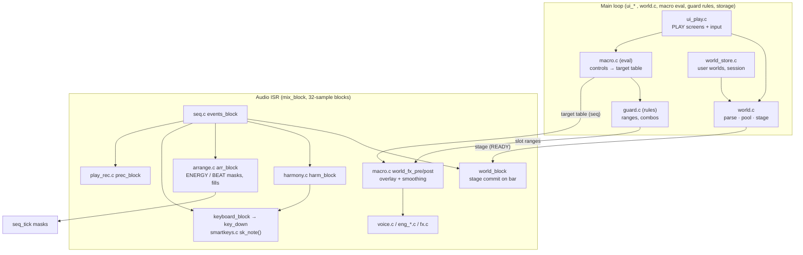
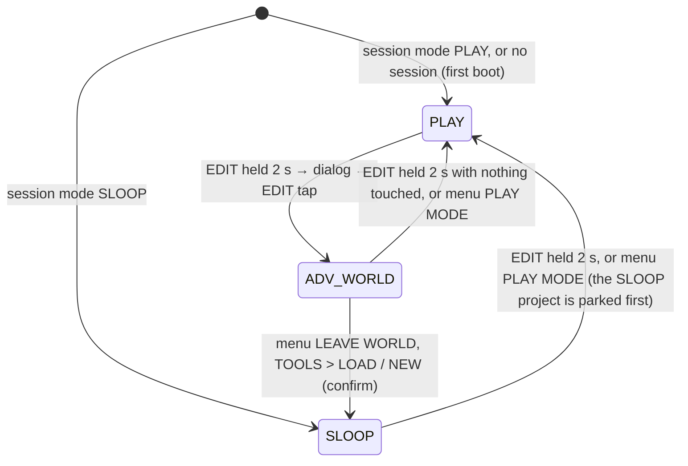
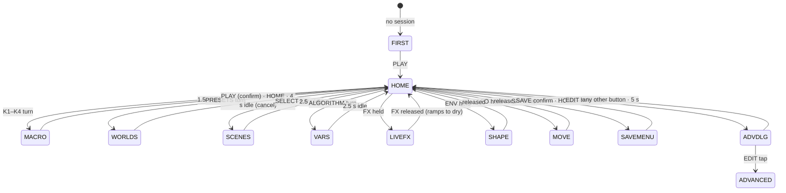
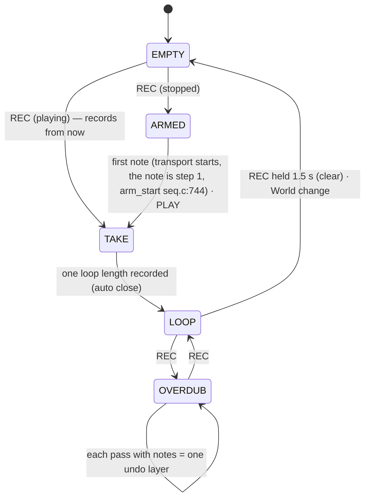

# PLAY MODE architecture: Musical Worlds on the SLOOP engine

| | |
| --- | --- |
| Status | Design for Phases 3–18. Every question has one answer here; anything still open is in [§15](#15-open-questions). |
| Inputs | [docs/architecture-audit.md](../architecture-audit.md) (Phase 0), the owner's PLAY MODE brief, `SLOOP.md` |
| Code references | `file:line` at HEAD `c111286`. `firmware/src/` at HEAD is identical to the audited `e421e43` except `ui_menu.c` (+4 lines), so the audit's references still hold. `src/` means `firmware/src/`, `hal/` means `firmware/hal/`. |
| Ground rules | No SLOOP rewrite, no new synth engine, no second audio engine, no AI generation. With no World active the firmware must render **bit-identically** to SLOOP, so the 83 golden renders keep guarding every refactor. |

---

## Contents

0. [Decisions at a glance](#0-decisions-at-a-glance)
1. [Module map](#1-module-map)
2. [Musical World data](#2-musical-world-data)
3. [Harmony model](#3-harmony-model)
4. [Smart Keys](#4-smart-keys)
5. [Macro engine](#5-macro-engine)
6. [Musical Guardrail Engine](#6-musical-guardrail-engine)
7. [Scenes and variations](#7-scenes-and-variations)
8. [PLAY MODE UI](#8-play-mode-ui)
9. [REC, PULSE, BEAT, LIVE FX, SOUND SHAPE, MOVEMENT](#9-rec-pulse-beat-live-fx-sound-shape-movement)
10. [Advanced Mode, user worlds and persistence](#10-advanced-mode-user-worlds-and-persistence)
11. [Budgets](#11-budgets)
12. [Simulator, authoring and validation](#12-simulator-authoring-and-validation)
13. [Testing strategy](#13-testing-strategy)
14. [Phase map](#14-phase-map)
15. [Open questions](#15-open-questions)
16. [Alignment with the UI spec](#16-alignment-with-the-ui-spec)

---

## 0. Decisions at a glance

| # | Question | Decision | Rejected (one line each) |
| --- | --- | --- | --- |
| D1 | Effective values for macros | **Sparse overlay swap**: in the audio ISR, after `events_block`, up to 48 slots write `clamp(base + offset)` into `p[]`/`g[]`; the same `mix_block` restores the base before it returns. Brightness and shape go through Q8 `vmod` offsets. | `pe[]`/`g_eff[]` mirrors read by every engine: touches 9 engines and `fx.c`, more flash, more risk to the goldens. |
| D2 | Feature gating | Compile flag `FELUCCA_WORLD` (1 in `felucca.c` and `host/core.c`, 0 in the existing tests). At runtime every hook takes its old path while `wrt.active == 0`. | Always-on hooks: the old tests would need world stubs, and bit-identity could not be proved per build. |
| D3 | Source format | **JSON** (`worlds/**/*.world.json`) with a published JSON Schema | TOML: the Python stdlib cannot write it and JS has no native parser. YAML: ambiguous and not in stdlib. |
| D4 | Pattern notation | Drums: one lane string per lane. Melodic: step tokens of scale degrees, chord tones (`c1 c3 c5 c7 c9`) or note names. Chord tokens are resolved at compile time against the scene's progression. | MIDI note lists (not transposable); runtime re-harmonisation (`step_t` has no room for it). |
| D5 | On-device format | Versioned TLV blob `FWD1` (≤ 3,840 B, CRC-32, bounds-checked), 1.4–2 KB per world, `const` in XIP flash | Raw `project_t` per scene (12 KB per world). |
| D6 | Scenes | World scenes A–D are **not** `proj_slot`. The main loop decodes into a stage buffer; the ISR commits it on the bar, restarts the section clock, and keeps held keys, arp latch and loops. | `arrangement_apply` on `proj_slot`: it kills notes and would overwrite the user's projects. |
| D7 | Smart Melody | White keys = the melody scale, fixed (C4 key = tonic). Black keys = the **current chord's** tones, ascending, in the same register. | SNAP (duplicates), WHITE (silent black keys), re-mapping every key per chord (no muscle memory). |
| D8 | Same-pitch voices (R1) | Per-track pitch reference count in `trk_note_on/off` (`src/voice.c:318,367`), enabled while a World is active | Counting in `input_on` only: misses sequencer-versus-live collisions. |
| D9 | ENERGY | Mostly arrangement: authored bands per scene drive mute masks (`trk_silent`), drum-lane and density masks, synth skip masks and fills. Parameter mappings add gain compensation. | ENERGY as parameters only (it would make a loud mess, not an arrangement). |
| D10 | WORLD confirm without a push switch | PRESETS opens the list and the current World keeps playing. **PLAY confirms** (switching on the next bar if playing). HOME or a 4 s timeout cancels. | Rest timeout (accidental World changes); confirming on the next bar (too implicit). |
| D11 | Tempo | The World's tempo. GLO held + SELECT nudges it ±1 BPM within the World's range; a GLO double-tap resets it. | Keeping SELECT as tempo (it is SCENE now). |
| D12 | User World storage | **Widen `FL_STORE_OK`** to `0xE5000–0xFBFFF`: 10 user World slots plus a session object | Repurposing a user sample slot: it removes a SLOOP feature that Advanced Mode must keep. |
| D13 | Persistence | The PLAY session (World, scene, variation, controls, loop, edits) is a delta object saved like autosave. SLOOP's FUN4 autosave is **fenced** while a World is active. | Writing World state into the FUN4 autosave (it would destroy the user's SLOOP project). |
| D14 | REC model | 1/2/4-bar loop on the keys track. Record one pass, it loops, then REC toggles overdub. 4-deep undo ring. "Gentle" quantise stores micro-timing in the spare `step_t.flags` bits 2–4. | The free take (it infers the tempo, but the World owns it); 100 % quantise only. |
| D15 | LIVE FX | FILTER = DJ filter (`G_FILT`), ECHO = delay bus (mix, sends, bounded feedback), CRUSH = DUST (`G_DUST`), FREEZE = punch-in LOOP. All four are overlay controls that ramp back to dry on release. | The punch engine for all four (it plays one effect at a time). |
| D16 | Authoring | JSON is the source of truth. A Python compiler (`tools/worldc.py`) is shared by the build, `validate-world` and the authoring UI (a local web page). Audio always comes from the native simulator, which hot-reloads. | An ImGui editor inside the simulator (more C UI code, slower to iterate). |

---

## 1. Module map

### 1.1 Overview



### 1.2 New files

| File | Owns | Context | Phase |
| --- | --- | --- | --- |
| `src/world_rt.h` | Types and ISR-shared state: `wrt` (active, keys track, mode flags, `mute`), harmony runtime, overlay slot tables, arrangement masks, stage buffer, `wvm_cut[3]`/`wvm_shape[3]`. No code except inline accessors. | both | 5 |
| `src/guard_limits.h` | Hard safety limits as `#define`s. `tools/worldc.py` parses this file, so the limits exist in one place only. | both | 7 (the slot clamp), 8 |
| `src/harmony.c` | Chord-quality tables, `harm_block()` (current chord per block), chord-tone and safe-tone masks | ISR | 6 |
| `src/smartkeys.c` | Key-map building (main loop, per chord), `sk_note(k)` and `sk_midi_*` (ISR), SMART CHORDS/BASS/DRUMS later | both | 6 |
| `src/guard.c` | Note guard (range fold, polyphony cap, loop snap), sound rules (combo evaluation into slot ranges), arrangement timing, CPU guard | both | 8 |
| `src/macro.c` | Control positions, mapping evaluation, cross-macro rules, target-table publication; ISR overlay `world_fx_pre/post`; engine role table | both | 7 |
| `src/arrange.c` | ENERGY bands, BEAT, fills, quantised application of masks | ISR (requests from main) | 7 (bands, masks, fills), 11 |
| `src/play_rec.c` | PLAY REC state machine, loop close, overdub, undo ring, micro-timing | both | 10 |
| `src/world.c` | Blob check and parse, working World (pattern pool, overrides), stage builder, `world_block()`/commit, World load/reset, user-World encoder | main (+ ISR commit) | 5, 11, 14 |
| `src/ui_play.c` | PLAY MODE state machine, screens, LEDs, Advanced dialog | main | 9 |
| `src/world_store.c` | Storage objects in the new flash region: user Worlds, session; autosave fence | main | 9, 14 |
| `build/gen/felucca_worlds.h` | Factory blobs and index (generated) | const | 5 |
| `tools/worldc.py` | JSON → blob compiler, blob → JSON decompiler, schema validator, Python reference model of macros and guard | host | 5 |
| `tools/gen_worlds.py` | Called by `build.py generate()`: compiles `worlds/factory/*.world.json` into `felucca_worlds.h` | host | 5 |
| `tools/validate-world` (+ `tools/validate_world.py`) | Static checks plus host render sweeps | host | 8, 16 |
| `worlds/schema/world.schema.json`, `worlds/factory/*.world.json` | Schema and sources | data | 5 |

### 1.3 Unity order and the feature flag

`FELUCCA_WORLD` defaults to 0 at the top of `core.h`. `src/felucca.c` defines it as 1 before `#include "core.h"` (`felucca.c:19`). The end of `core.h` (`:279`) adds `#if FELUCCA_WORLD #include "world_rt.h"`, so every consumer of `core.h` sees the shared state. New code is included at three points. Functions that earlier files call are forward-declared there, the same way `seq.c` already declares `song_backup` (`seq.c:1241`).

```
felucca.c:20-47  engines.c … voice.c slicer.c fx.c usb.c arranger.c seq.c       (unchanged)
+ #if FELUCCA_WORLD
+   harmony.c  guard.c  smartkeys.c  macro.c  arrange.c  play_rec.c             (ISR group: need SCALE_MASK, kb_*, trk_grid from seq.c)
+ #endif
felucca.c:48-57  audio.c panel.c ui.c ui_song.c ui_studio.c icons.c ui_draw.c ui_layers.c ui_menu.c ui_input.c
+ #if FELUCCA_WORLD
+   world.c  ui_play.c                                                         (world.c: preset_fill (params.c); ui_play.c: gfx, ui_*)
+ #endif
felucca.c:64-115 [storage.c] upreset.c project.c(arranger_scene.c)
+ #if FELUCCA_WORLD
+   world_store.c                                                              (needs st_*, proj_capture, autosave_buf)
+ #endif
```

`host/core.c`, the Phase 2 host unity root, mirrors this order with `FELUCCA_WORLD 1`. A new `tests/unity_order_test.py` fails when the `firmware/src` includes of `host/core.c` and `felucca.c` differ, apart from an explicit list of hardware-only files (`audio.c`, `lcd.c`, `main.c`, `ota.c`, `recovery.c`, `console.c`, `editor.c`). The existing tests (`hostsim.c`, `regress.c`, …) keep `FELUCCA_WORLD 0` and stay untouched. The regression suite is additionally built a second time with `-DFELUCCA_WORLD=1` and must match the **same** `tests/golden.txt` ([§13](#13-testing-strategy)).

### 1.4 Hooks into existing code

Every hook is inert while `wrt.active == 0`. That is the bit-identity argument, checked by the second regression build.

| # | Location | Hook | Inert path |
| --- | --- | --- | --- |
| H1 | `core.h:270-274` `trk_silent` | `\|\| ((wrt.mute >> i) & 1u)`: ENERGY layers reuse the 8-block mute fade and note blocking | `wrt.mute == 0` |
| H2 | `voice.c:318-365`, `:367-401`, `:403`, `:451` | Pitch reference count ([§4.4](#44-pitch-reference-counting-r1)) | `wrt.refcount == 0` |
| H3 | `voice.c:564-567` | `m.cutoff += wvm_cut[pi]; m.shape += wvm_shape[pi];` | both 0 |
| H4 | `fx.c:380` (before `events_block`; as built, [§5.8](#58-as-built-phase-7)) | `world_fx_pre()`: smoothing and overlay apply | early return |
| H5 | `fx.c:394` (after `djf_process`) | `world_fx_post()`: restore the base values | early return |
| H6 | `fx.c:132,134` | `G_DFDBK` and `G_RSIZE` clamped to `GL_*` at the point of reading (hard invariants, [§6.3](#63-hard-invariants)) | in-range values pass unchanged |
| H7 | `seq.c:1006` in `key_down` | `n = sk_active(t) ? sk_note(k) : kb_map(t, k)` | `kb_map` |
| H8 | `seq.c:1536-1544` MIDI in | the keys channel is mapped through `sk_midi_on/off` | raw |
| H9 | `seq.c:761` `input_on` | note guard on the keys track: polyphony cap, range fold | none |
| H10 | `seq.c:220` `undo_mark` | while PLAY REC is active, push into the 4-deep ring instead | single undo |
| H11 | `seq.c:648` `arp_next` | PULSE with one held key: a chord-tone list from the harmony | held list |
| H12 | `seq.c:1323-1339` `seq_step` | keys-track loop follows the chord (`guard_loop_note`), using a local `nt[4]` for both on and `seq_notes` | `nt = s->note` |
| H13 | `seq.c:1347`, `:1359` | `& arr.lanes`, density-step mask, ratchet allow | masks all-ones |
| H14 | `seq.c:1419-1434` `seq_tick` | drum fill substitution, synth skip mask, micro-timing defer | none |
| H15 | `seq.c:1499-1501` | `wrt.active ? world_block() : live_block()` | `live_block` |
| H16 | `seq.c:1528` (before `keyboard_block`) | `harm_block(); arr_block();`; and after `seq_tick` (`:1547`): `prec_block()` | not called |
| H17 | `ui_layers.c:259-283` SAVE layer A–D | in a World session: request a World scene; storing is refused ("SCENES ARE PART OF THE WORLD") | SLOOP sections |
| H18 | `project.c:382` `autosave_tick` | `if (wrt.active) { wsession_tick(); return; }` (fence, [§10.4](#104-session-and-autosave-fence)) | SLOOP autosave |
| H19 | `ui_input.c:595`, `ui_input.c:121`, `ui_draw.c:918` | `if (ui_play_on()) { play_input(); return; }` and the same for LEDs and drawing | SLOOP UI |
| H20 | `ui_layers.c:28-37` | `play_layers_init()` next to `layers_init()` | — |
| H21 | `ui.c:237-273` | Extract a pure `preset_fill(int16_t *p, const engine_t *e, uint32_t pi)` (placed in `params.c` with `param_kept`, so that `world.c` needs no UI code); `apply_preset_to` calls it (bit-identical refactor, Phase 5) | — |
| H22 | `main.c:93-94` | `world_boot()` after `autosave_resume()`: reads the session, loads the World, sets the UI mode | SLOOP boot when there is no session or its mode is SLOOP |
| H23 | `storage.c:23`, `:51-60`; `hal/fm1_flash.h:38-49` | New object ids and sectors; `FL_STORE_OK` gains `0xE5000–0xFC000` | — |
| H24 | `ui_menu.c` menu items | `PLAY MODE` and `LEAVE WORLD` (Advanced only) | — |
| H25 | `tools/build.py:100-105` `generate()` | adds `[gen_worlds.py, GEN / "felucca_worlds.h"]` | — |
| H26 | `ui_input.c:664` song-mode PLAY, `ui_song.c` | song mode is refused in a World session in v1 ([§15](#15-open-questions)) | — |

### 1.5 Runtime modes



| Mode | UI | `wrt.active` | Keys | Macros / ENERGY | Proj slots |
| --- | --- | --- | --- | --- | --- |
| PLAY | `ui_play.c` | 1 | Smart Keys | live | never touched |
| ADV_WORLD | SLOOP UI | 1 | `kb_map` (SLOOP) | overlay frozen at its last positions; ENERGY band frozen | only TOOLS > SAVE writes one (an explicit export) |
| SLOOP | SLOOP UI | 0 | `kb_map` | none | SLOOP |

**Bit-identity applies to the SLOOP mode.**

### 1.6 State ownership and publication

| State | Writer | Reader | Protocol |
| --- | --- | --- | --- |
| `wrt.active`, `keys_trk`, `refcount`, `keys_on` | main (World load, mode change) | ISR | written inside `fm1_irq_off/on` together with the first commit |
| Control positions `ctl_pos[16]` (0–1000) | main | main | — |
| Overlay target table `ovb[2]` (≤ 48 slots: pointer, kind, target Q8, lo, hi, class, `from`) | main (`macro_publish`, ≤ 60 Hz, only on change) | ISR | double buffer plus `ov_pub` sequence; the ISR takes the new table at the start of a block |
| Overlay current, saved base, `wvm_*` | ISR | ISR | — |
| Stage buffer (`stage`: p[4][58], engine/preset, pattern ids, g whitelist, progression, key maps, energy table, fill) | main while `stage.st == FREE` → `READY` | ISR commit → `APPLIED`; main → `FREE` | a volatile `u8` state machine; at most one pending stage; a newer request restages after `APPLIED` |
| Pattern pool `wpool[16][64]` `step_t`/`dstep_t` (10,240 B) | ISR (write-back at commit), main (load, while stopped; Phase 11: the next World's decode while the old one plays, with no stage, BEAT or fill pending) | ISR (commit, BEAT swap, fill), main (encode, while stopped and with no stage pending) | ownership by transport state and stage state |
| Harmony runtime (`harm.ci`, `ci_key`, masks) | ISR `harm_block` | ISR; main reads for display (torn reads harmless) | — |
| Arrangement requests (`arr_req_energy`, `arr_req_beat`) | main | ISR `arr_block` | single-word stores |
| Arrangement masks (`arr.*`, `wrt.mute`) | ISR | ISR | — |
| Refcount `vref[3][128]` | ISR | ISR | cleared by `trk_all_off` |
| PLAY REC state, undo ring (4 × 650 B) | ISR (pass logic, ring push), main (requests, undo swap under IRQ off) | both | request bytes |
| Overrides `wovr[64]` | main | main (stage builder, encoder) | — |
| Session and playstate | main | main | — |

### 1.7 How the host uses the core

- **Renderer** (Phase 2 CLI in `host/`) gains `world` options: `--world FILE(.world.json|.wblob) --scene B --var DARK --ctl COLOR=0.2,ENERGY=0.9 --keys SCRIPT --bars N --metrics out.json`. JSON is compiled by spawning `tools/worldc.py compile`.
- **Real-time simulator** (Phases 3–4): a firmware thread runs `mix_block` lockstep with `ui_input`/`ui_draw`, as `ui_pages_test` does, and fills a FIFO that the SDL2 audio callback drains. The World modules need nothing host-specific: all timing comes from the clock and `fm1_ms`, which is derived from the rendered samples. Hot reload ([§2.8](#28-embedding-and-hot-reload)) runs between two `mix_block` calls on the firmware thread.
- **Sweeps** (`world_sweep` mode of the renderer): load a blob through the real `world.c` parser, set controls, render, measure ([§12.3](#123-validate-world)).
- The simulator's 1 MiB flash file holds user Worlds and the session at their device offsets.

---

## 2. Musical World data

### 2.1 Source format: JSON

JSON was chosen because:
- Python reads and writes it from the stdlib.
- The web authoring UI (and the existing `web/editor.html`) handles it natively.
- Diffs are deterministic (`sort_keys`, 2-space indent, one pattern string per line).
- It has a standard schema language.

JSON has no comments, so every object accepts a `"notes"` string that the compiler ignores. Files are named `worlds/<factory|user>/<id>.world.json` and carry `"format": "flowstate-world/1"`.

### 2.2 Schema (summary; `worlds/schema/world.schema.json` is normative)

| Key | Type | Rules |
| --- | --- | --- |
| `format` | `"flowstate-world/1"` | required |
| `id` | `[a-z0-9_]{1,24}` | unique. The device id is FNV-1a-32(`id`), and `gen_worlds.py` rejects collisions. |
| `name` | ≤ 14 chars of `A–Z 0–9 space & ' - .` | FONT_L charset (glyphs 32–95) |
| `category` | ≤ 10 chars, same charset | groups the list |
| `blurb` | ≤ 24 chars, printable Latin-1 | FONT_S |
| `tempo` | `{bpm 40–240, min, max}` | `min ≤ bpm ≤ max`, range ≤ ±20 % |
| `key` | `{root: "C".."B" (♯ as `#`, ♭ as `b`), scale: one of the 16 SLOOP scale names}` | written to `P_ROOT`/`P_SCALE` of tracks 1–3 |
| `swing` | 0–100 | `G_SWING` |
| `tracks` | array of exactly 4 `{name, role, sound, register?}` | slots 1–3 synth, slot 4 `role:"drums"`. Roles: `pad chords bass lead keys texture drums`. Exactly one track is `smart_keys.track`. |
| `sound` | `{engine, preset, params{}}`; drums `{kit, params{}}` | names, not indices ([§2.3](#23-notation)) |
| `fx` | `{name: value}` for the global whitelist `swing dtime dfdbk dcolor dmix rsize rdamp crate cdepth drlvl drrev dust duck filt` | any other `G_*` is rejected |
| `patterns` | `{id: {track, div?, steps}}` or `{id: {track:"drums", lanes{}}}` | ≤ 16 after compilation and unrolling |
| `progressions` | `{id: ["i:4", "VI:4", …]}` | 1–16 chords; total 4, 8, 16 or 32 beats |
| `scenes` | `{A,B,C,D: {name, role, progression, energy, transition?, patterns{}, fill?, params?, fx?}}` | all four are required; `role` is one of `intro main lift breakdown` |
| `variations` | ordered `{NAME: {sounds?, params?, fx?, swap?, energy_bias?}}` | the first is `ORIGINAL` and empty; ≤ 8; names ≤ 10 chars |
| `macros` | `{COLOR,MOTION,SPACE,ENERGY: [mapping…]}` | ≤ 40 mappings in total, counting `controls` |
| `controls` | optional overrides for `shape`, `movement`, `livefx` | defaults are built into the firmware |
| `rules` | `[{if:{CTL: threshold,…}, then:[{to, add}]}]` | ≤ 8 rules, ≤ 4 actions each |
| `energy` | `{id: {density_lanes[], bands[1..4]}}` | ≤ 4 tables |
| `smart_keys` | `{track, mode, melody_scale, white, black, tonic, range}` | see [§4](#4-smart-keys) |
| `guard` | `{notes, record, sound, arrangement, cpu}` | see [§6](#6-musical-guardrail-engine) |
| `defaults` | `{scene, variation, macros[4], pulse, beat}` | — |

### 2.3 Notation

**Sounds.**
- `engine` is an `ENGINES[]->name` (`ANALOG`, `DIGITAL`, `PHASE`, `LOFI`, `SAMPLE`, `VOICE`, `TRIO`, `WHEEL`, `GRAIN`).
- `preset` is a factory preset name of that engine.
- `params` keys are either:
  - common parameters, as lowercase `P_*` enum names (`level atk dec sus rel ed_flt … chord`);
  - engine parameters, as that engine's `edit[]` labels (`CUT`, `RES`, `IDX`, …). These are resolved against the track's engine, because `P_E0..E7` mean different things per engine.
- Enum values may be given by name (`"WAVE": "SAW"`).
- The compiler reads the descriptor and preset tables from `worlds/schema/sloop-params.json`, which the host tool `tools/dump_params.c` prints from `TP`, `GP`, `ENGINES[]`, the drum kits and lanes. The JSON is committed, so the build needs no host compiler, and a test fails when it is stale. The C tables stay the single source.
- Values are absolute and are checked against the descriptor range.

**Targets** (macros, rules, guard ranges):

| Form | Meaning | Example |
| --- | --- | --- |
| `<track>.<param>` | a track's parameter | `pad.rev`, `bass.CUT` |
| `*.<param>` | that parameter on every synth track | `*.level` |
| `<track>.@<ROLE>` | the engine role ([§5.3](#53-engine-role-table)) | `keys.@RESO` |
| `<track>.~bright`, `<track>.~shape` | Q8 vmod offset (smooth) | `pad.~bright` |
| `g.<name>` | a whitelisted global | `g.dfdbk` |

**Drum patterns.** One string per lane. The lane names are the format's (`WF_LANE_IDS` in `world_fmt.h`, in the order of SLOOP's lanes in `drums.c`): `kick kick2 snare clap hat open pedal rim snare2 tomlo tomhi crash ride shaker conga bell`. SLOOP's own names, lowercase without spaces, are accepted too. One character per step:

| Character | Step |
| --- | --- |
| `.` | nothing |
| `x` | normal |
| `X` | hard |
| `s` | soft |
| `g` | ghost |
| `2` `3` `4` | ratchet ×n at normal level |

`|` separators are allowed and checked (16 steps per bar at 1/16). The drum track is always 1/16 with a length of 16, 32 or 64.

**Melodic patterns.** One token per step, separated by spaces, with `|` between bars:

| Token | Meaning |
| --- | --- |
| `1`–`7` | scale degree of the World key in the track's `register` octave. Accidentals `b3 #4`; octave marks `'` (up) and `,` (down), repeatable. |
| `c1` `c3` `c5` `c7` `c9` | root, 3rd, 5th, 7th (falls back to the root an octave up on a triad), 9th of the chord sounding at that step |
| `A#3` | an absolute note (escape hatch) |
| `[c1 c3 c5]` | up to 4 notes in one step |
| `.` / `-` | rest / tie (continues the previous step) |
| suffix `!` / `_` / `~` / `*2..4` | accent (hard) / soft / slide / ratchet |

**Why this notation.** Degrees keep a pattern in key and make it transposable. Chord tokens let a bass or pad line follow the progression. Both compile to the absolute MIDI notes that `step_t` holds (`core.h:148-156`), so the runtime needs no transform. A pattern with chord tokens is **unrolled** to `lcm(pattern length, progression length)`, at most 64 steps, and compiled once per progression it meets. Identical results are deduplicated in the pool.

### 2.4 Example (complete, short)

```json
{
  "format": "flowstate-world/1",
  "id": "night_drive", "name": "MIDNIGHT DRIVE", "category": "SYNTHWAVE", "blurb": "Neon arps, warm bass",
  "tempo": {"bpm": 96, "min": 84, "max": 108}, "key": {"root": "A", "scale": "MIN"}, "swing": 0,
  "tracks": [
    {"name": "pad",   "role": "pad",  "sound": {"engine": "ANALOG", "preset": "WARM PAD", "params": {"CUT": 60, "rev": 50, "level": 92}}},
    {"name": "bass",  "role": "bass", "register": "A1", "sound": {"engine": "ANALOG", "preset": "SUB BASS", "params": {"CUT": 70}}},
    {"name": "keys",  "role": "lead", "register": "A3", "sound": {"engine": "TRIO", "preset": "SYNC LEAD", "params": {"dly": 40, "rev": 30}}},
    {"name": "drums", "role": "drums", "sound": {"kit": "808", "params": {"level": 104}}}
  ],
  "fx": {"dtime": "1/8", "dfdbk": 50, "dmix": 80, "rsize": 96, "rdamp": 60, "drrev": 12},
  "patterns": {
    "pad_main":  {"track": "pad", "div": "1/16", "steps": "[c1 c3 c5] - - - - - - - - - - - - - - -"},
    "bass_main": {"track": "bass", "steps": "c1 . c1 . c1 . c5 . c1 . c1 . c1 . c5 ."},
    "bass_drive":{"track": "bass", "steps": "c1 c1 c1 c1 c1 c1 c1 c1 c1 c1 c1 c1 c5 c5 c5 c5"},
    "dr_main":  {"track": "drums", "lanes": {"kick": "x...x...x...x...", "snare": "....x.......x...", "hat": "x.x.x.x.x.x.x.x."}},
    "dr_busy":  {"track": "drums", "lanes": {"kick": "x...x...x..xx...", "snare": "....x.......x..g", "hat": "xxxxxxxxxxxx2xxx", "open": "..x...x...x...x."}},
    "dr_break": {"track": "drums", "lanes": {"kick": "x.........x.....", "snare": "........X.......", "hat": "x...x...x...x..."}},
    "dr_fill":  {"track": "drums", "lanes": {"kick": "x...x...x.......", "snare": "....x...x.xxXXXX", "crash": "................"}}
  },
  "progressions": {"main": ["i:4", "VI:4", "III:4", "VII:4"], "dark": ["i:8", "iv:8"]},
  "scenes": {
    "A": {"name": "INTRO", "role": "intro", "progression": "dark", "energy": "e", "patterns": {"pad": "pad_main", "bass": null, "drums": {"GROOVE": "dr_break"}}},
    "B": {"name": "MAIN", "role": "main", "progression": "main", "energy": "e", "fill": "dr_fill",
          "patterns": {"pad": "pad_main", "bass": "bass_main", "drums": {"GROOVE": "dr_main", "BUSY": "dr_busy", "BREAK": "dr_break"}}},
    "C": {"name": "LIFT", "role": "lift", "progression": "main", "energy": "e", "fill": "dr_fill", "params": {"pad.CUT": 80},
          "patterns": {"pad": "pad_main", "bass": "bass_drive", "drums": {"GROOVE": "dr_busy"}}},
    "D": {"name": "BREAKDOWN", "role": "breakdown", "progression": "dark", "energy": "e", "fx": {"rsize": 115},
          "patterns": {"pad": "pad_main", "bass": null, "drums": null}}
  },
  "variations": {
    "ORIGINAL": {},
    "AIRY":  {"params": {"pad.rev": 80, "keys.rev": 60}, "fx": {"rsize": 110}, "energy_bias": -0.1},
    "DARK":  {"params": {"pad.CUT": 38, "keys.CUT": 50}, "fx": {"dcolor": 30}},
    "PULSING": {"swap": {"bass_main": "bass_drive"}, "energy_bias": 0.1}
  },
  "macros": {
    "COLOR":  [{"to": "*.~bright", "min": -40, "max": 28, "curve": "exp"}, {"to": "keys.@RESO", "min": -10, "max": 18},
               {"to": "g.dcolor", "min": -25, "max": 25}],
    "MOTION": [{"to": "pad.ld_flt", "min": -10, "max": 30, "smooth": "slow"}, {"to": "g.cdepth", "min": -20, "max": 40},
               {"to": "keys.~shape", "min": 0, "max": 24}],
    "SPACE":  [{"to": "*.rev", "min": -30, "max": 45, "curve": "s"}, {"to": "g.rsize", "min": -20, "max": 22},
               {"to": "g.dfdbk", "min": -30, "max": 30}, {"to": "keys.dly", "min": -30, "max": 40}],
    "ENERGY": [{"to": "*.level", "min": 4, "max": -4}, {"to": "bass.@DRIVE", "min": 0, "max": 30}]
  },
  "rules": [
    {"if": {"SPACE": 0.8, "ENERGY": 0.8}, "then": [{"to": "bass.rev", "add": -30}, {"to": "g.drrev", "add": -10}, {"to": "g.dfdbk", "add": -25}, {"to": "*.level", "add": -6}]},
    {"if": {"COLOR": 0.9, "ENERGY": 0.9}, "then": [{"to": "keys.@RESO", "add": -20}]},
    {"if": {"MOTION": 0.9, "ENERGY": 0.9}, "then": [{"to": "g.cdepth", "add": -30}]}
  ],
  "energy": {"e": {"density_lanes": ["hat", "open"], "bands": [
    {"from": 0.00, "layers": ["pad", "keys"], "drums": ["kick", "hat"], "density": "x...x...x...x..."},
    {"from": 0.35, "layers": ["pad", "bass", "keys", "drums"], "drums": ["kick", "snare", "hat"], "density": "x.x.x.x.x.x.x.x.", "bass": "x.x.x.x.x.x.x.x."},
    {"from": 0.65, "layers": "all", "drums": "all", "fills": true},
    {"from": 0.90, "layers": "all", "drums": "all", "fills": true, "ratchets": true}]}},
  "smart_keys": {"track": "keys", "mode": "melody", "melody_scale": "MPEN", "white": "scale", "black": "chord+9", "tonic": "A3", "range": ["E2", "C6"]},
  "guard": {"notes": {"keys": {"max_poly": 4, "loop_follow": "snap"}, "bass": {"range": ["E1", "A3"]}},
            "record": {"quantize": 0.75},
            "sound": {"ranges": {"keys.RES": [0, 100], "g.dfdbk": [0, 90]}, "max_level": 116},
            "arrangement": {"mute_change": "bar", "density_change": "beat", "fills_every": 4},
            "cpu": {"max_unison": 4}},
  "defaults": {"scene": "B", "variation": "ORIGINAL", "macros": [0.5, 0.5, 0.5, 0.5], "pulse": "OFF", "beat": "GROOVE"}
}
```

Composition order of a decoded state:
1. base sound (preset, then `params`);
2. the variation (preset swaps, then `params`);
3. the scene (`params`, `fx`);
4. the user overrides from Advanced Mode.

Later steps win. Variation pattern `swap`s apply to whatever the scene selects. `null` means that layer is absent in the scene. The keys track never has a scene pattern: it is the user loop.

### 2.5 Compiled blob `FWD1`

Little-endian, byte-aligned. The parser never casts the blob to a struct; it reads bytes with explicit bounds. The byte-level specification, which fills the gaps of the table below, is [fwd1-format.md](fwd1-format.md) (normative).

```
off  size  field
0    4     magic 'F','W','D','1'
4    1     version = 1                      (parser rejects > known)
5    1     flags: b0 USER, b1 SESSION (delta), others 0
6    2     L = total length, 24 ≤ L ≤ 3840
8    4     world_id = FNV-1a-32(id)
12   4     CRC-32 (zlib, = storage.c st_crc32) over bytes [0, 12) and [16, L)   (fwd1-format.md: the header too)
16   1     nsec (1..16)
17   3     reserved, 0
20   4·n   section table {u8 type, u8 count, u16 len}; payloads follow contiguously in table order
           check: 20 + 4·nsec + Σlen == L; each type at most once; required set present
```

| Type | Section | Layout (per item) | Size |
| --- | --- | --- | --- |
| 0x01 | META | `name[15] cat[11] blurb[25]` (NUL-padded), `bpm bpm_min bpm_max root scale swing` | 57 |
| 0x02 | TRACKS (count 4) | `role, engine (0xFF drums), preset/kit, register, npairs, {u8 P_id, i8 v}×n` | 5 + 2n |
| 0x03 | GLOBALS | `{u8 G_id, i8 v}` × count (whitelist only) | 2n |
| 0x04 | PATTERNS (≤ 16) | `u8 kind_div` (b7 drum, b0-2 div), `u8 len`, `u16 nbytes`, data | 4 + data |
| 0x05 | PROGS (≤ 8) | `u8 nchords`, `{u8 root_pc<<4 \| quality, u8 beats}` × n | 1 + 2n |
| 0x06 | SCENES (count 4) | `name[11] role prog energy transition fill pat[3] beat[4] npairs` + `{u8 scope, u8 id, i8 v}` × n | 24 + 3n |
| 0x07 | VARS (≤ 8) | `name[11] i8 energy_bias, nsound {u8 trk, u8 preset}, nswap {u8 from, u8 to}, npairs` + scoped pairs | 15 + 2a + 2b + 3n |
| 0x08 | MAPS (≤ 40) | `u8 ctl (0-15), u8 kind<<5 \| trkmask, u8 id, u8 class<<6 \| curve, i8 min, i8 max` | 6 |
| 0x09 | CURVES (≤ 8) | LUT9 `u8[9]` (0..255 at x = 0, 1/8 … 1) | 9 |
| 0x0A | RULES (≤ 8) | `u8 a<<4 \| b, u8 ta, u8 tb, u8 nact` + `{u8 kind<<5 \| trkmask, u8 id, i8 add, u8 0}` × n | 4 + 4n |
| 0x0B | ENERGY (≤ 4) | `u16 density_lanes, u8 nbands` + band `{u8 from (0..250), u8 layers \| fills<<4 \| ratchets<<5, u16 lanes, u16 dens_steps, u16 skip[3]}` | 3 + 12b |
| 0x0C | GUARD | 32 B fixed (ranges per track, poly, quantise, loop_follow, caps, timing, CPU) + `{scope, id, lo, hi}` × n | 32 + 4n |
| 0x0D | KEYS | `trk, mode, u16 melody_mask, white, black, tonic, loop_pat` | 8 |
| 0x0E | DEFAULTS | `scene var ctl[4] (0..250) pulse beat shape[4]? …` (pad to 16) | 16 |
| 0x0F | OVERRIDES (user/session) | scoped pairs + `{u8 trk, u8 engine, u8 preset}` | 3n + 3m |
| 0x10 | PATCHES (session) | `u8 pool_idx` + one PATTERNS record | — |
| 0x11 | PLAYSTATE (session) | [§10.4](#104-session-and-autosave-fence) | 48 |

**Pattern data.**

Synth patterns are a record stream with a cursor that starts at 0. Each record starts with `ctl = kind<<6 | arg`:

| Kind | Meaning |
| --- | --- |
| 0 NOTE | skip `arg` REST steps, then a note step. Byte `nf`: b0-2 = n (0 means "same notes as the previous NOTE"), b3 accent, b4 slide, b5 has lvl/rat, b6 has vel, b7 has micro. Then `note[n]`, then `[lvl rat] [vel] [micro]`. |
| 1 TIE | `arg` TIE steps |
| 2 REST | `arg` REST steps |
| 3 END | the rest of the pattern is REST |

Drum patterns are lane-major:
- `u8 nlanes`;
- per lane: `u8 lane | haslvl<<4 | hasrat<<5`, then a bitmap of `len/8` bytes;
- then 2 bits per hit for levels and for ratchets, if flagged.

**Bounds checks** (`wb_check`, main loop, before any decode). The whole blob is rejected on any failure, with an error code shown as `WORLD ERROR n`. The checks are:
- magic, version, `L` against the buffer and the 3,840 B cap, CRC, the section-table sum;
- required sections present; per-section `len` equals the length implied by its counts;
- every index in range: pattern < npat, prog < nprog, energy < ntab, curve < 8 + ncustom, ctl < 16;
- `P_id < P_COUNT` and not in the structural ban list; `G_id` in the whitelist;
- engine < `NENGINES`; preset < `npresets` of that engine; kit < `DRUM_KITS`;
- notes ≤ 127, `len` 1–64, `div` < 6, chord beats sum ∈ {4, 8, 16, 32}, keys track ≠ drum track;
- cursors never pass `len`; bitmaps fit.

The parser is fuzzed on the host ([§13](#13-testing-strategy)).

### 2.6 Decode path (never touches `proj_slot`)

```mermaid
sequenceDiagram
  participant UI as main loop (world.c)
  participant ST as stage buffer
  participant ISR as audio ISR (world_block)
  UI->>UI: wb_check(blob) · wctx = section pointers (XIP const, or wblob_ram for user worlds)
  UI->>UI: world_load: decode PATTERNS → wpool[16] (RAM); build key maps; wrt.* (keys track, scale)
  UI->>ST: world_stage(scene, var): per track p[] = TP/engine defaults → preset_fill → TRACKS pairs → VAR → SCENE → OVERRIDES → clamp to descriptors (as proj_apply, project.c:266-270)
  Note over UI,ST: keep the PULSE-owned arp group (P_AMODE..P_AORDER) of the keys track, system globals (G_MIDI…G_NEWPRJ), G_BPM (tempo state)
  alt transport stopped
    UI->>ISR: fm1_irq_off · world_commit(stage) · fm1_irq_on
  else playing
    UI->>ST: st = READY
    ISR->>ISR: world_block: on the boundary (bar × transition) commit; seq_reset_tracks(clk_pos) for a scene change
    ISR->>ST: st = APPLIED
  end
```

`world_commit` (ISR or IRQ-off) does the following:
1. For each track whose pattern id changes, write the outgoing `trk[t].step` back into `wpool[old]` (skipping the keys track's user loop), then copy `wpool[new]` in.
2. Copy `stage.p[t]` into `trk[t].p`. On a non-keys track, an engine change sets `eng_req`, and `engine_block` fades it out (`voice.c:422-456`).
3. Copy the global whitelist.
4. Flip the harmony progression, key maps, energy table and fill.
5. On a **World switch**, also: panic all tracks, clear the keys loop, `song.sel = keys`.

Cost: at most 4 × 640 B write-back + 4 × 640 B copy + 4 × 116 B + 64 B ≈ 5.7 KB of copying, once per boundary.

### 2.7 Byte budget per World (the example above, plus typical extras)

| Part | Arithmetic | Bytes |
| --- | --- | --- |
| Header + table | 20 + 14 × 4 | 76 |
| META | fixed | 57 |
| TRACKS | 4 × (5 + 2 × 8 pairs) | 84 |
| GLOBALS | 12 × 2 | 24 |
| PATTERNS | 5 drum × ~23; pad ×2 unrolled (4 × (1+1+3) + ties + 4) ≈ 2 × 30; bass ×2 unrolled 64 steps (first note 3 B, repeats 2 B) ≈ 2 × 120 | ≈ 415 |
| PROGS | 2 × (1 + 4 × 2) | 18 |
| SCENES | 4 × (24 + 3 × 3) | 132 |
| VARS | 4 × ~28 | 112 |
| MAPS + CURVES | 26 × 6 + 2 × 9 | 174 |
| RULES | 3 × (4 + 4 × 3) | 48 |
| ENERGY | 2 × (3 + 4 × 12) | 102 |
| GUARD, KEYS, DEFAULTS | 32 + 6 × 4, 8, 16 | 80 |
| **Total** | | **≈ 1,320** |

Targets:
- **≤ 2,048 B** soft limit: the validator warns above it.
- **≤ 3,072 B** hard limit for factory Worlds, so that a user copy with overrides and edited patterns fits a 3,840 B storage payload.
- The library average is planned at 2,000 B.

### 2.8 Embedding and hot reload

`tools/gen_worlds.py` runs in `build.py generate()` (and therefore in `--gen-only`):
1. It compiles every `worlds/factory/*.world.json`, running the static checks only (no audio) so the build stays fast.
2. It sorts the Worlds by category, then name.
3. It writes:

```c
#define WORLD_NFACTORY 4
static const uint8_t WORLD_DATA[] __attribute__((aligned(4))) = { /* blobs back to back */ };
static const struct { uint32_t id; uint16_t off, len; } WORLD_INDEX[WORLD_NFACTORY] = { … };
```

A static error fails the build. The audio sweeps run in `run_tests.sh` and CI. Factory blobs are read in place through XIP. User and session blobs are copied into `wblob_ram[3840]` (`.bss`), because `st_buf` is reused by every storage call.

**Simulator.**
- `--world PATH` accepts `.world.json` (compiled by spawning `worldc.py`) or `.wblob`.
- The firmware thread polls the file's mtime every 500 ms. On a change it recompiles and calls `world_hot_reload(blob, len)`. That runs `wb_check`, rebuilds the pool from the file (it keeps the user loop, and drops the RAM edits, because the file is the truth while authoring), restages the current scene and variation, and commits **immediately**, even while playing.
- A failed compile leaves the old World playing and shows the error in the simulator's status line.

---

## 3. Harmony model

**Representation.**
- A progression is 1–16 chords, each `{root semitones above the key (0–11), quality (16), beats (1–32)}`, with a total of 4, 8, 16 or 32 beats.
- Source roman numerals refer to degrees **of the World's scale**: in A natural minor, `VII` is G major. `b`/`#` alter the degree; case and suffix give the quality (`i`, `VI`, `ii°`, `V7`, `Imaj7`, `iv9`, `Isus4`, `I5`).
- Qualities, each a 12-bit tone mask in `harmony.c`: MAJ MIN DIM AUG SUS2 SUS4 MAJ7 MIN7 DOM7 M7B5 MAJ6 MIN6 ADD9 MADD9 POW5 DIM7.
- Each scene names one progression. Variations cannot change it (D-rule in [§7](#7-scenes-and-variations)).

**Runtime, `harm_block()`** (ISR, once per block, before `keyboard_block`, `seq.c:1528`):

```c
b      = song.playing ? clk_beat : 0;              /* clk_beat = beats since the section began (seq_reset_tracks zeroes it) */
ci     = prog_ci[b % prog_beats];                  /* beat → chord LUT, ≤ 32 entries, built at stage time */
ci_key = prog_ci[(b + (clk_pos + HARM_ANTICIP >= BEAT_U)) % prog_beats];   /* HARM_ANTICIP = BEAT_U/8 (a 32nd) */
if (ci != harm.ci) harm.ci = ci, harm.ct = CT[ci], harm.safe = SAFE[ci], harm.gen++;
```

- `ci_key` is used by Smart Keys: a key pressed up to a 32nd note before the downbeat already gets the new chord (players press early).
- `SAFE[ci]` is the set of scale tones that are not avoid notes. An avoid note is a scale tone one semitone above a chord tone (the 4th over a major chord), unless the policy is `none`. `CT` and `SAFE` are precomputed for the staged progression.
- Stopped, the harmony is chord 0 (home).
- Chords change on beats only; half-beat changes are not supported ([§15](#15-open-questions)).

**What changes it.**
- A scene commit swaps the progression and restarts it at chord 0, because `seq_reset_tracks` zeroes `clk_beat` (`seq.c:1229`).
- A variation never changes it.
- World load stages scene `defaults.scene`.

---

## 4. Smart Keys

### 4.1 SMART MELODY mapping (27 keys, F3..G5, `k` = 0..26)

Inputs:
- the tonic (MIDI), e.g. `A3` = 57;
- the melody scale mask `M` (12 bits relative to the key root; default: the pentatonic of the World scale: MAJ → PEN, MIN/DOR/PHRY → MPEN), with `m` = popcount(M);
- the current chord `ci_key`: root pitch class `C`, tone mask `T`;
- with `black: "chord+9"`, the 9th if it is in the World scale and safe (`X`);
- the role range `[lo, hi]` and `song.octave`.

```
white index w = 0..15 (F3 G3 A3 B3 C4 D4 E4 F4 G4 A4 B4 C5 D5 E5 F5 G5); the C4 key is w = 4 = the tonic (SLOOP's landmark)
  d = w − 4;  q = floor(d / m);  r = d − q·m
  white[w] = tonic + 12q + (r-th set bit of M)
black index b = 0..10 (F#3 G#3 A#3 C#4 D#4 F#4 G#4 A#4 C#5 D#5 F#5); left white LW = {0,1,2,4,5,7,8,9,11,12,14}
  S = {(C + i) mod 12 : bit i of T ∪ X}
  black[b] = smallest p with p mod 12 ∈ S and p > max(white[LW[b]], black[b−1])
output = fold(note + 12·song.octave) into [lo, hi] by octaves
```

Worked example: C major pentatonic, tonic C4.
- White keys: D3 E3 G3 A3 **C4** D4 E4 G4 A4 C5 D5 E5 G5 A5 C6 D6.
- Over C(add9), black keys: E3 G3 C4 D4 E4 C5 D5 E5 G5 C6 D6.
- Both span about three octaves and every key sounds.
- When the chord changes to Am, the black keys move to its tones. The white keys never move.

Properties and policies:
- No two white keys share a pitch, and neither do two black keys. A black key may equal a white key's pitch; the refcount ([§4.4](#44-pitch-reference-counting-r1)) makes that safe.
- `white: "scale"` (default) keeps the white keys fixed.
- `white: "safe"` instead walks only the `SAFE[ci]` tones, so the white keys shift on avoid notes. It is for Worlds with a 7-note melody scale.
- `black: "chord"` uses chord tones only; `"chord+9"` adds the safe 9th.
- The main loop builds `sk_map[ci][27]` (≤ 16 × 27 = 432 B) for every chord of the staged progression and stages it with the scene. `sk_note(k)` in the ISR is then a table read: `sk_map[harm.ci_key][k]` plus the octave fold.

### 4.2 Held-note stability

The mechanism already exists. `key_down` stores what it sounded in `kb_nt[k][≤4]`, `kb_n[k]` and `kb_trk[k]` (`seq.c:47`, `:1016-1022`). `key_up` releases exactly those notes (`seq.c:1063-1069`). Smart Keys only changes where `n` comes from (H7), so a held note is never re-pitched by a chord change, a scene change or an octave change. `tests/scale_test.c:113-132` already proves this, and the new `smartkeys_test` extends it across chord boundaries.

### 4.3 Guard on input (H9, `seq.c:761`)

On the keys track in PLAY:
- **Polyphony cap.** A new note beyond `max_poly` (default 4, the most a step holds) while that many keys are held is ignored, and `kb_n[k] = 0` makes its release a no-op.
- **Range fold.** Notes are folded into the role range.
- Out-of-scale notes cannot occur from keys. MIDI is mapped as below.

### 4.4 Pitch reference counting (R1)

Where: `voice.c`, enabled by `wrt.refcount` (set while a World is active; SLOOP mode keeps today's behaviour, which keeps the goldens).

```c
static uint8_t vref[NPART][128];                       /* world_rt.h */
trk_note_on(t, n, vel):  if (refcount && !is_drum(t)) { if (vref[i][n] < 255) vref[i][n]++; }   /* before the trk_silent return */
                         → trk_voice_on(t, n, vel)       /* today's body, renamed (voice.c:321-364) */
trk_note_off(t, n):      if (refcount && !is_drum(t)) { if (vref[i][n] > 1) { vref[i][n]--; return; } vref[i][n] = 0; }
                         → today's body (xp queue removal, mono stack, release)
trk_all_off(t):          memset(vref[i], 0, 128)
engine_block replay (voice.c:451): calls trk_voice_on (the queued note was already counted)
```

A second source of the same pitch retriggers the shared voice (`voice_alloc` reuses it, `voice.c:147`). Only the last release ends it. This covers all three collisions the audit reproduced:
- two keys with the same note;
- overlapping chords;
- the sequencer's gate cutting a live note (seq and live both count).

An underflow (an off after `trk_all_off`) releases, as today.

### 4.5 MIDI in (H8, `seq.c:1536-1544`)

In PLAY, notes on the keys track's channel (`trk_midi_ch(keys)`, or any non-part channel, since these route to the selected track, which is the keys track) are mapped by **virtual key**: MIDI note `v` is treated as a key whose colour is the colour of `v`. The white/black formula above extends past the 27 keys, with `d` counted from C4 = 60. The sounded note is stored in `sk_midi[128]` and used for the matching note-off. Velocity passes through. Other channels stay raw. MIDI out already sends the mapped notes from `key_down` (`seq.c:1026`).

### 4.6 Later modes (Phase 6 leaves room; `wrt.keys_mode`, chosen with SCL in PLAY)

| Mode | Target track | White keys | Black keys | Notes |
| --- | --- | --- | --- | --- |
| SMART CHORDS | `chords`/`pad` | diatonic chords I–vii of the scale, 3–4 notes each, voice-led toward the previous chord's centre | the current chord in 5 inversions and colours (sus2, add9) | uses `kb_nt[k][4]`; refcount required |
| SMART BASS | `bass` | the scale in the bass register | current root (2 octaves), 5th, octave, approach note (a semitone below the next chord's root) | MONO/LEGATO |
| SMART DRUMS | drums | the World kit's playable lanes, reordered by importance | fill trigger, crash + kick, hat roll (the roll engine), half-time toggle | records through `rec_hit` |

---

## 5. Macro engine

### 5.1 Controls

There are 16 controls, positions 0–1000. Each has a home position where its offsets are zero:

| Ids | Controls | Home | Owner |
| --- | --- | --- | --- |
| 0–3 | COLOR, MOTION, SPACE, ENERGY | 500 | K1–K4 on HOME |
| 4–7 | SOFT, SHORT, BODY, TAIL | 0 | ENV held + K1–K4 |
| 8–11 | DRIFT, WOBBLE, PULSE, RATE | 0, 0, 0, 500 | LFO held + K1–K4 |
| 12–15 | FILTER, ECHO, CRUSH, FREEZE | 500, 0, 0, 0 | FX held + K1–K4 (momentary) |

The built-in mappings for 4–15 are firmware `const` tables ([§9](#9-rec-pulse-beat-live-fx-sound-shape-movement)). A World may replace them per control.

### 5.2 Mapping model

A mapping is `{ctl, kind, track mask, id, curve, class, min, max}`:
- **Kinds:** 0 track param, 1 engine role, 2 vmod bright, 3 vmod shape, 4 global param.
- **Offset**, for a home-500 control at position `x`:
  - `x < 500`: `min · c((500−x)/500)`;
  - `x ≥ 500`: `max · c((x−500)/500)`.
- **Offset** for a home-0 control: `max · c(x/1000)`.
- **Curve** `c`: a half-curve 0→1. Built-ins: 0 `lin`, 1 `exp` (slow start, x²), 2 `log` (fast start, √x), 3 `s` (smoothstep), 4 `late` (0 until 0.5, then linear). Custom curves are LUT9 from piecewise points or a raw `[y0..y8]`, interpolated in Q8.
- The centre is therefore always **exactly the authored sound**, and `max` is by definition the largest musically useful offset. The validator rejects mappings that saturate the descriptor maximum ([§6.4](#64-offline-reuse)).
- Units are the target's own: parameter steps, or vmod Q8 / 256.

### 5.3 Engine role table

Roles let one mapping mean "brightness" or "resonance" whatever engine the track runs. The table is `WF_ENG_ROLE` in `world_fmt.h` (defined in Phase 5, read by `macro.c`), exported by `tools/dump_params.c`. `—` means none, and the mapping is then skipped.

| Engine | BRIGHT | RESO | DRIVE | SHAPE | DETUNE | AIR | MOVE | BODY |
| --- | --- | --- | --- | --- | --- | --- | --- | --- |
| ANALOG | E4 CUT | E5 RES | E6 DRV | E2 MIX | E1 DTN | E3 NOIS | — | — |
| DIGITAL | E4 IDX | — | E6 FB | E5 MDEC | — | — | — | — |
| PHASE | E2 DCW | — | — | E3 ENV | E4 DTN | — | — | E6 SUB |
| LOFI | E7 TONE | — | E3 CRSH | E2 DUTY | — | — | E5 VIB | — |
| SAMPLE | E4 CUT | — | E6 DRV | — | — | — | — | — |
| VOICE | E4 BUZZ | E6 Q | — | E0 VOWL | — | E5 BRTH | E7 RAND | — |
| TRIO | E5 CUT | E6 RES | — | E7 PW | E3 DTN | — | — | — |
| WHEEL | E3 TOP | — | E6 DRV | E5 CLICK | — | — | E7 ROTR (stepped, class 3) | E1 SUB |
| GRAIN | E7 TONE | — | — | E1 POS | E6 RAND | — | E5 SPRD | E2 SIZE |

Enum parameters are **structural** and can never be macro targets:
- `engine`;
- `P_VOICE ROOT SCALE QUANT TRANS SLEN SDIV CHORD MUTE SLCR SLPAT`;
- the arp group (`P_AMODE` … `P_AORDER`, owned by PULSE);
- `G_BPM DTIME CLOCK …`;
- every `F_ENUM` engine parameter except WHEEL ROTR.

`vmod bright`/`vmod shape` are the preferred COLOR/MOTION targets. `m.cutoff`/`m.shape` already mean "brightness"/"timbre" in every engine (`eng_analog.c:23`, `eng_digital.c:43`, `eng_phase.c:130`, `eng_trio.c:300`, …) and have Q8 resolution, so there is no zipper noise.

### 5.4 Evaluation (main loop, `macro_eval`, on any change, ≤ 60 Hz)

1. For every mapping, resolve the target per track (a role through `ENG_ROLE[trk.engine]`), compute the offset (Q8), and **sum** into a unique slot per (track, param) or (global) or (vmod, part).
2. **Cross-macro rules.** For each rule `{a > ta, b > tb}`, the strength is `s = clamp(min((pa−ta)/(1000−ta), (pb−tb)/(1000−tb)), 0, 1)`. Each action adds `add · s` to its slot (creating it if needed).
3. **Guard ([§6.2](#62-evaluation-points)).** Combo rules on `base + target`; per-slot `[lo, hi]` = descriptor ∩ World range ∩ hard limits; in ADV_WORLD only the descriptor ∩ hard limits apply.
4. **Publish** `ovb[1−cur]` with the per-slot `from` (the index of the same slot in the previous table, so the ISR carries its smoothing state), then `ov_pub++`.

### 5.5 The effective-value pass (ISR, H4/H5)

```c
static void world_fx_pre(void)                         /* fx.c:380, before events_block (as built: §5.8) */
{
    if (!wrt.active) return;
    if (ov_pub != ov_seen) ov_take();                  /* carry cur[] by 'from', zero for new slots */
    for (i = 0; i < ov.n; i++) {
        ov_slot_t *s = &ov.s[i];
        s->cur += ov_step(s->tgt - s->cur, s->cls);    /* one-pole Q16 per class, min step 1 */
        if (s->kind == OV_VCUT)  { wvm_cut[s->part]   = s->cur; continue; }
        if (s->kind == OV_VSHP)  { wvm_shape[s->part] = s->cur; continue; }
        s->saved = *s->ptr;                            /* the base, as the UI / editor / scene left it */
        *s->ptr  = (int16_t)clamp(s->saved + ((s->cur + 128) >> 8), s->lo, s->hi);
    }
}
static void world_fx_post(void)                        /* fx.c:394, after djf_process */
{
    if (!wrt.active) return;
    for (i = ov.n; i--;) if (ov.s[i].kind <= OV_G) *ov.s[i].ptr = ov.s[i].saved;
}
```

Why this is safe:
- The main loop cannot run inside the ISR, so outside the window `p[]`/`g[]` always hold base values. That keeps the UI, the editor, presets, autosave and the Advanced-edit diff correct.
- Between H4 and H5 no code writes `p[]`, except the engine-fade swap (`voice.c:514-518`, `:571-574`), which saves and restores the effective values symmetrically.
- `events_block` (which may commit a scene into `p[]`) runs inside the window (as built, §5.8): the commit takes the overlay out, writes the new bases and puts it back.
- With no slots, nothing is touched.

Smoothing classes, at a block rate of 1378 Hz:

| Class | Name | τ | k (Q16) |
| --- | --- | --- | --- |
| 0 | fast | 10 ms | 4581 |
| 1 | medium | 60 ms | 787 |
| 2 | slow | 250 ms | 190 |
| 3 | stepped | — | 65536 |

### 5.6 Gain compensation

Gain compensation is data only: `*.level`, `g.drlvl` and `g.dmix` mappings on ENERGY and SPACE, plus negative `add` actions in rules. There is no new master trim; the limiter (`fx.c:92-117`) stays the last safety. The validator checks loudness across the sweep: ENERGY 1.0 at most +4 dB louder than 0.5, and ENERGY 0 at least −9 dB below it ([§12.3](#123-validate-world)).

### 5.7 ENERGY as arrangement (`arrange.c`, Phase 7; BEAT and transitions, Phase 11)

- **Band selection.** The main loop publishes `arr_req_energy = clamp(ctl[ENERGY] + var.energy_bias)`. `arr_block` picks band `k` with ±20 hysteresis around each `from`.
- **When a change applies** (guard arrangement timing): `layers` (track mutes) at the **next bar**; `lanes`, density and skip masks at the **next beat**.
- **Masks** (all neutral = all ones):

| Mask | Effect | Hook |
| --- | --- | --- |
| `wrt.mute` | tracks not in `layers` are silent (the keys track never is) | H1 |
| `arr.lanes` | allowed drum lanes | H13 |
| `arr.dens_steps` | applied only to `density_lanes`: a hit on step `idx` sounds if bit `idx & 15` is set | H13 |
| `arr.skip[3]` | per synth track: a NOTE step whose bit `idx & 15` is clear plays as REST | H14 |
| `arr.ratchets` | when 0, ratchets are masked | H13 |

- **Fills.** If the band has `fills` and the scene has a fill pattern, the last bar of every `fills_every`-bar phrase (default: the progression length) plays `wfill[idx & 15]` instead of `dstep[idx]` (H14).
- **BEAT** ([§9.2](#92-pulse-and-beat)) combines with these masks by intersection.

---

### 5.8 As built (Phase 7)

`firmware/src/macro.c`, `arrange.c` and `guard_limits.h` follow §5.1–5.7, with these differences:

| Here | As built | Why |
| --- | --- | --- |
| H4 after `events_block` | **before** it; a commit inside the window (`world_commit` on the bar) takes the overlay out (`ov_restore`), writes the new bases and puts it back (`ov_apply`) | The sequencer reads note-time parameters inside `events_block`: the gate (`P_SGATE`, MIDNIGHT DRIVE's MOTION), glide, unison detune, LFO phase. After it, those mappings did nothing. An engine fade now renders the old engine with the values it was heard with. |
| ENERGY bands in Phase 11 | the bands, their hysteresis (±20 per mille), GUARD's timing (`mute_change`, `density_change`, `min_band_bars`), the masks (H1 `wrt.mute`, H13 lanes / density / ratchets, H14 play masks) and the fills on phrase ends are built; BEAT stays for Phase 11/13 | ENERGY is the knob's main effect (D9). The variation's bias is added in the ISR from the committed variation, so it changes on the variation's bar. A scene's commit applies its table's band at once. |
| `guard_limits.h` in Phase 8 | built now, used by the slot clamp: `GL_DFDBK_MAX` 120, `GL_RSIZE_MAX` 127, `GL_LEVEL_MAX` 120, `GL_RESO_MAX` 110 (each engine's RESO role), `GL_VMOD_MAX` 64; H6 and the GUARD soft caps stay Phase 8 ([§6.5](#65-as-built-phase-8)) | A limit never moves an authored base: a base already past one stays, and the overlay only cannot push it further (no increase past it). |
| slot class | the slowest class of its mappings; stepped if any is, or if the parameter is an enum; a rule-only slot medium | — |
| slots | a target gets a slot only while it moves: a non-zero offset, or still on its way home (the live table's offset not yet 0); an idle target costs the ISR nothing, and a target leaving home ramps from 0 | the cost at the defaults (most macros at home): 1–8 instructions a sample instead of about 20 |
| publication | the main loop writes the spare table only when the ISR has taken the last one (else it stays dirty), at most once in 22 blocks; a World switch empties the overlay (`ov_reset`, IRQs off) and the new World's first table starts at its targets (`snap`) | — |
| more than 48 slots | the first 48 (in mapping order, then the rules) apply; the rest are counted (`mac.over`) | Phase 8's validator refuses such a World |
| gain compensation | data, as §5.6; the factory Worlds' `~bright` minimums were tuned (COLOR −36/−32 → −24/−22 on the pads and chords, ENERGY's `~bright` minimum 0) | COLOR 0 and ENERGY 0 summed into a closed filter: 18 LU under the defaults |
| CPU (§11.3) | measured on the host (`tests/macro_test.c --cost`): about 1.3 instructions per moving slot and sample: 1–8 per sample at the factory defaults, about 30 with every target of a factory World moving (21–24 slots), about 50 at 36; `macro_eval` 14,000–16,000 instructions a run (main loop, at most 60 a second) | at most 1.6 % of the 1,876-instruction heavy mix. If the device needs it: apply and restore once per DMA half (8 blocks) instead of per block. |

## 6. Musical Guardrail Engine

### 6.1 Rule model (GUARD section; firmware defaults when a field is absent)

| Area | Rules | Default |
| --- | --- | --- |
| Notes | key/scale/chord (by construction in Smart Keys); `range[lo,hi]` per track role; `max_poly`; `loop_follow` (`off`/`snap`: user-loop notes that are avoid notes over the sounding chord move to the nearest chord tone at trigger time, H12); avoid policy (`classic`/`none`/`strict`) | keys C3–C6, bass E1–G3, pad C3–C6; poly 4; snap; classic |
| Record | `quantize` strength 0–1; max notes per step (≤ 4) | 0.75; 4 |
| Sound | per-target `[lo, hi]`; `max_level`, `max_reso`, `max_dfdbk`, `max_rsize`, `max_dist`, `max_dust`; combos `{if target > v and target > w → cap target}` | 116, 110, 96, 120, 100, 100 |
| Arrangement | `mute_change` (bar/2 bars), `density_change` (beat/bar), `fills_every` bars, minimum bars between band changes, scene `transition` (1/2/4 bars), layer compatibility (`never_with` pairs, checked offline) | bar, beat, progression length, 1, bar |
| CPU | `max_unison` voices, GRAIN `DENS` cap, maximum tracks with DIST > 0, runtime `cpu_q8` ceiling | 4, 90, 2, 217 (85 %) |

### 6.2 Evaluation points

| Point | Code | What |
| --- | --- | --- |
| Key press | `sk_note`, H7/H9 | range fold, polyphony cap |
| MIDI in | H8 | same as keys |
| Recording | `play_rec.c` via `rec_target`/`step_add` (`seq.c:243,254`) | quantise strength, micro-timing, notes per step |
| Loop playback | H12 | `loop_follow` snap |
| Sound, main | `guard_sound()` in `macro_eval` | combos and caps over `base + target` → slot `[lo, hi]` |
| Sound, ISR | `world_fx_pre` clamp + H6 | per-slot clamp; hard invariants at the read site |
| Arrangement | `arr_block`, `world_block` | quantised application, fills only on phrase ends |
| CPU | `arr_block` reads `song.cpu_q8` | above the ceiling for 8 halves: slots with cost targets (DIST, DUST, GRAIN DENS, SLDEPTH) are held at their base (no increase), until below 80 % for 2 s. Voice shedding (`audio.c:85-97`) remains underneath. |

### 6.3 Hard invariants

`guard_limits.h` holds the limits; they are enforced regardless of World data:

| Invariant | Value | Where enforced |
| --- | --- | --- |
| Delay feedback coefficient < 1 | `G_DFDBK ≤ 120` → 0.842 | H6 (`fx.c:132`) and slot clamp; LIVE ECHO ≤ 96 (0.67) |
| Reverb comb gain < 1 | `G_RSIZE ≤ 127` → 0.957 (≥ 155 would reach 1.0) | H6 (`fx.c:134`) and slot clamp |
| Every effective parameter inside its descriptor | `TP`/`GP`/`edit[]` min–max | slot clamp |
| Structural parameters never modulated | ban list | parser (`wb_check`) and compiler |
| Track level in a World | ≤ 120 | slot clamp |
| Output | DC block, peak limiter, tanh knee | unchanged (`fx.c:92-117`) |
| CPU | above | `arr_block` + shedding |

H6 is the only invariant that is active even with no World. For in-range values it is a no-op, so it keeps bit-identity.

### 6.4 Offline reuse

`tools/worldc.py` contains a **reference model** of [§5.4](#54-evaluation-main-loop-macro_eval-on-any-change--60-hz) and [§6.2](#62-evaluation-points): the same curves, sums, rule strengths and clamps, with the limits parsed from `guard_limits.h`. The validator uses it statically:
- For every mapping and every scene/variation base: the effective value at 0, 0.5 and 1 must stay inside the descriptor range.
- **"100 % is never all-max":** a mapping whose effective value at 100 % equals the descriptor maximum is an error unless it is marked `"saturate": true`. If more than half of a control's slots sit at their World `hi` at 100 %, that is a warning.
- Combos and rules are evaluated on the 3⁴ grid of the macros.

The **C sweep** then runs the real firmware code ([§12.3](#123-validate-world)). A mismatch between the Python model and the C slot table on the same inputs is itself a test failure: `world_sweep --dump-slots` against `worldc.py model`.

### 6.5 As built (Phase 8)

`firmware/src/guard.c` (unity order: after `harmony.c`, before `smartkeys.c`) follows §6.1–6.4, with these differences. What the guardrails guarantee, the limits and the sweep results: [guardrails.md](../guardrails.md).

| Here | As built | Why |
| --- | --- | --- |
| combos `{if target > v and target > w → cap target}`, format unspecified | GUARD byte 25 counts 9-byte records after the ranges (`{target, id, i8 over}` × 2 conditions + `{target, id, i8 cap}`); unset (255): the firmware's six (`WF_COMBO_DEFAULT`); 0: none. Applied in `macro_eval` after the sums (`guard_sound`): a per-track target per track, the cap coming in over `WF_COMBO_RAMP` (16) steps past the thresholds, as a lower target offset | An offset is smoothed by the slot's class, a moving cap would step. Older blobs had 255 in byte 25: they get the defaults. |
| soft caps over `base + target` | the caps (`max_level`, `max_reso`, `max_dfdbk`, `max_rsize`, `max_dist`, `max_dust`, `grain_dens`) and the target ranges narrow each slot's range (`guard_range` from `mc_slot`); as Phase 7's hard limits they bound what a macro can do, never an authored base | The authored sound is the World's; the guard bounds the player's reach. |
| H6 on `G_DFDBK`, `G_RSIZE` | also every bus global the buses read (`G_DCOLOR`, `G_DMIX`, `G_RDAMP`, `G_CDEPTH`) through its descriptor, `G_DUST`, `P_DIST`, and every engine's EDIT values in `track_render` (swapped in and back like the engine fade's values: resonance, feedback, drive of every engine at one point) | Every one of them is a one-pole or gain that misbehaves out of range; the descriptors' maxima are the stability limits, so H6 is a no-op for any value the editor can set (the goldens are unchanged). |
| CPU guard in `arr_block`, on `song.cpu_q8` | `guard_cpu_block` in `world_fx_pre`, every DMA half (8 blocks): the load is the larger of `cpu_q8` and an estimate from what sounds (per-voice costs per engine, DIST, SLICER, DUST, GRAIN density, drum voices: fitted on the sweeps' measurements); over the GUARD ceiling for `GL_CPU_HOLD` (8) halves it holds, under `ceiling − ceiling/16` (80 % for the default 85 %) for `GL_CPU_RELEASE` (2 s) it lets go. Holding: the costly slots (DIST, DUST, GRAIN DENS, SLICER depth) ramp back to their base, a UNISON part plays 2 voices | The host has no ISR timer: the estimate makes the guard testable, and on the device it acts before shedding. `GL_CPU_FULL` (2,700 host instructions a sample = 100 %) is a placeholder for Phase 17's measurement. |
| `max_unison`, GRAIN `DENS` cap, max tracks with DIST > 0 | `max_unison` in `voice.c trk_nvoice` (a World's UNISON part); DENS in the slot range; the distorted tracks in `guard_sound`: a track the World leaves clean that a macro would distort beyond the count keeps its DIST at 0 | — |
| note guard at H9 inside `input_on` | in `guard.c` behind `gnote_t` (`guard_note_stage`, `guard_fold`, `guard_admit`); still called where Smart Keys choose the note (Phase 6's deviation stands) | — |
| H12 inside `seq_step` (`nt[4]`) | in the caller: the keys track's NOTE step is copied with each note through `guard_loop_note` (an avoid note, or one out of the scale, over the sounding chord → the nearest chord tone, a tie below), and the same for its ratchets | `seq_step` and the ratchets see one step; the loop itself is never rewritten. |
| record guard in Phase 10 | the entry points exist (`guard_rec_note`, `_dup`, `_room`, `_len`, `_quant`) and are tested | PLAY REC (Phase 10) calls them. |
| arrangement timing in `guard.c` | stays in `world.c` (a scene or variation on the next bar) and `arrange.c` (layers on the bar or every second, masks on the beat or the bar, `min_band_bars`, fills on phrase ends), which read GUARD through `guard_byte`; verified by `tests/guard_test.c` and `tests/macro_test.c` | They act where the clock is; a scene's 2- and 4-bar transitions came in Phase 11 ([§7.1](#71-as-built-phase-11)). |
| the validator's static checks | `worldc check`: a mapping alone out of its range or past a hard limit, and "100 % is never all-max" without `saturate`, are errors; mappings and rules that only summed run past one are warnings (the firmware holds them); more than 48 slots and a Smart Keys range under an octave are errors. The model needs each preset's values: `sloop-params.json` carries them (`preset_p`) | — |
| `world_sweep --dump-slots` | `tests/guard_sweep.c --dump-slots` against `worldc.py model`: every scene × variation at 105 positions, byte for byte; `tools/validate-world` (its wrapper) stays Phase 16 | — |
| CPU (§11.3) | `macro_eval` 20,000–21,700 instructions a run with the guard (16,000–17,800 without its combinations; main loop, at most 60 a second); the CPU guard's estimate once a DMA half (a pass over the 24 synth and the drum voices: about 1 instruction a sample); H6 in SLOOP within the counter's noise (`3parts_full_drums` 1,883 against 1,877) | — |
| the sweep's checks (§12.3) | see [guardrails.md](../guardrails.md): every render has a player on the Smart Keys track (and the full sweep's grid is played again without one); DC is measured over bars and tail (through the master's DC blocker a 2-bar window measures a pulse wave's first note); loudness jumps between grid neighbours replace the ENERGY band rule (`world_render --extremes` keeps that one); CPU is the mean over the bars and the costliest DMA half but one | — |

---

## 7. Scenes and variations

**A scene diff** (SCENES section) can contain:
- a progression;
- an energy table;
- a transition quantum (1/2/4 bars);
- a pattern id per non-keys synth track (or absent);
- the drum pattern per BEAT (MINIMAL uses GROOVE plus a mask);
- a fill;
- track parameter pairs;
- whitelisted global pairs.

It cannot change: the tempo, the key, the scale, the keys track's patterns or structural parameters, or the PULSE-owned arp group.

**A variation diff** (VARS section) can contain:
- preset swaps on non-keys tracks (same engine), plus preset or param changes on the keys track that are not structural;
- the drum kit;
- track and global pairs;
- pattern `swap`s for non-drum tracks;
- an `energy_bias` of ±0.25.

It cannot change: the key, the scale, the progression, the tempo, swing (`G_SWING`/`P_SSWING`), the drum patterns (the groove), the engine, or `P_VOICE` on the keys track. The validator enforces all of this.

**Application.**

| | Scene change | Variation change | World change |
| --- | --- | --- | --- |
| Request | SELECT (PLAY) or SAVE + key A–D (ADV) | ALGORITHM | PLAY in the World list |
| Quantum | `transition` bars (default 1), counted from the section start | next bar | next bar |
| Clock | `seq_reset_tracks(clk_pos)` (`seq.c:1214`): every track, including the user loop, restarts at step 0 with the sub-bar remainder, as `live_block` does today; harmony restarts at chord 0 | no reset (patterns stay phase-locked) | reset |
| Held keys | kept (no `trk_all_off` on the keys track; `kb_nt` intact) | kept | released (a different instrument) |
| Arp latch | kept (`seq_reset_tracks` only sets `arp_new`, `seq.c:1225`) | kept | dropped |
| Recording | a first-pass recording defers the scene change to the loop's close (the screen says "AFTER TAKE"); overdub continues into the restarted loop | continues | stops; asks first if the loop is unsaved |
| Macros | positions kept; slots re-resolved against the new bases (`from` carries smoothing) | same | reset to the World defaults |
| ENERGY | knob position kept; its meaning comes from the new scene's bands | the bias changes | defaults |

The UI requests a scene by staging immediately. A newer request while one is `READY` replaces it; while one is `APPLIED`, it restages afterwards. Turning SELECT quickly therefore lands on the last scene highlighted at the bar.

### 7.1 As built (Phase 11)

`firmware/src/world.c` (`wreq_block`, `world_commit`, `world_service`), `arrange.c` (fills, BEAT), `macro.c` (commit glides) and `fx.c` (the delay's crossfade, the level / pan / delay-mix ramps) follow the table above with these differences. The tests: `tests/scene_test.c` (and the earlier groups, updated for the transitions).

| Here | As built | Why |
| --- | --- | --- |
| Quantum: `transition` bars (1/2/4) from the section start | as designed, plus `"phrase"` (blob value 0: the length in bars of the progression playing when the request is staged) and `"bar"` (1). The stage carries it (`wst.q`, `qp`): a scene's from its `transition`, a variation (same scene) and a World switch the next bar line. `wreq_block` commits on the first block of a bar line whose index since the section start is a multiple of `q`; nothing else is ever a commit point (never mid-beat) | Bar lines from the section start keep every quantum in phase with the patterns and the progression (they restart there). |
| Clock: a variation, no reset | as designed (before Phase 11 every commit restarted the clock): a variation commits on the bar line with the clock running on; the tracks whose pattern changes release their notes, the others play on. A scene or a World restarts every track from step 0 (`seq_reset_tracks(clk_pos)`), the keys loop rebased (`prec_rebase`) | A held pad note is not cut by a variation. |
| Advanced Mode immediate transitions | `world_immediate(1)` while `wrt.mode == WM_ADV`: `q` 0, committed at the next block with the clock running on (the patterns and the progression phase-locked, the keys loop untouched); PLAY ignores the flag. The API only: no Advanced control calls it yet | The owner's "Advanced Mode may allow immediate transitions"; which control is a Phase 14 question. |
| Pending state for the UI | `world_bars_left(&phrase)`: the bar lines to go. SCENES shows `CHANGES NEXT BAR` (one to go), `CHANGES IN n BARS`, or `CHANGES NEXT PHRASE`; the simulator's Studio `NEXT BAR` / `IN n BARS` / `NEXT PHRASE` (`host_world` `bars_left`, `phrase`) | The spec's wording, made true for 2- and 4-bar and phrase transitions. |
| Fill (a scene diff's fill) into the new scene | `arr_block`: while a scene change waits for the next bar line, that bar plays a fill (from the beat it was asked on when that is inside it): the new scene's `fill`, else the current scene's. Only when the drums play (a pattern, not MUTE / solo / the band's layer) and never with BEAT MINIMAL; through the band's lanes and density like every step (the guard) | Fills only where a drum groove leads into them; the band keeps a sparse ENERGY sparse. |
| World switch: panic, clear the keys loop (§2.6 step 5) | seamless (the Phase 6/9 stop → load → start is gone). `world_switch` checks the blob into `wnext`, drops a pending stage, BEAT and fill; `world_service` decodes its patterns into the pool (the old World plays from `trk[]`; the pool is read only at commits, BEAT swaps and fills, none pending) and stages its default scene with the old World's names kept for the UI; `wreq_block` commits on the next bar: the new keys track, BPM, `ov_reset` + `guard_reset`, the panic (a release: the old voices ring out, or fade over `XF_BLOCKS` on an engine change), the keys loop and the ring cleared, the clock restarted, the FX buses untouched. The main loop then takes its name, macros (positions at the defaults, the table ramping in from neutral: `snap` 0) and GUARD (`wsv_free`); `macro_service` waits meanwhile (`wrt.swp`). From SLOOP while playing: a stop, then the World and PLAY (as before) | No second 10 KB pool: the decode happens while nothing reads the pool. RAM +608 B (the next World's context, the glide table, the ramps' state). |
| Smoothness at a commit | while playing, `world_commit(1)` glides the values that click when they jump: per track `LEVEL PAN DIST CHOR DLY REV`, and the engine's continuous EDIT values when the engine stays; the bus globals of the whitelist but `SWING` and `DTIME` (macro.c `wgl_*`: the base moves 1/16 of the way a block, at least a step, about 50 ms for 100; a base written meanwhile ends its glide; 48 slots, more jump). In a World, `mix_part` ramps each part's level and pan gains and `fx_buses` the delay mix over every block (as the mute gain), so a glide step, a macro or a knob never zippers. A delay time change (a scene's `DTIME`, a World's tempo) crossfades the old tap into the new over 2,048 samples (46 ms; a second change waits for the fade). Reverb size and damping glide (their tails go on); an engine change keeps `engine_block`'s fade. Harmony, key maps, swing and the patterns flip exactly on the bar | SLOOP mode is untouched (all of it behind `wrt.active`): both regression builds keep the 83 goldens. |
| BEAT masks "intersected with ENERGY" | `arr_dskip`: a BEAT the scene has no pattern for plays its GROOVE masked: MINIMAL kick, kick 2, snare, clap, rim; BUSY every density step and the ratchets; BREAK kick, kick 2, snare, snare 2 with hat and pedal on the second eighth of each beat. A scene's own BEAT pattern plays unmasked (`et.bm` + 4). MINIMAL never fills. A BEAT changes on the next bar line (pattern and masks together); a scene waiting for its line carries it | §9.2's table. |
| Flash, RAM (§11) | image 555,008 B (+2,284 B); RAM `.data` + `.bss` 71,088 B (+608 B) | 26.5 KB of the app slot left. |

### 7.2 As built (Phase 12)

The variation table above, with what Phase 12 adds (`world.c` `wvar_macros`, `macro.c` `mac.touched`, `tools/worldc.py`; the tests: `tests/scene_test.c` `variations`, `tests/worldc_test.py`, `tests/world_render.c`).

| Here | As built | Why |
| --- | --- | --- |
| A variation's macro defaults (UI spec §6) | VARS pairs of scope 5 (`WF_SCOPE_CTL`: id 0–3, a `u8` position 0–250; JSON `"macros": {"SPACE": 0.7}`); old blobs need nothing. When a variation commits (or a World loads), each of COLOR MOTION SPACE ENERGY that the player has not turned since the World loaded (`macro_set` marks it) goes to the variation's default, else to the World's DEFAULTS; one the player turned stays. Playing, the positions move on the main loop's next pass and the overlay glides there (each slot at its smoothing class, no snap); ENERGY's band follows with its own timing | "Respect what the player touched" decided as: sticky until the next World load, so a variation never undoes the player's hands, and ORIGINAL brings the World's defaults back for the others. |
| Identity (key, scale, harmony, tempo, groove) | already structural in the format (root and scale fixed, swing NOVAR, the rest structural, no progression or drum pattern in VARS). `worldc` adds: the schema's `x-refused` names `tempo`, `key`, `scale`, `progression`, `swing`, `beat`, `patterns`, `smart_keys` with the reason; a `swap` keeps the length class (the same length, or whole bars of which one divides the other); a warning when a variation changes more than two tracks of the groove (swapped patterns plus the drum kit) | The keys track's sound may still change (instrumentation); its structure and the KEYS section cannot. |
| Curated sets | every factory World keeps ORIGINAL + 4, at least one tone or space variation and one rhythm or arrangement one; macro defaults where they help (DREAMY/AIRY: SPACE up, DARK: COLOR down, PULSING/DRIVING/FLOATING: MOTION up, DUSTY CAFE's SPARSE: MOTION down); MIDNIGHT DRIVE's DREAMY / DARK / HEAVY and FROZEN LAKE's DARK lowered (they were up to +8.3 LU over ORIGINAL). Every variation within 3 LU of ORIGINAL in each scene (`world_render --var all`) | Spec: "same World, new feel", not louder. |
| A variation change while playing | on the next bar line, the clock running on (Phase 11); ORIGINAL ↔ a variation and back returns exactly to ORIGINAL's parameters, patterns, positions and progression | — |
| Flash | image 555,328 B (+320 B with the factory data) | — |

---

## 8. PLAY MODE UI

### 8.1 State machine



REC state is shown inline in HOME, not as its own screen. Toasts (1.2 s) and the REC hold-to-clear ring overlay any state.

### 8.2 Control map (PLAY)

| Control | Tap / turn | Hold |
| --- | --- | --- |
| PRESETS | WORLD list: move the highlight; the current World keeps playing (▶ mark) | — |
| SELECT | SCENE A–D: requested at once, "CHANGES NEXT BAR" (stopped: immediate) | with GLO held: tempo ±1 within `tempo.min..max` |
| ALGORITHM | VARIATION: requested at once, next bar | — |
| K1–K4 | COLOR MOTION SPACE ENERGY, 10 units per detent, `accel()` ×3 when fast (`ui_input.c:154`) | with FX/ENV/LFO held: that page's four controls |
| PLAY | start/stop; **in WORLDS: load the highlighted World** (stopped: load and start; playing: switch on the next bar) | — |
| REC | the cycle in [§9.1](#91-rec-loop-and-overdub) | 1.5 s: CLEAR LOOP (ring, as SLOOP's `ui_layers.c:731`) |
| EDIT | UNDO; tap again: REDO | 0.5–2 s ring "HOLD FOR ADVANCED"; at 2 s: Advanced dialog |
| ARP | opens the PULSE list (UI spec §8). While it is open, ARP taps or any K1–K4 turn step OFF → SLOW → PULSE → DRIVE. It closes after 2.5 s idle. | — |
| SEQ | opens the BEAT list. While it is open, SEQ taps or any K1–K4 turn step MINIMAL → GROOVE → BUSY → BREAK ("TURN TO CHANGE FEEL"). It closes after 2.5 s idle. | — |
| FX | shows LIVE FX | LIVE FX on K1–K4; white keys still trigger SLOOP's punch FX (`seq.c:945-953`) |
| ENV | shows SOUND SHAPE | SOFT SHORT BODY TAIL on K1–K4 |
| LFO | shows MOVEMENT | DRIFT WOBBLE PULSE RATE on K1–K4 |
| SCL | KEYS mode (MELODY only until the later modes exist) | — |
| GLO | double tap: tempo back to the World's | + SELECT: tempo |
| SAVE | save menu: SAVE AS USER WORLD / SAVE (user World loaded) / RESET WORLD; PRESETS moves, SAVE confirms | — |
| HOME | back to HOME (closes any list) | 0.7 s: PLAY menu (SLOOP PROJECT, SETTINGS → SLOOP menu) |
| OCT− / OCT+ | octave within the role range; both: 0 | both 5 s: update mode (unchanged, `main.c:164-189`) |

Hold and tap timing reuses SLOOP's constants: a tap is under 450 ms with nothing touched (`ui_layers.c:24`). The EDIT 2 s detector is cancelled if any key, knob or other button is used while EDIT is held.

**`play_layers_init()`** keeps `ly_bit[LY_FX]` and zeroes every other layer bit (`ui_layers.c:28-37`), so the ISR never routes keys into erase, roll, step or SCL layers in PLAY. Leaving PLAY calls `layers_init()`.

### 8.3 Advanced Mode entry and exit

1. Holding EDIT for 2 s, untouched, shows the dialog "ADVANCED MODE · FULL SLOOP CONTROLS · EDIT: ENTER · OTHER: CANCEL".
2. An EDIT tap enters: `layers_init()`, `wrt.keys_on = 0`, overlay frozen, `ui.force = 1`.
3. Exit: EDIT held 2 s with nothing touched (in Advanced, EDIT plus a key is the erase layer, and any key cancels the detector), or HOME-hold menu → PLAY MODE.
4. On exit, the edits are committed to the working World ([§10.2](#102-what-edit-current-world-means)), the toast reads "EDITS KEPT · SAVE TO KEEP", and play continues uninterrupted.

### 8.4 LEDs (off / dim / on)

| LED | PLAY meaning |
| --- | --- |
| PLAY | the beat (`play_led`, `ui_input.c:42`) |
| REC | blinks 125 ms: armed; on: recording the first pass; blinks 250 ms: overdub; dim: a loop exists |
| EDIT | dim: undo available; on: held |
| ARP / SEQ | on when not at their default (PULSE ≠ OFF, BEAT ≠ GROOVE) |
| ENV / LFO | dim when any of their controls is off home; on while held |
| FX | on while held |
| SAVE | dim: unsaved edits or loop |
| OCT± | as SLOOP |
| Keys | on: pressed; dim: white keys whose note is a tone of the current chord, plus the tonic key. The glow moves with the progression, which teaches the harmony. |

### 8.5 Screens (240 × 240, band-redrawn with `cv_begin`/`cv_text`/`cv_rect`/`cv_blit`, `gfx.c:55-180`)

SPI cost is about 0.67 ms per 1,000 px. Every redraw is limited to the band whose signature changed, and full-screen redraws happen only on FIRST, WORLDS open and Advanced exit.

The layout follows the UI spec ([../spec/flowstate-ui-spec.md](../spec/flowstate-ui-spec.md) §3; see [§16](#16-alignment-with-the-ui-spec)):

```
y   0– 19  BRAND    FLOWSTATE ▶  (FONT_S; ▶ playing, ■ stopped, ● recording)                  redraw: on change
y  20– 55  TITLE    NEON RAIN (FONT_L, ≤14 chars)                                             on change
y  56– 75  SUB      CINEMATIC · SCENE B                         (variation name when not ORIGINAL)   on change
y  76–131  STAGE    activity bars ▂ ▄ ▆ █ ▆ ▄ ▂ (track peaks, ≤ 15 fps, 240×56)
                    — or the overlay: macro bar / scene list / variation / record / page     bars: ≤ 15 fps; overlays on change
y 132–155  KEYS     KEYS: SMART MELODY                      (OCT +1 · 96 BPM when not default)  on change
y 156–239  CONTROLS COLOR   MOTION   SPACE   ENERGY  (label, value 0–100 in FONT_L, 3 px bar)  one 60×84 column per change
```

The current chord is not shown on screen. It is taught by the key LEDs ([§8.4](#84-leds-off--dim--on)), so the
STAGE band keeps the spec's simple activity animation, and its cost is capped.

| Screen | Content (texts as in the UI spec) | Band(s) |
| --- | --- | --- |
| FIRST | `FLOWSTATE READY` · World name (FONT_L) · category · a waveform line · `PRESS PLAY` (FONT_L) · the four macros with values | full, once |
| HOME | as above | per band |
| MACRO overlay | `SPACE` · `CLOSE ━━━━●━━ HUGE` · `78` · `NEON RAIN · SCENE B` (end labels: DARK/BRIGHT, STILL/ALIVE, CLOSE/HUGE, SPARSE/INTENSE); only the 240 × 16 bar redraws per detent (≈ 2.6 ms) | STAGE + KEYS |
| WORLDS | `CHOOSE WORLD`; rows `› NEON RAIN` with the playing World marked ▶; the highlighted World's category below; user Worlds last under `MY WORLDS`; scrolling redraws 2 rows | 20–239 |
| SCENES | World name · `A INTRO / B MAIN / C LIFT / D BREAKDOWN` with the current row marked and the pending one blinking · `CHANGES NEXT BAR` | STAGE + KEYS |
| VARS | World name · `VARIATION 03` · `✦` · `DREAMY` (FONT_L) · `SAME WORLD · NEW FEEL` | STAGE + KEYS |
| RECORDING (first pass) | `RECORDING...` · 4 bar dots (filled as the bars pass) · `PLAY SOMETHING` · `SMART KEYS ACTIVE` | STAGE + KEYS |
| LOOP (looping / overdub) | `LOOP 1` · the loop's activity bars · `PLAYING` / `PLAYING + REC` · `TAP KEYS TO ADD MORE · UNDO READY` | STAGE + KEYS |
| PULSE / BEAT | the list `OFF / SLOW / PULSE / DRIVE` or `MINIMAL / GROOVE / BUSY / BREAK` with `›` · `HOLD KEYS AND LISTEN` / `TURN TO CHANGE FEEL` | STAGE + KEYS |
| LIVE FX / SOUND SHAPE / MOVEMENT | the page title in STAGE; the CONTROLS band relabelled `FILTER ECHO CRUSH FREEZE` / `SOFT SHORT BODY TAIL` / `DRIFT WOBBLE PULSE RATE` with `K1 K2 K3 K4` | STAGE + CONTROLS |
| ADVDLG | `ADVANCED MODE` · `⌁` · `FULL SLOOP CONTROL` · `ENTER / CANCEL` | STAGE + KEYS |
| SAVEMENU | text rows | STAGE + KEYS |

**Tempo.** The World's `tempo.bpm` is written to `G_BPM` at load. GLO + SELECT nudges it within `[min, max]`, shows `96 BPM` in the KEYS band, and stores it in the playstate. In ADV_WORLD the SLOOP SELECT tempo works without bounds; returning to PLAY clamps to `[min, max]`.

### 8.6 As built (Phase 9)

`firmware/src/ui_play.c` (after `world.c`) and `firmware/src/world_store.c` (after `project.c`) follow §8, §1.5 and §10.4 with these differences. The screens: [../images/play-first.png](../images/play-first.png) and the other `play-*.png`; `tests/ui_play_test.c` checks them.

| Here | As built | Why |
| --- | --- | --- |
| MACRO, SCENES, VARS, RECORDING, LOOP, PULSE / BEAT, ADVDLG in STAGE + KEYS | in the body, y 20–155 (four bands, or 20 px rows for the lists); BRAND and CONTROLS stay. A band is redrawn when its signature changes, a detent sends only the bar and the digits (MACRO: 6,500 px; a page knob: 1,800 px), an overlay opens with the body (≈ 33,000 px), CHOOSE WORLD and FIRST with the screen (57,600 px), HOME's bars ≤ 15 times a second (7,000 px each) | The spec's overlays carry four lines (`SPACE`, the bar, `78`, `NEON RAIN · SCENE B`), two of them in FONT_L: 96 rows, the STAGE + KEYS bands have 80. |
| toasts in the KEYS band | in the BRAND band, white on violet, 1.2 s; SLOOP's messages (`ui_say`: the update countdown, the host's scene requests) become toasts | One place on every screen, CHOOSE WORLD included. |
| `TAP KEYS TO ADD MORE · UNDO READY` | on two lines | 33 characters: 264 px. |
| values 0–100 | position / 10; LIVE FX as the spec writes it, two digits (`03`, `00`); 10 units a detent, `accel` ×3 | — |
| REC (§9.1) | a stand-in in Phase 9; Phase 10's `play_rec.c` records ([§9.1.1](#911-as-built-phase-10)) | — |
| BEAT through `arr_req_beat` | `world.c world_beat`: the scene's drum pattern for the BEAT (none authored: its GROOVE) swapped in on the next bar without a clock reset (`wreq_block`), at once while stopped; a scene staged meanwhile is staged again with it. Phase 11 adds MINIMAL's lanes, BUSY's density and ratchets, BREAK's hats as masks with the band's ([§7.1](#71-as-built-phase-11)) | — |
| SAVE menu | `SAVE AS USER WORLD` (a toast: not in this version) and `RESET WORLD` (the World again with its defaults; playing: on the next bar). `SAVE` (overwrite a user World) needs user Worlds | Phase 14. |
| EDIT tap: UNDO | Phase 10: UNDO; REDO is EDIT held + OCT+ ([§9.1.1](#911-as-built-phase-10)) | — |
| HOME held: a PLAY menu (SLOOP PROJECT, SETTINGS) | SLOOP's menu with `LEAVE WORLD` first (PLAY), `PLAY MODE` first (SLOOP), both (ADVANCED) | One menu; H24's items. |
| SLOOP → PLAY: the session's World and state | the last World played (in RAM, else the session's, else NEON RAIN), at its defaults; a reboot restores the whole state | — |
| PLAYSTATE inside an `FWD1` blob with flag SESSION | a 48-byte record (`world_rt.h wplay_t`, magic `PLY1`, its size first): the controls as u8 ×4 plus their last two bits (`ctl_lo`), exact. Phases 10 and 14 append the loop and the overrides; a shorter record reads with its tail at the defaults | No blob needed until there are overrides; storage.c already checks CRCs. |
| `FL_WORLD` objects up to 3,840 B | up to 3,584 B (`ST_LOW_MAX`): nothing is ever programmed at offset 0xF00 of a sector in 0xE5000–0xFBFFF | The update loader (`ldr_records_drop`) and the SPL take a sector whose bytes at 0xF00 look like an update record for one; erased bytes never do. A user World over 3,584 B must be refused or split (Phase 14). |
| session saved only while a World is active | `wsession_tick` runs in every mode (project.c, H18): it saves a change of mode too (LEAVE WORLD → the next boot is SLOOP); in a World session it returns 1 and SLOOP's autosave waits | — |
| parking: `proj_capture(&autosave_buf)` | also what a `project_t` does not hold: octave, solo, song mode, the section playing, the user preset marks; written to `OBJ_AUTOSAVE` at the next quiet moment unless it is already there (a first boot parks the power-on project and writes nothing) | LEAVE WORLD then restores the project and its UI exactly. SLOOP's undo is dropped at both changes (it holds the other mode's pattern). |
| ADV_WORLD → SLOOP through TOOLS > LOAD / NEW, asking first | LOAD (stopped) and NEW leave the World first; their two-detent arm is the question | — |
| `world_boot` reads the session | `world_boot` still only checks the factory Worlds (the tests rely on it); `wsession_boot` (world_store.c) decides, called after it in `felucca_init`, which now runs `layers_init` and `go_home` first | — |
| the host | `host_boot` boots SLOOP unless `host_boot_device(1)` (the simulator); `host_world_load` / `_unload` / `host_project_load` go through PLAY MODE's way in and out (parking) | The renderer and the examples keep SLOOP's power-on state. |
| §13 invariant 1's second half (`regress_world`: a World loaded then unloaded before every golden) | `tests/ui_play_test.c leave`: NEON RAIN loaded over a SLOOP project and LEAVE WORLD: the project bit-identical, its render bit-identical to the same project with no World (4,000 blocks); with the World played and left through the panel the project is compared (the LFOs and the noise generator ran on meanwhile, as in SLOOP) | The parking lives in world_store.c, which `regress_world` does not build. |
| Flash (§11.1) | image 548,764 B, +27,368 B: about 8,200 B of World code from Phases 5–8 that the firmware now calls for the first time (measured by keeping the World API alive in the Phase 8 build), about 19,200 B for Phase 9 (estimate 11,700). RAM +976 B (.data + .bss 67,872 B), 576 B of it the World code's state | `-Os` on pi32v2 gives about 12 B a line for this UI code (1,631 lines). 32.8 KB of the app slot are left. |

---

## 9. REC, PULSE, BEAT, LIVE FX, SOUND SHAPE, MOVEMENT

### 9.1 REC, loop and overdub (`play_rec.c`)



- **Loop length** is `min(progression bars, 4)` bars at 1/16 on the keys track (`P_SLEN = 16 · bars`, `P_SDIV = 2`). A 4-bar loop is 64 steps, the `step_t` array's limit.
- **TAKE.** Recording runs exactly one loop length from its start step. `prec_block` closes it when the keys track's grid position reaches the start position plus `len` (`song.rec` cleared).
- **Recording machinery.** SLOOP's own: `song.rec` bit → `rec_note`/`rec_target`/`step_add`/`rec_hold`/TIE steps (`seq.c:243-366`).
- **Gentle quantise.**
  1. `rec_target` picks the step as today.
  2. The residual timing `e` (step fraction, −½..+½) is scaled by `1 − quantize`.
  3. A positive residual goes into the step's `flags` bits 2–4 (0–7 eighths of a step late). A negative one moves the note into the previous step with `8 + e·8` eighths late.
  4. On playback (H14), a step with micro > 0 defers its `seq_step` until `into ≥ micro · slen / 8`.
  5. The bits are spare in `step_t.flags` (`core.h:143-144`) and ignored by SLOOP, so FUN4 stays size-compatible. One offset is shared by the notes of a step.
- **Undo.** A ring of 4 snapshots (keys steps + `P_SLEN`, 650 B each = 2,600 B). `undo_mark` (H10) pushes on the first recorded note of each pass, so a pass with nothing recorded costs no layer. EDIT tap pops (the current state goes to a single redo slot). The pop runs under IRQ off.
- **Safe notes and limits.** Notes arrive already mapped (Smart Keys). The polyphony cap is `max_poly`. Duplicates in a step are merged by `step_add` (`seq.c:265-272`), and the sound by the refcount. Steps hold at most 4 notes, which is `max notes per step`.
- **Relation to SLOOP.** The free take (`seq.c:387-557`) is not used in PLAY: the World owns the tempo and length. The format is the normal step format, so in ADV_WORLD the loop is just track 3's pattern and editable with SLOOP's tools.
- **Persistence.** The loop is stored in the session ([§10.4](#104-session-and-autosave-fence)) and in user Worlds (KEYS `loop_pat`).

### 9.1.1 As built (Phase 10)

`firmware/src/play_rec.c` (unity order: after `arrange.c`) follows §9.1 and D14 with these differences. The tests:
`tests/play_rec_test.c` (timing, guard, layers, scenes, session, modes, fuzz) and `tests/ui_play_test.c` (screens, LEDs).

| Here | As built | Why |
| --- | --- | --- |
| Loop length `min(progression bars, 4)`; the TAKE closes itself after one loop length | The take records into all 64 steps (4 bars at 1/16) from its first note's bar. REC closes it on the next bar line, or on the bar line just passed when pressed inside that bar's first step (the one the player meant; the loop's first step then sounds at once, without doubling what sounds live). The loop is 1, 2 or 4 bars by how many were played (3 → 4: the close waits a bar); 4 bars close it by themselves. Step `i` folds onto `i % len`, which keeps the loop in phase with what was played (no rotation). Until a take the keys track keeps world.c's `min(bars, 4)` | The owner's flow (PLAY → REC → play → REC → it loops): a beginner never counts bars, and neither GUARD nor KEYS has a loop length field. |
| ARMED through `arm_start` / `rec_wait` | PLAY REC's own arm (`prec_arm`, called first in `arm_start`): a keys note starts the transport (it is step 1), or PLAY does. SLOOP's `rec_wait` and free take are never set in PLAY | SLOOP's arm starts a free take on an empty project. |
| H16 `prec_block` after `seq_tick` | before the steps, after the keys and MIDI | The close must land before the bar's first step plays. |
| H10: a layer per pass | as designed: the first recorded note of a pass pushes (a pass = grid step / loop length; the take is one) | — |
| Undo: 4 snapshots + a single redo slot (3,250 B), EDIT tap UNDO, tap again REDO | 4 snapshots (steps, `P_SLEN`, layers: 644 B each, 2,576 B) and a cursor: UNDO swaps the loop with the snapshot under the cursor, REDO with the one over it, so there is no redo slot and nothing is lost until a new layer drops the redo side (a fifth layer drops the oldest). EDIT tap = UNDO (again: one more), EDIT held + OCT+ = REDO, EDIT held + OCT− = UNDO (SLOOP's pair). CLEAR pushes too: an UNDO brings a cleared loop back | "Tap again: REDO" leaves the ring's depth out of reach; the spec asks only for `UNDO READY`. |
| H14: a step with micro > 0 defers its `seq_step` | as designed: `seq_tick`'s synth step body is `syn_step` (bit-identical), `prec_defer` holds the step at its entry and `prec_wait` plays it when `into ≥ micro · slen / 8` (its ratchets wait too). The keys track only, while a World is active (PLAY and ADVANCED). A note recorded into a step still waiting is skipped there (`rskip`), so it never sounds twice | — |
| Gentle quantise | as designed; the scaled leftover is rounded to the nearest eighth (a half away from zero); a negative one goes late into the step before | — |
| The keys loop through a scene change | not covered: a scene's commit restarts the clock on its bar (`seq_reset_tracks`), which restarted the loop. `wrt.koff` is added to the keys track's grid step (`trk_grid`); `prec_rebase` sets it in `wreq_block` before the restart, so the loop (and a take) go on in phase; 0 while stopped | "Keep loop timing coherent"; a take across a scene change stays in order. |
| `world_commit` | takes the keys track's `P_SLEN`/`P_SDIV` from the live track, not the stage | The ISR may close a take between the stage and its commit. |
| The record guard (§6.2) | `guard_rec_note` keeps a note in key (the World scale or a tone of the sounding chord: every Smart Keys note) as it sounded and moves one out of key to the nearest safe tone, then folds into the range; a duplicate is the same note in the step or half a step from itself in a neighbour; a step holds at most `min(max_notes, max_poly)`; at the fold a tie only follows a note and a run stays under the loop (`guard_rec_len`) | "As sounded": loop follow (H12) already moves avoid notes at playback, over whatever chord sounds then. |
| STOP, ADVANCED | STOP closes a take on what was played (the bar under way counts) and ends an overdub; entering ADVANCED ends an overdub and closes a take on its bar. An UNDO, REDO, CLEAR or close ends a recorded hold (`rh_n`), so no tie runs into another loop | — |
| Persistence: the loop as a PATCHES record `0xFE` in an `FWD1` session | appended to the 48-byte PLAYSTATE: `u8 steps, u8 layers`, the steps (at most 690 B in all, under `ST_LOW_MAX`). Built on the main loop's stack (`st_save` reads the current copy into `st_buf` first); the ring is not saved. A World switch (the commit's `sw`) and LEAVE WORLD clear the loop and the ring (`prec_reset`) | The session is not an `FWD1` blob yet (§8.6). |
| Screens | RECORDING: four dots (a take is 4 bars at most), filled as its bars pass from the first note. LOOP n: the layers. The activity bars: the loop's notes per eighth of it, the eighth playing white. `UNDO READY` while there is an undo. Toasts `UNDONE`, `REDONE`, `NOTHING TO UNDO`, `LOOP CLEARED` | — |
| Flash, RAM (§11) | image 552,724 B (+3,960 B for the phase: `play_rec.c`, the hooks, the screens, the session record); RAM `.data` + `.bss` 70,480 B (+2,608 B: the ring and the state) | 28,840 B (28.8 KB) of the app slot left. |

### 9.2 PULSE and BEAT

**PULSE** (ARP) writes the keys track's arp group into the base `p[]`. These parameters are PULSE-owned, kept by the stage builder and excluded from the override diff.

| PULSE | `AMODE` | `ARATE` | `AOCT` | `AGATE` | `AHOLD` |
| --- | --- | --- | --- | --- | --- |
| OFF | 0 | — | — | — | 0 |
| SLOW | UP | 1/8 | 1 | 60 | 0 |
| PULSE | UP/DN | 1/16 | 1 | 50 | 0 |
| DRIVE | UP | 1/16 | 2 | 35 | 0 |

With **one** key held, `arp_next` (H11) arpeggiates the held note plus the next 2–3 chord tones above it from `harm.ct`, re-read on every arp step. One finger then follows the progression, while the held key itself is never re-pitched. With two or more keys held, it is SLOOP's arp over the held notes. A World may override the table.

**BEAT** (SEQ) is applied at the next bar through `arr_req_beat`:

| BEAT | Drum pattern | Extra mask |
| --- | --- | --- |
| MINIMAL | the scene's GROOVE | lanes = kick, kick2, snare, clap, rim; no fills |
| GROOVE | the scene's GROOVE | none |
| BUSY | the scene's BUSY, else GROOVE with the density mask forced all-on and ratchets allowed | none |
| BREAK | the scene's BREAK, else GROOVE masked to kick + snare with hats on every second 1/8 | none |

Pattern switching is the same pool copy as a scene change, without a clock reset (the drum track is 1/16, bar-aligned). ENERGY masks are intersected with these.

### 9.3 LIVE FX (FX held; momentary; "clean escape")

| Knob | Name | Implementation (overlay controls 12–15 unless noted) | Bounds |
| --- | --- | --- | --- |
| K1 | FILTER | `g.filt` −64..+63, centred (left: LP closing, right: HP opening). The DJ filter already glides (`fx.c:342-370`). | full range |
| K2 | ECHO | `g.dmix` +0..+60, `*.dly` +0..+70, `g.dfdbk` +0..+40, class fast. Time is the World's `dtime`. | `dfdbk ≤ 96` (0.67) |
| K3 | CRUSH | `g.dust` +0..+90 (drive, sample rate, bits, low-pass; `fx.c:293-332`) | ≤ 100 |
| K4 | FREEZE | 0–24 % off; 25–49 % `PX_LOOP4` (1 beat); 50–74 % `PX_LOOP8`; 75–100 % `PX_LOOP16`. The main loop writes `punch.req` (`punch.c:20`); the punch engine crossfades over 64 samples. | a loop, so no feedback |

On FX release, controls 12–15 snap their *targets* to home. Class fast gives about 30 ms to dry. The main loop sets `punch.req = −1` if LIVE FX set it. Nothing persists. The white keys keep SLOOP's 16 punch FX while FX is held.

### 9.4 SOUND SHAPE (ENV held) and MOVEMENT (LFO held)

These controls persist in the playstate. They are overlay controls 4–11, applied to `controls.<page>.tracks` (default: the keys track).

| Control | Built-in mapping (home 0 unless noted) |
| --- | --- |
| SOFT | `atk` +0..+70 (exp) |
| SHORT | `dec` −0..−50, `rel` −0..−50, `sus` −0..−60 |
| BODY | `sus` +0..+50, `dec` +0..+30, `@BODY` +0..+30 |
| TAIL | `rel` +0..+60, `rev` +0..+35 |
| DRIFT | `ld_pit` +0..+3, `ld_flt` +0..+10, `@DETUNE` +0..+15 |
| WOBBLE | `ld_flt` +0..+45 |
| PULSE | `ld_amp` +0..+70 |
| RATE | `lrate` −40..+40 (home 500) |

The movement styles share the track's single LFO; the authored `lwave` sets its shape. Offsets add up in shared slots (DRIFT + WOBBLE on `ld_flt`).

### 9.5 As built (Phase 13)

`firmware/src/macro.c` (built-in mappings, `live_freeze`), `guard.c` (`guard_live`, the CPU estimate), `guard_limits.h`
(the Smart Keys windows), `world_fmt.h` (`WF_CTL_BUILTIN`, `WF_COMBO_LIVE`), `ui_play.c` (homing) and `punch.c` (one
fix) follow §9.3–9.4, with these differences. The bounds and measurements: [guardrails.md §2.7](../guardrails.md#27-live-fx-sound-shape-and-movement-phase-13).

| Here | As built | Why |
| --- | --- | --- |
| built-in mappings as `const` tables | MAPS records in `world_fmt.h` (`WF_CTL_BUILTIN`, 22 records), evaluated after the World's own, before the rules; `tools/worldc.py`'s model reads the same macro, and the slot dump stays byte-identical | one table for the firmware and the model |
| applied to `controls.<page>.tracks` (default: the keys track) | the Smart Keys track (target mask `WF_TMASK_KEYS`, built-in records only); the format has no `tracks` field: a World that wants other tracks names the control in `controls` (all of its built-in records then stand aside) | no format change; Phase 5's `controls` already replace per control |
| ECHO `g.dmix` +60, `*.dly` +70, `g.dfdbk` +40, class fast; `dfdbk ≤ 96` | +40, +60, +30, class medium; while ECHO is up `WF_COMBO_LIVE` holds the feedback at ≤ `GL_ECHO_DFDBK` (96) and, in a big room (`g.rsize` > 104), at ≤ 72, whatever the World's GUARD; `max_dfdbk` (default 96) still applies | at 66–72 BPM a 1/4 echo with feedback 0.6 still sounded at −36 dBFS 6 s after STOP; now under −60 dBFS within 8 s, and the release ramps |
| FILTER, CRUSH class fast; "about 30 ms to dry" | class medium: home 276–320 ms after FX is let go, at most 2 steps a block | the owner's 100–300 ms; fast sounded like a snap on ECHO's mix |
| CRUSH `g.dust` +90 | also every synth track's `level` −5 and the drums' −5 (2.5 dB), data like §5.6; while CRUSH is up a part distorted past 80 keeps DUST ≤ 64 (`WF_COMBO_LIVE`) | the cuts balance DUST's drive: +0.65 to +0.96 LU on three Worlds, −1.37 LU on DUSTY CAFE (its `max_dust` 40 keeps CRUSH mild): within 1.4 LU of dry |
| FREEZE: the main loop writes `punch.req` | `macro.c live_freeze` in `macro_service`: only while FX is held in PLAY (`punch.hold`), from 25 % (1 beat, ½ from 50 %, ¼ from 75 %); a held white key (`punch.keybit`) wins, FREEZE comes back after it; only its own request is ever withdrawn (FX let go, under 25 %, ADVANCED, SLOOP, no World) | no stuck loop, and SLOOP's punch FX untouched |
| SHORT `dec` −50; BODY `sus` +50; TAIL `rel` +60 | −40; +40; +56, and the Smart Keys windows (`GL_K*`): attack ≤ 0.59 s, decay ≥ 58 ms, release 25 ms–1.9 s, whatever moves them | no click-short or endless envelope |
| DRIFT `ld_pit` +3; RATE `lrate` −40..+40 | +2 on the `late` curve; ±24, and windows on the keys LFO: pitch ±4 (±0.75 st, the most NEON RAIN's MOTION reaches), filter ±48, tremolo ≤ 80, rate 0.12–9.6 Hz | MOTION + MOVEMENT summed stay musical (NEON RAIN's MOTION also moves the lead's pitch LFO) |
| RATE tempo-friendly | `lrate` in SLOOP's LFO_HZ steps, not synced | SLOOP's LFO has no tempo sync |
| classes | SOUND SHAPE medium, MOVEMENT slow; a built-in control at home adds no class to a slot (it is invisible: a World's MOTION on the lead's `ld_pit` keeps its medium until DRIFT is turned) | depth and rate changes glide; the authored sound and its smoothing unchanged while the pages are untouched |
| the session saves the controls | all 16 are saved; a restored session sets 0..11 and leaves LIVE FX home; `pl_ui_reset` (every mode change) sends LIVE FX home | LIVE FX is momentary |
| — | `punch.c`: a fade-out that ended inside a block let the gain climb back for the rest of it, so the next effect started up to half wet (a click); the target is now 0 while nothing plays | FREEZE's 1,000-event test found it; SLOOP's punch FX get the fix (no golden changes) |
| — | the CPU estimate counts the DJ filter (66), a punch effect (96) and DUST the overlay moves | measured 56–60 and 88 instructions a sample |
| at most 48 slots | the built-ins add up to 22 targets; past 48, a World's own come first | — |

---

## 10. Advanced Mode, user worlds and persistence

### 10.1 Storage objects (decision D12)

`hal/fm1_flash.h` gains `FL_WORLD_LO 0xE5000`, `FL_WORLD_HI 0xFC000`, and `FL_STORE_OK` gains `|| FL_IN(off, n, FL_WORLD_LO, FL_WORLD_HI)` (`:49`). `storage.c` appends object ids after `OBJ_AUTOSAVE` (`:23`), so existing headers keep their types, and maps them in `st_sector` (`:51-60`):

| Object | Ids | Sectors (A / B) | Payload |
| --- | --- | --- | --- |
| `OBJ_UWORLD0..9` | 7–16 | `0xE5000 + 0x2000·k` / `+0x1000` → `0xE5000–0xF8FFF` | a full `FWD1` blob with flag USER (≤ 3,840 B) |
| `OBJ_WSESSION` | 17 | `0xF9000` / `0xFA000` | PLAYSTATE + delta ([§10.4](#104-session-and-autosave-fence)) |
| spare | — | `0xFB000` | reserved |

Why this choice:
- The region is unused (audit §8.1). The loader writes only `[0x4000, 0x93000)`, and OTA staging ends at `0xE4FFF` (`ota.c:24-25`).
- It is read as plaintext through XIP (`fl_plain_window_init`, `hal/fm1_flash.h:217`).
- It keeps all three user sample slots, which Advanced Mode must keep.

A stock-firmware leftover in the region fails magic/CRC and is ignored; the first save erases it. Phase 14 verifies on hardware that neither the update loader nor recovery erases the region ([§15](#15-open-questions)).

### 10.2 What "edit current World" means

- In ADV_WORLD, SLOOP edits `trk[]`/`song.g[]` directly: the current scene and variation as decoded.
- **On exit to PLAY**, `world_commit_edits()`:
  1. Re-decodes the current scene and variation **without** overrides into a scratch stage.
  2. Diffs it against `trk[].p`/`song.g` (whitelist only). It skips PULSE-owned and system parameters and the transport-written `P_SLEN`/`P_SDIV` of the keys loop. The overlay is not in `p[]`, so the diff is clean.
  3. Each difference becomes an override `{scope, id, value}`; engine/preset differences become sound overrides. At most 64 overrides; beyond that, the toast says "TOO MANY EDITS: SAVE AS PROJECT".
  4. Steps are written back into the pool entries in use (marked dirty).
- Overrides apply **after** the scene, in every scene and variation: your edits stick everywhere.

Inside ADV_WORLD:
- SAVE + key A–D switches **World scenes** (H17). Section store is refused.
- TOOLS > SAVE writes a FUN4 snapshot of the current state into a project slot. This is the only way a World session touches `proj_slot`, and it is explicit.
- TOOLS > LOAD and NEW ask "LEAVE WORLD?" and go to SLOOP mode.
- Song mode is refused in v1 (H26).

### 10.3 SAVE AS USER WORLD / SAVE / RESET WORLD

| Action | Effect |
| --- | --- |
| SAVE AS USER WORLD | Encode the working World into `wenc_buf[3840]`: META (name `MIDNIGHT DRIVE 2`, the next free number; category `MY WORLDS`), every section copied verbatim from the source blob except PATTERNS (re-encoded from `wpool`, user loop included, KEYS `loop_pat` set), OVERRIDES (appended) and DEFAULTS (the current scene, variation, controls, PULSE, BEAT). Then `wb_check` its own output and `st_save` it into the first free slot (or the one PRESETS picks when all 10 are full). Only while stopped, because an erase silences audio for about 50 ms (audit §4.1); the menu says "STOP TO SAVE". Over 3,840 B: "WORLD TOO BIG: SAVE AS PROJECT". |
| SAVE | A user World is loaded: overwrite its slot (confirm). |
| RESET WORLD | Confirm, then drop the overrides, pool edits and loop, and reload from the source blob (factory XIP, or the user slot as last saved). The factory data is `const`: it is never written. |

User Worlds keep preset and engine **indices**, so firmware preset tables are append-only (SLOOP's rule for engines already). On load, an index out of range for the running firmware falls back to preset 0 and toasts "WORLD UPDATED".

### 10.4 Session and autosave fence

`OBJ_WSESSION` is a `FWD1` blob with flag SESSION. It contains:
- **PLAYSTATE** (48 B): magic `PLY1`, mode (PLAY / ADV_WORLD / SLOOP), World ref (factory `world_id` or user slot + its CRC), scene, variation, `ctl_pos[16]` (u8 ×4 units), PULSE, BEAT, keys mode, octave, tempo, first-boot-done flag.
- **OVERRIDES**.
- **PATCHES**: dirty pool entries only.
- The keys loop as a PATCHES record with index `0xFE`.

A factory-World session is about 0.3–1.2 KB: no blob copy, because the factory blob is in flash.

| Rule | Detail |
| --- | --- |
| Fence (H18) | While `wrt.active`, `autosave_tick` never captures `trk[]` into `OBJ_AUTOSAVE`, so the user's SLOOP project in flash stays intact. `wsession_tick()` saves the session under the same conditions as autosave (stopped, quiet, 2.5 s idle, 20 s gap, hash changed; `project.c:386-388`). |
| Parking | Going SLOOP → PLAY first runs `proj_capture(&autosave_buf)` and marks it pending. `wsession_tick` writes that parked SLOOP project to `OBJ_AUTOSAVE` at the next quiet moment. |
| Leaving | ADV_WORLD → SLOOP restores the SLOOP project with the `autosave_resume` path (`project.c:400`). |
| Boot (H22) | `autosave_resume` (`main.c:93`) runs as today, then `world_boot()`. No session, or a corrupt one: FIRST screen with factory World 0. Mode SLOOP: stay in SLOOP (`wrt.active = 0`). Otherwise: load the World ref (missing → factory 0, "WORLD NOT FOUND"), apply the overrides and patches, stage the scene and variation, set the controls, stopped. |
| `proj_slot` | Never read or written by a World session, except the explicit TOOLS > SAVE. |

---

## 11. Budgets

### 11.1 Flash (75,316 B free in the app slot)

| Item | Phase | Estimate (B) |
| --- | --- | --- |
| `world.c` (check, parse, pool, stage, commit, encoder) | 5, 11, 14 | 6,500 |
| `harmony.c` + quality tables | 6 | 1,200 |
| `smartkeys.c` + refcount in `voice.c` | 6 | 2,200 |
| `macro.c` + role table + built-in control maps | 7, 13 | 3,300 |
| `guard.c` | 8 | 2,300 |
| `arrange.c` | 11 | 2,000 |
| `play_rec.c` | 10 | 2,000 |
| `ui_play.c` (+ about 1 KB of strings) | 9 | 9,000 |
| `world_store.c` | 9, 14 | 1,700 |
| Hooks in existing files | 5–14 | 1,000 |
| **Code subtotal** (about 7.4 B per source line, as SLOOP measures; ±25 %) | | **≈ 31,000** |
| 4 demo Worlds × 2,000 | 5 | 8,000 |
| **Through Phase 17** | | **≈ 39,000 (36 KB headroom)** |
| 30 factory Worlds × 2,000 | 18 | 60,000 |
| **Phase 18 total** | | **≈ 91,000: over by about 16 KB** |

**What to cut, in order.**
1. **Replace the Hügelton PERC one-shots** (74,417 B, required for licensing anyway, audit §15.2) with synthesised kits or a CC0 set of 24 KB or less. This frees **≥ 50 KB** and is a Phase 18 prerequisite, landed with a deliberate golden rebaseline in its own commit.
2. Share patterns and curves across the library (a global factory pattern bank referenced by index): about 15–20 % of World data.
3. Audit the 46 KB of font tables (FONT_L could be pixel-doubled from FONT_S at draw time).
4. Ship fewer Worlds.

A build check (`build.py`) fails when the image leaves less than **8 KB** of the app slot free.

### 11.2 RAM (`.bss` 46,384 B free; pool and `.noinit` unchanged)

| State | Bytes |
| --- | --- |
| Pattern pool 16 × 640 | 10,240 |
| Stage buffer (p 464, pattern ids, g 64, progression, key maps 432, energy, fill 160) | ≈ 1,400 |
| Live key maps (double buffered) | 864 |
| `wblob_ram` (user/session blob) + `wenc_buf` (encoder) | 7,680 |
| Undo ring 4 × 650 + redo 650 | 3,250 |
| Overlay tables 2 × 48 × 12 + current 48 × 12 | 1,728 |
| Refcount 3 × 128, `sk_midi` 128 | 512 |
| Harmony, arrangement, play_rec, wrt, controls, overrides 64 × 4 | ≈ 900 |
| `ui_play` state and caches | ≈ 400 |
| **Total** | **≈ 27,000 (19 KB left)** |

### 11.3 CPU

| Work | Where | Estimate |
| --- | --- | --- |
| Overlay apply, restore, smoothing (typical 20 slots, max 48) | ISR per block | ≈ 15 host instr/sample typical, 35 at max (1–2 % of the 1,876 heavy mix) |
| `harm_block`, `arr_block`, masks, `prec_block` | ISR per block | < 3 instr/sample |
| Stage commit | ISR once per boundary | ≈ 6 KB copied, < 20 µs |
| Stage decode, key maps, `macro_eval` | main | < 1 ms each, at most once per frame |

The real risk is musical: macros switch on stepped-cost stages (DIST, DUST, GRAIN density, UNISON, SLICER). Controls:
- The validator's sweep budget: max host instr/sample over the grid ≤ 2,300, recalibrated against device `song.cpu_q8` in Phase 17.
- The runtime CPU guard ([§6.2](#62-evaluation-points)).
- Shedding.

---

## 12. Simulator, authoring and validation

### 12.1 Simulator (Phases 3–4)

- One SDL2 native app on `host/core.c` and the host HAL.
- **Firmware thread** (lockstep `mix_block` × N, then `ui_input`/`ui_leds`/`ui_draw`; `fm1_ms` from the sample count) → lock-free FIFO → **SDL audio callback** at 44.1 kHz (resample if the device refuses).
- **Window:**
  - the 240 × 240 LCD at ×2;
  - a panel drawing with 14 buttons and LEDs from `fm1_led`/`fm1_led_dim`;
  - 7 encoders (mouse wheel over a knob, or key pairs);
  - 27 keys on two computer-keyboard rows with ≥ 4-key rollover;
  - every button holdable while encoders turn (EDIT 2 s, FX + knobs).
- CoreMIDI in/out through `midi_in_q`/`midi_out_q`, and SysEx to `ed_service` so the web editor can drive it.
- A 1 MiB flash file holds user Worlds and the session.
- Flags: `--world`, `--scene`, `--var`, `--author` (hot reload on, errors on screen).

### 12.2 Authoring tool (Phase 15)

- `tools/world_author.py` serves `web/author.html` on localhost. The page is vanilla JS, like `web/editor.html`, with forms for metadata, tracks, scenes, variations, macro mappings with live curve plots, progression entry, and a step grid for lane and degree patterns.
- It reads and writes `.world.json` (sorted keys), runs `worldc.py check` on save, and shows errors inline.
- **Audio is always the simulator** running `--author --world that.json`, which hot-reloads on save. There is no second audio engine, and the browser plays nothing.
- "Sweep" in the page runs `validate-world --sweep` and shows the metrics table and the worst cases.

### 12.3 validate-world

`tools/validate-world FILE…` exits non-zero on any error. `--json` gives a machine report.

**1. Schema** (`world.schema.json`, by a built-in minimal validator; no new pip dependency).

**2. Semantics** (Python, with `worlds/schema/sloop-params.json`):
- metadata charset and lengths;
- engines and presets exist; parameter names valid for the track's engine;
- no structural or banned targets; global whitelist;
- patterns: lanes, tokens, lengths, unroll ≤ 64, the drum track at 1/16;
- every scene is complete; variation restrictions ([§7](#7-scenes-and-variations));
- the key/scale exists; the melody scale is a subset of the World scale; avoid-note exposure per chord;
- progressions parse and their beat totals are valid;
- smart keys: track, tonic within range, all 27 keys inside the role range for every chord at octave 0;
- macro ranges against descriptors and `guard_limits.h`, including the "100 % ≠ all-max" check;
- guard ranges are consistent;
- the keys track is in every ENERGY band.

**3. Compile and round-trip.** blob → `worldc.py decompile` → compile → identical bytes. Size: ≤ 2,048 B warns, > 3,072 B errors. The RAM pool needs ≤ 16 patterns.

**4. Host sweeps** (`world_sweep`, the real C parser and core):
- every scene × ORIGINAL on the 3⁴ macro grid (324 renders);
- every other variation on the 2⁴ corners;
- 2 bars each, BEAT GROOVE plus one BUSY pass, PULSE OFF plus a DRIVE pass;
- a scripted Smart Keys pass over every chord.

Each render is measured; any failed check is an error:

| Check | Limit |
| --- | --- |
| Peak and limiter | pre-limiter peak ≤ 4× `LIM_T`; limiter gain reduction ≤ 6 dB for at most 5 % of the time |
| Output | no output sample at full scale |
| DC | ≤ 1e-3 |
| Loudness | ENERGY band ≤ +4 dB / ≥ −9 dB relative to 0.5 |
| Feedback | after stop, the tail falls below −60 dBFS within 6 s (catches runaway feedback) |
| CPU | ≤ 2,300 host instr/sample |
| Keys | every Smart Keys note in scale ∪ chord and inside the role range |
| Hanging notes | none after all-keys-up |
| Parser | the blob also passes a 10,000-case corruption fuzz without crashing (ASan/UBSan build) |

On 8 jobs this is about 10 s per World.

---

## 13. Testing strategy

**Invariants, enforced in `tests/run_tests.sh` from Phase 5 on:**
1. **SLOOP bit-identity:** `regress` built with `FELUCCA_WORLD=0` *and* `=1` (World code linked, no World loaded) both match `tests/golden.txt` (83 renders). The second build also renders a World load followed by `world_unload()` and must match the same goldens.
2. **World goldens:** `tests/world_golden.txt` hashes, for each demo World, every scene × ORIGINAL at default controls, plus a scripted performance: keys, a chord change, a scene change, a macro sweep, PULSE, REC with overdub.
3. Every hook's inert path is covered by invariant 1; every active path by invariant 2 and the unit tests below.

| Phase | New tests |
| --- | --- |
| 3 | audio FIFO under/overrun counter; 10-minute real-time soak with no underruns on Apple silicon |
| 4 | simulator screenshot test (PPM of HOME) |
| 5 | `world_blob_test` (round trip, every truncation length, 10k random corruptions under ASan/UBSan → rejected or safe); `worldc` unit tests; `unity_order_test.py`; `preset_fill` refactor (goldens) |
| 6 | `harmony_test` (beat→chord, anticipation); `smartkeys_test` (tables for all 16 scales × qualities, no duplicate whites/blacks, held note across chord change); `refcount_test` (the audit's 3 collisions + mono modes + engine fade + `trk_all_off`) |
| 7 | `macro_test`: neutral = identity, `p[]` after `mix_block` equals the base (always), smoothing bounds, rule strength, Python model = C slot table |
| 8 | `guard_test`: random writers (editor-like) cannot push effective values past `guard_limits.h`; feedback tail decay; CPU guard engages |
| 9 | `ui_play_test`: screen dumps of every screen; 20,000-frame fuzz in PLAY with audio (as `ui_pages_test`); EDIT 2 s detector; WORLDS confirm/cancel |
| 10 | `play_rec_test`: loop close at the exact step, overdub layers, 4-deep undo/redo, micro-timing playback offsets, FUN4 round trip of flags bits |
| 11 | `scene_test`: commit lands on the bar sample-exactly; held keys, arp latch and loop survive; ENERGY band timing (bar/beat); fills on phrase ends |
| 12 | variation restrictions; `swap`; energy bias |
| 13 | LIVE FX escape returns to the dry hash within 2,000 samples; FREEZE zones; SHAPE/MOVE bounds |
| 14 | `world_store_test` on the fake NOR (torn writes in the new region, `FL_STORE_OK` bounds, 10 slots full); override diff exactness; session boot paths; SLOOP-project parking and fence |
| 15 | authoring round trip (JSON → UI → JSON byte-identical) |
| 16 | `validate-world` on the demo Worlds plus a set of deliberately broken Worlds (`tests/worlds_bad/*.json`, each must fail with its expected code) |
| 17 | device: `cpu_q8` per demo World at max sweep corners via the USB console `status`; LCD band timings; flash region erase and verify |
| 18 | the whole library through `validate-world`; image headroom ≥ 8 KB |

---

## 14. Phase map

| Phase | Builds | Sections |
| --- | --- | --- |
| 3 Real-time host audio | SDL2 FIFO and callback, firmware thread | §1.7, §12.1 |
| 4 Simulator UI | window, LCD, panel, input, LEDs, flash file | §12.1 |
| 5 World format + 4 demo Worlds | `world_rt.h`, `world.c` (check, parse, pool, stage, commit-while-stopped), `worldc.py`, `gen_worlds.py`, schema, `FELUCCA_WORLD`, H2/H15/H18 (fence)/H21/H22/H25; demo Worlds: FROZEN LAKE (ambient), MIDNIGHT DRIVE (synthwave), DUSTY CAFE (lo-fi), NEON RAIN (cinematic), per UI spec §11 | §1, §2, §10.4 (fence only) |
| 6 Smart Keys | `harmony.c`, `smartkeys.c`, refcount (H2), H7–H9, H16 | §3, §4 |
| 7 Macro engine | `macro.c`, H3–H5, role table; `guard_limits.h` (slot clamp); `arrange.c` bands, masks and fills (H1, H13, H14, H16) | §5.1–5.8 |
| 8 Guardrails + sweeps | `guard.c`, `guard_limits.h`, H6, `world_sweep`, Python model | §6, §12.3 (sweeps) |
| 9 PLAY MODE UI | `ui_play.c`, H17, H19, H20, H24; `world_store.c` with `OBJ_WSESSION` (playstate only) and H23 | §8, §10.1, §10.4 |
| 10 Record / overdub | `play_rec.c`, H10, H14 (micro), session PATCHES for the loop | §9.1 |
| 11 Scene system | ISR commit on the bar, `arrange.c` (BEAT with the ENERGY masks, fills in transitions) | §5.7, §7 |
| 12 Variations | VARS decode, `swap`, bias | §7 |
| 13 Beginner FX | controls 4–15, PULSE (H11), BEAT, LIVE FX | §9.2–9.4 |
| 14 Advanced + user Worlds | mode switching, override diff, encoder, `OBJ_UWORLD*`, RESET, H26 | §8.3, §10 |
| 15 Authoring tool | `world_author.py`, `web/author.html` | §12.2 |
| 16 validate-world | full static and sweep suite, bad-World corpus | §12.3 |
| 17 Hardware integration | CPU calibration, LCD timing, flash verification, budget gates | §11, §13 |
| 18 Factory library (~30) | Worlds, PERC replacement, shared pattern bank | §11.1 |

---

## 15. Open questions

These are for the owner, separate from the decisions above. Each has a default that the design already assumes.

| # | Question | Default assumed |
| --- | --- | --- |
| Q1 | USB VID/PID (today the pid.codes test id `1209:0001`), package identity (`FM-1_9xx` is shared with Felucca/SLOOP), and the strings the web editor and installers match (`/felucca/i`). The product name is settled: **Flowstate** (UI spec). | PLAY MODE screens say FLOWSTATE from Phase 9. USB, package and installer identifiers stay unchanged until a release phase; renaming touches `usb.c`, `editor.c`, `splash.c`, `fm1pkg_make.py` and the web tools |
| Q2 | Flash strategy: confirm on hardware that the update loader, recovery and a stock-firmware reinstall do not rely on `0xE5000–0xFBFFF`; and whether 10 user World slots is the right number | Widen `FL_STORE_OK` (D12); 10 slots |
| Q3 | Replacing the Hügelton PERC samples and icons (licensing) to free flash for 30 Worlds | Synthesised kits + ≤ 24 KB CC0 set in Phase 18 |
| Q4 | ENV and LFO as four-knob pages (SOFT/SHORT/BODY/TAIL, DRIFT/WOBBLE/PULSE/RATE) rather than tap-to-cycle choices | Four-knob pages (§9.4) |
| Q5 | LIVE FX momentary only, or a latch (for example FX double-tap) | Momentary |
| Q6 | Melody scale default: the pentatonic of the World scale (very safe) or the full scale with `white:"safe"` | Pentatonic |
| Q7 | Should user loops re-harmonise across scenes (`loop_follow: snap`) or play exactly as recorded | Snap avoid notes only |
| Q8 | Macros in ADV_WORLD: frozen at their positions (no jump), or neutral so Advanced hears the pure `p[]` | Frozen |
| Q9 | SLOOP song mode over World scenes (needs a look-ahead stage) | Refused in v1 |
| Q10 | Chord changes on half beats; progressions longer than 8 bars | Not supported |
| Q11 | World switch while playing: on the next bar (the default) or only while stopped | Next bar, with an "unsaved loop" double confirm |
| Q12 | Distribution of the GPL simulator and authoring tool (not on the Mac App Store, audit §15.1) | Source plus notarised DMG outside the store |

---

## 16. Alignment with the UI spec

The owner's UI and experience specification ([../spec/flowstate-ui-spec.pdf](../spec/flowstate-ui-spec.pdf), with a
text copy in [../spec/flowstate-ui-spec.md](../spec/flowstate-ui-spec.md)) arrived after this design was drafted.
Where the two differ, **the spec wins**. The sections above have been updated, and this table records each point.
Phase work checks its screens, texts and behaviour against the spec section listed.

| Topic | UI spec | Design consequence |
| --- | --- | --- |
| Product name | **Flowstate** (cover, §3, §12) | PLAY MODE screens show `FLOWSTATE`; the simulator window is `FLOWSTATE STUDIO`. USB, package and installer identifiers are unchanged for now (§15 Q1). |
| First boot | `FLOWSTATE READY` · `NEON RAIN` · `CINEMATIC` · waveform · `PRESS PLAY` · the four macros with values (cover) | FIRST screen (§8.5). **NEON RAIN is the default World** on first boot. |
| Home | `FLOWSTATE ▶` · World · `CATEGORY · SCENE B` · activity bars · `KEYS: SMART MELODY` · the four macros (§3) | The HOME bands in §8.5. The chord strip is dropped from the screen; the key LEDs show the chord tones. |
| World browser | `CHOOSE WORLD`, `›` cursor, category below, one encoder, no nested menu, playback does not glitch (§3) | WORLDS screen; D10 (PLAY confirms, current World keeps playing). |
| Smart Keys | Safe notes repeat across the keyboard; chord tones preferred as harmony moves; held notes stable; MELODY default; CHORDS/BASS/DRUMS later (§4) | D7 and §4 unchanged. The melody scale defaults to the pentatonic (Q6), as in the spec's A minor pentatonic example. |
| Macros | Never expose raw parameters; 100 % = "the biggest version the designer decided still sounds great"; overlay `SPACE / CLOSE ━━●━━ HUGE / 78 / NEON RAIN · SCENE B` (§5) | §5, and the MACRO overlay in §8.5. |
| Scenes | `A INTRO / B MAIN / C LIFT / D BREAKDOWN`, `CHANGES NEXT BAR` (§6) | §7 and the SCENES screen. |
| Variations | `VARIATION 03` · `✦` · `DREAMY` · `SAME WORLD · NEW FEEL`; may alter patterns, instrumentation, FX, macro defaults, not key/tempo/identity (§6) | §7 and the VARS screen. |
| Recording | `RECORDING... / ● ● ● ● / PLAY SOMETHING / SMART KEYS ACTIVE`, then `LOOP 1 / bars / PLAYING + REC / TAP KEYS TO ADD MORE · UNDO READY`; eight beginner recording guardrails (§7) | D14, §9.1. RECORDING and LOOP are full overlays, not inline. |
| PULSE / BEAT | List screens with `›`; `HOLD KEYS AND LISTEN`, `TURN TO CHANGE FEEL` (§8) | §8.2: the button opens the list; the button or a knob steps it. |
| LIVE FX | `FILTER ECHO CRUSH FREEZE` on K1–K4, bounded, always a clean way back (§8) | D15, §9.3. |
| Deeper pages | `SOUND SHAPE: SOFT SHORT BODY TAIL` (ENV), `MOVEMENT: DRIFT WOBBLE PULSE RATE` (LFO), four values each (§10) | §9.4 four-knob pages (§15 Q4 settled). |
| Advanced Mode | `ADVANCED MODE / ⌁ / FULL SLOOP CONTROL / ENTER / CANCEL`; exposes everything including macro mapping, guardrail configuration and World authoring (§10) | §8.3 dialog text. |
| Demo Worlds | NEON RAIN (cinematic, 72 BPM: warm evolving pad, deep drone bass, expressive lead, sparse electronic percussion); MIDNIGHT DRIVE (retro/synthwave: analog chords, driving bass, retro kit, FM/chiptune lead); FROZEN LAKE (ambient: long pad, granular texture, sparse bell, minimal percussion); DUSTY CAFE (lo-fi: warm keys, dusty drums, simple bass, tape texture) (§11) | **These are the four Phase 5 demo Worlds**, with the macro emphasis the spec lists for each. |
| Simulator | `FLOWSTATE STUDIO · 72 BPM`, `NEON RAIN · SCENE B`, `[A] [B●] [C] [D] VAR: DREAMY`, the four macros, `PLAY · REC · PULSE · BEAT · FX`, `PAD ✓ BASS ✓ LEAD ✓ DRUMS ✓` (mute/level), `KEYS: SMART MELODY`, virtual Smart Keyboard + computer keys (§12) | The Phase 3–4 simulator layout. |
| Success criteria | 0:30 / 2:00 / 5:00 milestones; "Instant · Safe · Deep" (§1, §13) | The Phase 9 acceptance walkthrough and the five-minute test. |
