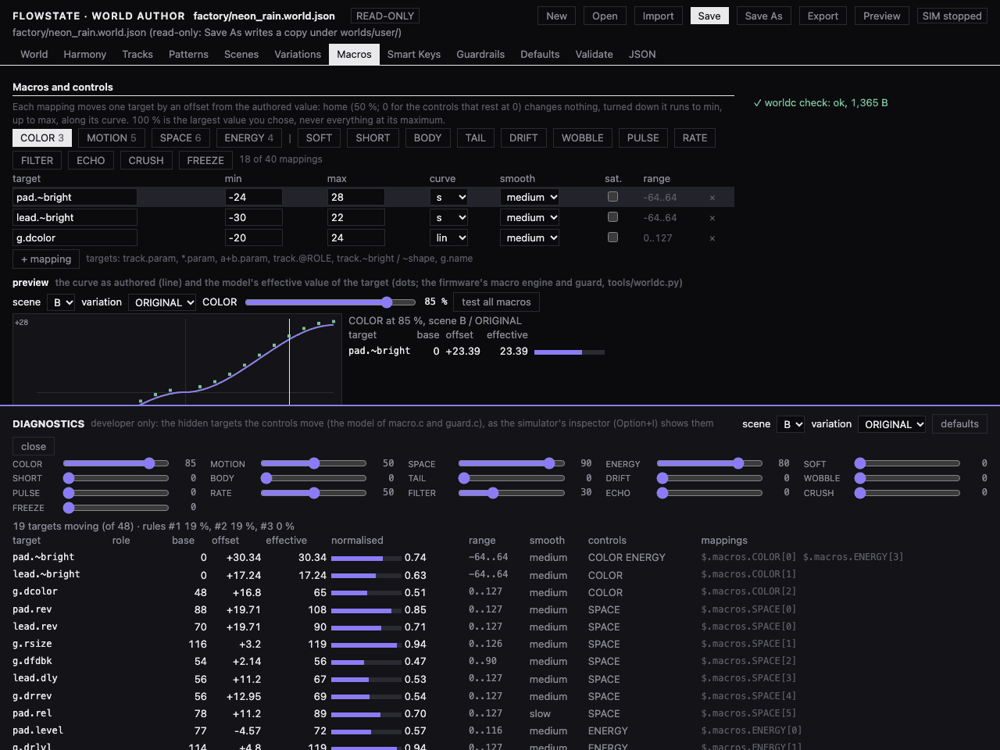

<!-- SPDX-License-Identifier: GPL-3.0-only -->
# Progress log: the Musical World firmware

One entry per phase of the plan, newest last. Each entry lists what was done, the key decisions, how it was
verified, the risks, the commits, and what comes next.

Main references:
- The architecture of SLOOP as forked: [architecture-audit.md](architecture-audit.md)
- The design that the later phases follow: [design/play-mode-architecture.md](design/play-mode-architecture.md)

---

## Phase 0: Architecture audit (2026-10-04)

**Done.** A read-only audit of SLOOP 2.1 (`e421e43`), recorded in [architecture-audit.md](architecture-audit.md).
It covers:
- the code layers, the dependency map and the audio, sequencer and UI paths;
- which code compiles on a host and which is hardware-bound;
- flash and RAM budgets;
- insertion points for Smart Keys, macros and guardrails;
- the simulator recommendation, licensing, 15 ranked risks, and the answers to all 31 questions.

**Verified.**
- The firmware builds.
- `tests/run_tests.sh` passes all 24 groups.
- The app image matches the published 2.1 apart from the build-date stamp.

**Key findings.**
- **Voices are keyed by pitch.** Two sounding notes of the same pitch cut each other off, which must be fixed before
  Smart Keys.
- **Sections A–D are the user's own project slots.**
- **Flash:** 75 KB free.
- **RAM pool:** nearly full.
- **CPU baseline:** stale.

**Commit:** `622ad2e`.

## Phase 1: Mac development environment (2026-10-05)

**Done.**
- `tools/setup-macos.sh`: one idempotent setup command.
- Pinned and SHA-256-checked downloads: the JieLi toolchain (`tools/get_toolchain.sh`) and the three AC79 SDK files
  (`tools/fetch_sdk.py`).
- The build container image is pinned by digest.
- `tools/build.py --gen-only` and `tests/run_tests.sh --host-only`: development without Docker.
- `SOURCE_DATE_EPOCH` gives reproducible builds.
- The CPU baseline was rebaselined: all 54 presets are checked again.
- [macos-development.md](macos-development.md).

**Verified.**
- A date-pinned build is byte-identical to the published `sloop-2.1.fwsc` (SHA-256 `acf2c754…`).
- The full test suite and `--host-only` both pass.
- A fresh setup run worked end to end.

**Behaviour change:** none.

**Commits:** `3f22947` to `c111286`.

## Phase 2: Host audio renderer (2026-10-05)

**Done.**

- **`host/`: the one shared host platform layer.**
  - `hal_host.h` stands in for the hardware and reuses the real `fm1_input.h`, `fm1_adc.h` and `fm1_flash.h`, so
    the key map, LEDs and flash write windows are the device's.
  - `core.c` is the host unity root, with the firmware sources included in `felucca.c` order.
  - `host.h` is a small API.
  - `Makefile` builds into `build/host-bin/`.
- **Flash.** A 1 MiB NOR image, optionally file-backed, runs the real `storage.c`, `project.c` and `upreset.c`.
- **The 64-bit hazard at `eng_sample.c:89`** is handled on the host side. The flash image is a static array placed
  above `SMP_DATA`, with an abort if that ever fails. The firmware is untouched.
- **`sloop-render`.** Renders a SLOOP project (FUN4; FUN1–3 are converted) or a song of up to 4 sections to WAV
  through the real transport. Options: `--bars`, `--seconds`, `--tail`, `--analyze`, `--check`, `--dump`, `--screen`.
  It runs about 200× realtime and the output is deterministic.
- **`sloop-examples`** builds three example projects with the real firmware API into `examples/projects/`:
  - **ambient:** 70 BPM, D major
  - **groove:** lo-fi house, 120 BPM, A minor
  - **cinematic:** 72 BPM, C minor

**Design.** [design/play-mode-architecture.md](design/play-mode-architecture.md) covers Phases 3–18. Its 16 decisions
(D1–D16) include:
- macros as a sparse overlay applied and restored inside the audio interrupt;
- the `FELUCCA_WORLD` flag, with SLOOP mode bit-identical;
- JSON World sources compiled to `FWD1` blobs of about 2 KB;
- World scenes kept separate from the user's project slots;
- white keys on the scale and black keys on the chord tones;
- a pitch reference count;
- user Worlds stored in the unused flash region.

It was aligned with the owner's UI spec, now saved as [spec/flowstate-ui-spec.pdf](spec/flowstate-ui-spec.pdf)
with a text copy alongside (design §16). The product is **Flowstate**, and the demo Worlds are Neon Rain,
Midnight Drive, Frozen Lake and Dusty Cafe.

**Verified.**
- The firmware package is still byte-identical to the published 2.1 (`SOURCE_DATE_EPOCH`).
- `./tests/run_tests.sh` passes all 25 groups (new: the host renderer group). The 83 golden renders are unchanged.
- `--host-only` passes.
- The three examples render clean: peaks between −3.2 and −4.1 dBFS, no full-scale samples, DC below 0.0005,
  identical bytes on a second render.

**Risks / open.**
- The existing tests still use their own stubs, not `hal_host.h`. Migrating them is optional and must keep the
  golden hashes.
- On the host there is no CPU model (no voice shedding, `cpu_q8` stays 0) and no MIDI or editor connection.

**Next.** Phase 3: real-time host audio. SDL2, a firmware thread feeding a lock-free FIFO, keyboard commands, and
measurements of latency, underruns, CPU and timing.

## Phase 3: Real-time host audio (2026-10-05)

**Done.** `build/host-bin/flowstate-sim` (`host/sim/`) runs the SLOOP core in real time on macOS through SDL2.

**Threads.**
- One firmware thread runs the core in lockstep, as the device's single core does: audio blocks, plus a main-loop
  pass every 22 blocks. It writes into a lock-free FIFO.
- The SDL audio callback only drains the FIFO.
- The main thread polls input and draws from a double-buffered snapshot.
- The firmware and sink threads use the macOS real-time thread policy, so they wake up about 20 µs late instead of
  1–7 ms.

**Controls.** The FM-1 panel is mapped to the computer keyboard by key position. Option-key commands give PLAY/STOP,
scene A–D on the next bar, mute tracks 1–4, filter and tempo. K1–K4 stand in for the macros until Phase 7.

**Options:** `--project`, `--demo`, `--flash` (persists the NOR image), `--buffer`, `--fifo`, `--headless`, `--fast`,
`--mute-output`, `--script` (timed commands and expectations), `--stats`, `--wav`, `--screen`, `--shot`.

**Measured (M1 Pro, built-in speakers at 48 kHz).**
- 0 underruns over 60 s at the default 672-frame buffer.
- Latency the simulator controls: about 32 ms. SDL2 keeps at least 30 ms queued in its AudioQueue, so 20–25 ms is
  not reachable with SDL. The speakers add 28 ms.
- CPU: about 1.4 % of realtime.
- The speaker clock drifts 5–11 ppm.

The full table is in [simulator.md](simulator.md).

**Verified** on the commit alone, in a clean worktree:
- A date-pinned build is byte-identical to the published 2.1.
- `./tests/run_tests.sh` passes all 26 groups. The new simulator group checks scripted PLAY, scene on the bar, mutes,
  tempo, filter, audio, the exact frame count and a clean exit, and that the real-time output is bit-identical to
  `--fast`.

**Risks / open.**
- The latency floor of SDL2 on macOS. Writing directly to CoreAudio's output unit could reach about 10 ms plus the
  device, if that is ever needed.
- On the host there is still no CPU model and no MIDI.

**Commits:** `7b21d70` to `51a95f4`.

**Next.** Phase 4: the FLOWSTATE STUDIO simulator UI (UI spec §12). Phase 5 (the World format) is already being
built in parallel.

## Phase 4: Basic simulator UI (2026-10-05)

**Done.** `flowstate-sim` opens on a **FLOWSTATE STUDIO** view laid out as UI spec §12
(screenshot: [images/studio.png](images/studio.png)). It contains:
- **The World card and chooser.** You highlight a World and load it, on the next bar while playing (design D10).
- **Scene buttons A–D**, with `NEXT BAR` / `CHANGES NEXT BAR` feedback.
- **The four macro knobs** (COLOR, MOTION, SPACE, ENERGY) with the spec's end words.
- **Performance buttons:** PLAY, REC, PULSE, BEAT and FX, with their LEDs.
- **Track strips:** mute, level and sound.
- **The keys line** and a 27-key keyboard.
- **The live 240×240 device screen.**
- **A developer inspector** (Option+I).

Tab switches to the full FM-1 panel (ADVANCED).

All of it runs from one studio model (`host/sim/studio.c`). Until the World runtime is wired in, that model fills
it with stand-ins:
- the example projects act as Worlds, and SLOOP sections as scenes;
- the macro knobs drive KNOB 1–4.

Features that arrive later carry honest labels: VAR shows "PHASE 12", SMART MELODY shows "PHASE 6".

**Verified** on the commit alone, in a clean worktree:
- A date-pinned build is byte-identical to the published 2.1.
- `./tests/run_tests.sh` passes all 26 groups. The simulator group now also scripts the Studio: a World chosen while
  another plays loads on its next bar; then scene, mute, level and macro; the Studio and ADVANCED views are drawn.

**Commits:** `5e31230` to `aaf8663`.

**Next.** Phase 5: Musical World data format. The core (format, compiler, firmware parser) is already built; the
four demo Worlds are being composed.

## Phase 5: Musical World data format (2026-10-05)

**Done.**

- **Format.** A normative byte-level spec, [design/fwd1-format.md](design/fwd1-format.md), and
  `firmware/src/world_fmt.h`, which holds the same constants. The compiler parses that header, so the format has one
  source of truth.
- **Compiler.** `tools/worldc.py`, commands `compile` / `decompile` / `check` / `names`. It reads World JSON
  ([worlds.md](worlds.md)): sounds by engine and preset name, parameters by label, drum lane strings, melodic
  degrees, chord tokens resolved against each progression, roman-numeral progressions, scenes, variations, macros,
  cross-macro rules, ENERGY tables, Smart Keys, guard and defaults.
- **Name resolution.** All names come from the firmware's own tables, via a committed
  `worlds/schema/sloop-params.json` generated by `tools/dump_params.c`.
- **Build.** `tools/gen_worlds.py` embeds `worlds/factory/*.world.json` into `build/gen/felucca_worlds.h`.
- **Firmware: `world.c` / `world_rt.h`, behind `FELUCCA_WORLD`.**
  - A bounds-checked blob parser.
  - A RAM pattern pool.
  - Stage (base → variation → scene → overrides) and commit while stopped.
  - It never touches the user's project slots.
  - Hooks, inert with no World active: `world_block`, the autosave fence, `world_boot`.
  - `preset_fill()` was factored out of `apply_preset_to`, bit-identically.
- **The four demo Worlds** of UI spec §11:

  | World | Category | Key | Tempo | Size |
  | --- | --- | --- | --- | --- |
  | NEON RAIN | cinematic | D minor | 72 BPM | 1,356 B |
  | MIDNIGHT DRIVE | synthwave | A minor | 100 BPM | 1,786 B |
  | FROZEN LAKE | ambient | E major | 66 BPM | 1,297 B |
  | DUSTY CAFE | lo-fi, swung | F major | 82 BPM | 1,428 B |

  Each has 4 scenes, 4–5 variations, ENERGY tables, macro mappings and the three cross-macro rules. All material is
  original.

**Verified.**
- `./tests/run_tests.sh` passes all 31 groups. New:
  - worldc unit tests;
  - FWD1 parser tests, including every truncation, every byte flip and 20,000 random corruptions under ASan/UBSan;
  - "World modules never name `proj_slot`";
  - the regression suite rebuilt with `FELUCCA_WORLD=1`, matching the **same** 83 goldens;
  - every factory World × scene × variation rendered through the real firmware (`tests/world_render.c`): clean
    (peak ≤ −3 dBFS), every note in the scale, registers respected, ENERGY monotonic, macro ranges safe, default
    loudness within 0.9 LU.
- `--host-only` passes.

**Sizes.**
- Firmware image: 516,452 B (+10.2 KB, including 5.9 KB of World data); about 65 KB of flash is left.
- `.bss`: +16 B today. About 11 KB more once the Phase 9 UI calls the whole World API.

**Notes / risks.**
- Until Phase 11, scenes change only while stopped, and ENERGY bands are only emulated in the test renderer.
- The factory index is sorted by category, so Phase 9 must pick NEON RAIN for first boot by id (`0x4eee4454`).
- UBSan flags a pre-existing signed left shift in `eng_analog.c:82`. It is harmless on the target and was left
  untouched.
- The compiler bug found while authoring (a variation swap whose source has no chord tokens, spanning several
  progressions) is now refused with a clear message and covered by a test.

**Commits:** `e0af0e6` to `92e4214`.

**Next.** Phase 6: Smart Keys. It starts by wiring the World runtime into the host core, renderer and Studio so the
Worlds can be heard in the simulator, then the pitch reference count, then SMART MELODY.

## Phase 6: Smart Keys (2026-10-05)

**Done.**

**Harmony.** `firmware/src/harmony.c` follows the committed progression per audio block. It names the chord in the
World's key ("Bbmaj7", "Dmadd9") and gives the chord-tone masks.

**SMART MELODY.** `firmware/src/smartkeys.c` implements design D7 and UI spec §4.
- **White keys** play the World's melody scale (pentatonic by default). The C4 key is the tonic, and they never move.
- **Black keys** play the current chord's tones, ascending in the same register.
- **Range and octaves:** notes are folded into the role range; OCT moves by octaves.
- **Note guard:** a polyphony cap.
- **MIDI in:** mapped, and remembered per incoming note.
- **PULSE with one key held:** arpeggiates chord tones.
- **Held notes** keep exactly what they sounded, whatever happens to the chord, the octave or the scene.

**Pitch reference count** (design D8; fixes audit R1). Notes of the same pitch no longer cut each other: two keys, or
a key and the sequencer.
- **Exactness:** the live-input counts, slides, ratchets and panic are handled so the counts stay exact.
- **Voice budget:** an existing SLOOP hole let a same-pitch voice reuse exceed the 8-voice budget. It is fixed in
  World mode.
- **Scope:** all of this applies only while a World is active.

**Worlds in the host tools.**
- `host/core.c` builds with `FELUCCA_WORLD 1`.
- `sloop-render --world NAME|FILE --scene --var` and `--world-sequence`.
- The Studio:
  - opens on NEON RAIN;
  - lists the factory Worlds, then the SLOOP projects;
  - uses real scene and variation names, applied on the next bar;
  - shows role-named tracks and "KEYS: SMART MELODY" with the current chord;
  - hot-reloads a World JSON while playing.
- `world_request` applies a scene/variation immediately when stopped and on the next bar while playing.
- A World switch while playing happens on the bar as stop → load → start. Seamless switching is Phase 11.

**Verified.**
- `./tests/run_tests.sh` passes all 33 groups. New:
  - `smartkeys_test`: about 20 M checks, ASan/UBSan, against an independent model of design §4.1, covering every key
    over every chord of every World. Nine deliberately injected bugs were all caught.
  - `unity_order_test`.
  - Random key-mashing over all 80 scene × variation renders: 0 notes out of key, about 60 % of them chord tones.
  - Scene, variation and World switching on the bar in the simulator.
- Both regression builds match the 83 goldens.
- `--host-only` passes.

**Sizes.**
- Image 517,992 B.
- RAM `.data` + `.bss` 64,656 B of 98,304 B. The World pattern pool (10 KB) is now reachable.

**Deviations from the design**, all inert in SLOOP mode:
- The note guard runs where the note is chosen (`key_down` / MIDI), not inside `input_on`.
- A second table, `vlive`, counts the notes the live input started.
- A range under an octave is widened to one octave.
- Smart Keys ignore the keys track's transpose and chord mode.

**Left for later.**
- SMART CHORDS / BASS / DRUMS need product decisions (target track, loop, SCL selector). Their hooks are in place.
- Key LEDs and the mode selector: Phase 9.
- Moving the note guard into `guard.c` and loop-follow: Phase 8.

**Commits:** `89a69be` to `2806141`.

**Next.** Phase 7: the performance macro engine (COLOR, MOTION, SPACE, ENERGY).

## Phase 7: Performance macro engine (2026-10-05)

**Done.**

**Macro engine** (`firmware/src/macro.c`, design §5).
- **Controls.** COLOR, MOTION, SPACE and ENERGY are positions 0–1000, taken from the World's defaults.
- **Evaluation, `macro_eval`** (main loop, on change, at most 60 Hz):
  - runs every mapping through its curve: lin, exp, log, s, late or a 9-point LUT;
  - resolves `@ROLE` against each track's engine;
  - adds the cross-macro rules, scaled by how far past their thresholds the controls are;
  - clamps to the parameter descriptors and to the hard limits in `guard_limits.h`;
  - publishes an overlay table of at most 48 slots.
- **The overlay, inside the audio ISR.** Each slot is smoothed (fast / medium / slow / stepped). The effective value
  `clamp(base + offset)` is written into `p[]`/`g[]` for the block, then the authored base is restored. The UI,
  editor and autosave never see macro values.
- **Smooth targets.** `~bright`/`~shape` reach the engines as per-voice offsets.

**ENERGY as arrangement** (`firmware/src/arrange.c`). The scene's ENERGY band, with hysteresis:
- mutes layers through SLOOP's mute fade, on the bar;
- masks drum lanes, density and synth steps, on the beat;
- plays fills on phrase ends.

The Smart Keys track is never muted.

**Host.**
- The Studio's four knobs drive the real macros.
- The Option+I inspector shows each macro's hidden mappings with live values
  ([images/inspector.png](images/inspector.png)).
- `sloop-render --ctl` and `--sweep`.

**Factory Worlds tuned.** The all-zero macro corner of three Worlds was about 22 LU under their defaults. COLOR's
minimum is now smaller and ENERGY no longer darkens, so the corner sits 2–7 LU under. The defaults are unchanged.

**Verified.** `./tests/run_tests.sh` passes all 34 groups.

`macro_test` (about 5 M checks, ASan/UBSan) covers:
- inert behaviour with no World;
- 625 macro combinations per World against an independent model;
- ranges, hard limits, and "100 % is never all-max";
- the base restored after every block;
- rules at their thresholds;
- smoothing;
- ENERGY timing and hysteresis;
- slot overflow, using a new test World.

24 injected bugs were all caught.

Every World also renders clean at every macro extreme:

| World | Worst peak | Slowest tail 6 s after STOP | ENERGY 0→1: notes | ENERGY 0→1: loudness |
| --- | --- | --- | --- | --- |
| NEON RAIN | −4.1 dBFS | −78 dBFS | 2.8× | −1.2 LU |
| MIDNIGHT DRIVE | −3.1 dBFS | −81 dBFS | 8.6× | +4.8 LU |
| FROZEN LAKE | −4.5 dBFS | −66 dBFS | 5.0× | −0.5 LU |
| DUSTY CAFE | −3.5 dBFS | −78 dBFS | 2.7× | +1.0 LU |

ENERGY makes the music fuller, not louder. Both regression builds match the 83 goldens.

**Sizes and cost.**
- Image 520,424 B (+2.4 KB).
- RAM `.data` + `.bss` 66,880 B of 98,304 B.
- The overlay costs about 1.3 instructions per moving slot per sample, at most 1.6 % of the heaviest mix.

**Deviations** (design §5.8):
- The overlay is applied before `events_block`, so mappings read at note time (such as gate) work.
- `arrange.c` (including fills) and `guard_limits.h` moved forward into this phase.

**Commits:** `9af542f` to `f1c7b8c`.

**Next.** Phase 8: the Musical Guardrail Engine. `guard.c` with soft caps, sound ranges and combinations, the note
guard moved there, read-site clamps, a CPU guard, and exhaustive macro sweeps checking clipping, runaway feedback,
silence, CPU and invalid parameters.

## Phase 8: Musical Guardrail Engine (2026-10-05)

**Done.**

**`firmware/src/guard.c`** has three areas.
- **Notes.** The note guard (range fold and polyphony cap) moved here from Smart Keys. Loop follow: an avoid note in
  the keys loop plays the nearest chord tone. The record-guard entry points that Phase 10 will call are implemented.
- **Sound.**
  - The World's GUARD soft caps and ranges apply inside each macro slot.
  - A limit on how many tracks may distort at once.
  - Six default sound combinations (for example, a big room with a long echo caps the echo), or the World's own,
    now carried in the format.
- **CPU.** UNISON and GRAIN density caps. Above the ceiling, the costly slots glide back to their base.

**Read-site clamps (H6).** The bus globals, DUST, DIST and every engine EDIT value are clamped against the hard limits
and descriptors at the point where they are read. They protect SLOOP mode too, and are no-ops for in-range values.

**`tools/worldc.py`** gains an integer-exact Python model of the macros and guard (`worldc model`). `worldc check` now
refuses:
- out-of-range or over-limit mappings;
- saturation at 100 % without an explicit `saturate`;
- more than 48 slots;
- Smart Keys ranges under an octave.

**World data fixes.** The dark variations of NEON RAIN, MIDNIGHT DRIVE and FROZEN LAKE went nearly silent at COLOR 0;
their cutoffs and levels are raised. FROZEN LAKE's echo tail is shorter. The ORIGINAL variations and defaults are
unchanged.

**Verified.**
- `./tests/run_tests.sh` passes all 35 groups. New: `guard_test`, `guard_sweep` (quick mode), `guard_mutants` (28
  injected bugs, all caught), and the Python model checked byte-identical to the C engine (13,020 slot tables).
- **Full sweep** (`SWEEP=full`): 14,800 points over every World × scene × the 4-D macro space. All clean:

  | Check | Result |
  | --- | --- |
  | Worst peak | −2.5 dBFS |
  | Tails 6 s after STOP | every one below −60 dBFS |
  | Silence while a layer plays | none |
  | Loudness jumps with a player | at most 7.6 LU |
  | CPU | at most 2,072 host instructions/sample; the guard never needed to engage |

- Both regression builds match the 83 goldens.

**Sizes.** Image 521,396 B (+1 KB).

**Deviations** (design §6.5):
- Sound combinations use the reserved GUARD byte 25, so existing Worlds get the six defaults.
- The H6 clamps cover more parameters than the design named.

**Left for later.**
- The PLAY REC record guard (Phase 10).
- LIVE ECHO's feedback limit (Phase 13).
- The `validate-world` wrapper (Phase 16).
- Calibrating the CPU budget against the device (Phase 17).
- Two Worlds pass the tail check by less than 1 dB, so a DSP change that lengthens tails will flag them.

**Commits:** `16cb839` to `d0785fd`.

**Next.** Phase 9: the PLAY MODE UI on the device: home, World browser, scenes, variations, macro overlay, record and
live FX screens; key LEDs; long-hold EDIT for Advanced Mode; first boot into NEON RAIN.

## Phase 9: PLAY MODE UI (2026-10-05)

**Done.** The device now boots into **PLAY MODE**. First boot opens NEON RAIN on the FIRST screen.

**Screens.** `firmware/src/ui_play.c` implements every UI spec screen with its texts:

| Screen | What it shows |
| --- | --- |
| FIRST | FLOWSTATE READY, PRESS PLAY |
| HOME | FLOWSTATE, World, category and scene, activity bars, KEYS: SMART MELODY, the four macros |
| Macro overlay | DARK–BRIGHT etc. bar |
| CHOOSE WORLD | list; PLAY confirms, on the next bar while playing |
| SCENES | CHANGES NEXT BAR |
| VARIATION | SAME WORLD · NEW FEEL |
| RECORDING, LOOP | the record states |
| PULSE, BEAT | lists |
| LIVE FX, SOUND SHAPE, MOVEMENT | four-knob pages |
| ADVANCED | ADVANCED MODE dialog |

Screenshots: `images/play-*.png`. Glyphs the fonts lack (▶ ■ ● ━ ✦ ⌁ › and the waveform) are drawn by hand.
Redraws are limited to changed bands: a knob detent costs about 4 ms of SPI, and HOME at rest costs 0.

**Controls.**
- PRESETS = World; SELECT = scene (GLO + SELECT = tempo within the World's range); ALGORITHM = variation.
- K1–K4 = the macros.
- ARP = PULSE (drives the keys track's arp); SEQ = BEAT.
- FX / ENV / LFO held = their pages.
- EDIT held 2 s untouched = the ADVANCED dialog.

**LEDs:** the beat, the REC states, pressed keys, and the current chord's tones dim.

**Modes.** PLAY, ADVANCED (the SLOOP UI over the World) and SLOOP. Entering PLAY parks the SLOOP project, and
LEAVE WORLD restores it **bit-identically** (tested).

**Persistence.** `world_store.c` saves the session (World, scene, variation, controls, PULSE/BEAT, octave, tempo,
mode) in the newly writable flash region `0xE5000–0xFBFFF`. Nothing is written past offset 0xF00 of a sector, which
the update loader scans for update records. SLOOP's autosave stays fenced while a World is active.

**Verified.**
- `./tests/run_tests.sh` passes all 36 groups. New: `ui_play_test`, 119 checks under ASan/UBSan, covering:
  - every screen and its texts;
  - the control map;
  - World, scene and variation on the bar;
  - timeouts;
  - the ADVANCED round trip;
  - LEAVE WORLD restoring bit-identically;
  - the session across a reboot;
  - LEDs;
  - a 20,000-frame random-input fuzz.
- Both regression builds match the 83 goldens, and the SLOOP UI tests pass.
- The fuzz found and fixed an out-of-bounds read in SLOOP's STEP page on the drum track.

**Sizes. Watch this.**
- The image is 548,764 B (+27.4 KB). About 8.2 KB of that is Phase 5–8 World code that is called for the first time
  now (before, the compiler dropped it as unused).
- About **32.8 KB** of the app slot is left.
- RAM `.data` + `.bss` 67,872 B of 98,304 B.
- Phase 18's 30-World library will need flash reclaimed: replacing the Hügelton drum one-shots (74 KB, required for
  licensing anyway) is the plan.

**Deviations** (design §8.6):
- Overlays use the whole middle of the screen.
- REC is a stand-in until Phase 10.
- BEAT swaps the drum pattern on the next bar, but the factory Worlds have no per-BEAT patterns yet.
- SAVE AS USER WORLD waits for Phase 14.
- The session is a plain 48-byte record rather than an FWD1 blob.

**Commits:** `6d22a20` to `6eeeddc`.

**Next.** Phase 10: simple record and overdub.

## Phase 10: Simple record / overdub (2026-10-05)

**Done.** `firmware/src/play_rec.c` follows UI spec §7.

**The flow.**
- REC while playing starts a take; REC while stopped arms, and a key or PLAY starts it.
- REC closes the take on the next bar. A REC just after a bar line closes on that line.
- The take becomes a 1-, 2- or 4-bar loop, depending on how many bars were played.
- REC then toggles overdub. REC held 1.5 s clears the loop.
- Beginners never see bars, steps or quantise settings.

**Gentle quantise.** Each note goes to its nearest step and keeps `(1 − quantize)` of its timing offset as micro-timing,
stored in spare step bits and played back within one block. For example, FROZEN LAKE (quantize 0.5) keeps about half
of a player's timing feel.

**Record guard.** Every recorded note goes through it:
- in key, recorded exactly as it sounded;
- no duplicate notes;
- a polyphony cap;
- clamped note lengths, with no stuck ties.

**Undo.** Four layers on EDIT: a tap is UNDO, EDIT + OCT+ is REDO. The layers are swapped rather than overwritten.

**The loop:**
- keeps its phase across scene changes and follows the harmony;
- is saved with the session, at most 690 B;
- is cleared when you switch World;
- appears as normal steps in Advanced Mode.

**Screens and LEDs.** The RECORDING screen (bar dots) and LOOP n screen (the loop's activity, PLAYING / PLAYING +
REC, UNDO READY), and the REC/EDIT LEDs, follow the real state.

**Verified.**
- `./tests/run_tests.sh` passes all 37 groups. New: `play_rec_test`, 90 checks under ASan/UBSan, covering:
  - timing at three quantize strengths;
  - the guards;
  - the late REC press;
  - layers and undo;
  - scene and chord changes;
  - reboot and World switch;
  - Advanced Mode;
  - a fuzz.
- `ui_play_test` now has 126 checks.
- SLOOP's own REC and free take are unchanged, and both regression builds match the 83 goldens.

**Sizes.**
- Image 552,724 B (+3.96 KB). **28.8 KB** of the app slot is left.
- RAM `.data` + `.bss` 70,480 B of 98,304 B.

**Deviations** (design §9.1.1):
- The loop length comes from the bars played.
- REDO is EDIT + OCT+.
- The loop is appended to the session record.

**Commits:** see `git log` after `a412d15`.

**Next.** Phase 11: the scene system polish. Seamless World switching while playing, held notes and tails across
transitions, 2- and 4-bar transitions, and BEAT masks.

## Phase 11: Scene system polish (2026-10-05)

**Done.** Scene changes and World switches now feel like part of the music. As built: design §7.1.

**Transitions** (`world.c` `wreq_block`).
- A scene lands on the bar line its `transition` names: every 1, 2 or 4 bars, or every phrase (new: `"phrase"`, the
  length of the progression playing; `"bar"` = 1), counted from the section start. A variation lands on the next bar
  line. Nothing ever commits mid-beat.
- A request while one waits replaces it, and the commit happens on the new request's line.
- A scene restarts every track from step 0 on its bar. A variation now keeps the clock running (phase-locked): only the
  tracks whose pattern changes release their notes, so a held pad note is not cut.
- SCENES says when the change lands: `CHANGES NEXT BAR`, `CHANGES IN n BARS` or `CHANGES NEXT PHRASE`. The simulator's
  Studio shows the same.
- ADVANCED: `world_immediate(1)` commits a scene or variation at the next block, with the clock running on. It is an
  API only; no Advanced control calls it yet.

**Fills.** While a scene change waits for the next bar line, that bar plays a fill: the new scene's, else the current
one's, from the beat it was asked on. It plays only while the drums play (a pattern, not muted, not left out by the
band), never with BEAT MINIMAL, and it goes through the band's lanes and density like every step.

**Seamless World switch.** The Phase 6 stop → load → start is gone.
- `world_service` decodes the next World's patterns into the existing pool while the old World plays on from `trk[]`.
  The pool is read only at commits, BEAT swaps and fills, and none of them can happen meanwhile. No second 10 KB pool.
- The new World's default scene is staged; the ISR commits it on the next bar with no transport stop.
- The FX buses are untouched, so tails ring on. The old voices release (or fade on an engine change), held keys are
  released, the keys loop and its ring are cleared (D14), and the new tempo applies from the bar.
- The macros go to the new World's defaults and the overlay ramps in from neutral. The main loop's macro evaluation
  waits until the commit (`wrt.swp`).
- From SLOOP while playing it is still a stop, then the World and PLAY.

**Smoothness.**
- While playing, a commit glides the values that click when they jump: level, pan, DIST, the sends, the engine's
  continuous EDIT values when the engine stays, and the bus globals (reverb, delay feedback and mix, DUST, the DJ
  filter...). The glide covers about 50 ms (`macro.c` `wgl_*`).
- In a World, each part's level and pan gains and the delay mix ramp per sample over every block, so neither a glide,
  a macro nor a knob zippers.
- A delay time change crossfades the old tap into the new one over 46 ms (`fx.c`).
- Harmony, key maps, swing and the patterns flip exactly on the bar.
- SLOOP mode is untouched.

**BEAT.** A BEAT the scene has no pattern for plays its GROOVE through a mask, intersected with the band's:
- MINIMAL: kick, kick 2, snare, clap and rim.
- BUSY: every density step, and the ratchets.
- BREAK: kick, kick 2, snare and snare 2, with the hats on the second eighth of each beat.

A BEAT changes on the next bar line. PULSE was already as design §9.2.

**Verified.**
- `./tests/run_tests.sh` passes all 38 groups. New: `scene_test`, 105 checks under ASan/UBSan, and the compiler's
  transition checks (`worldc_test`):
  - every factory World with a keys loop and a held key, through A→B, B→C, C→D, D→A and 12 random requests (some
    replaced on their way): each commit on the first block of its line, a scene from step 0 once, a variation
    phase-locked, the held key sounding on, the loop in phase, nothing left after STOP;
  - fills, four World switches, BEAT masks, ADVANCED's immediate commits, a phrase transition, the glides.
- `ui_play_test`, `play_rec_test`, `guard_test`, `macro_test` and `smartkeys_test` were updated for the 2- and 4-bar
  transitions and the glides. The simulator's script checks that NEON RAIN's C waits for its 2-bar line.
- Both regression builds match the 83 goldens.

Clicks and tails:

| Measurement | Result |
| --- | --- |
| Largest sample step at a commit over the render's largest elsewhere | 0.38–0.81× (scenes), 0.52× (switches) |
| The wet bus, 12 ms after a commit over 12 ms before | at worst −4.7 dB |
| The quietest 5 ms around a World switch | −36 dBFS (no gap) |
| Lone held note: a level / pan / delay-mix jump as before Phase 11 | 2.70× (a click) |
| Lone held note: the same jump through a commit | 0.87× |
| Lone held note: a delay time jump without the crossfade | 7.75× on the wet bus |
| Lone held note: the same change crossfaded | 1.00× |

**Renders for the owner.** `build/renders/worlds/<id>-scenes.wav` for each factory World: A, B, C, D on their lines
while playing, a key held across two changes, then a switch to the next World, STOP and a tail. 30–54 s each, peaks
−3.6 to −3.8 dBFS, nothing at full scale, every commit clean.

**Sizes.**
- Image 555,008 B (+2,284 B). **26.5 KB** of the app slot is left.
- RAM `.data` + `.bss` 71,088 B of 98,304 B (+608 B).

**Deviations** (design §7.1):
- `"phrase"` and `"bar"` transitions were added to the format.
- A variation no longer restarts the clock.
- The overlay ramps in from neutral rather than gliding from the old World's targets (those are other parameters).
- No fill leads into a World switch, because the pool already holds the next World.

**Left for later.**
- A control for ADVANCED's immediate transitions (Phase 14).
- The factory Worlds author no per-BEAT patterns yet.
- Sends, DIST and engine values step per block while they glide (they feed the buses or the voices, where it is not
  heard); enum values change at once.
- A World switch asked for while playing, then STOP before its bar, waits for PLAY and lands on bar 0 (a stopped
  request loads at once, as before).

**Next.** Phase 12: variations.

## Phase 12: Variations (2026-10-05)

**Done.** Curated variations that keep the World's identity, now with their own macro defaults. As built: design §7.2.

**Macro defaults.** A variation can carry positions for COLOR, MOTION, SPACE and ENERGY: `"macros": {"SPACE": 0.7}`.
- In the blob they are VARS pairs of a new scope (`WF_SCOPE_CTL`: the macro, a `u8` position). Old blobs stay valid.
- When a variation lands (or a World loads), each macro the player has not turned since the World loaded goes to the
  variation's default, or to the World's default when the variation names none. A macro the player turned stays.
- While playing, the overlay glides there; nothing snaps.
- ORIGINAL therefore brings back the World's defaults for the untouched macros.

**Identity** (`worldc`). The format already left a variation no tempo, key, scale, progression, swing, drum groove or
Smart Keys setting. The compiler now also:
- refuses `tempo`, `key`, `scale`, `progression`, `swing`, `beat`, `patterns` and `smart_keys` in a variation, with the
  reason (the schema's `x-refused`);
- requires a `swap` to keep the length class: the same length, or whole bars of which one divides the other;
- warns when a variation changes more than two tracks of the groove at once (swapped patterns plus the drum kit).

**Factory Worlds.** Each keeps ORIGINAL + 4, with at least one tone or space variation and one rhythm or arrangement
one. ORIGINAL and the defaults are unchanged.

| World | Tone / space | Rhythm / arrangement | Macro defaults added |
| --- | --- | --- | --- |
| NEON RAIN | DREAMY, DARK | PULSING (pad and bass patterns), HEAVY | DREAMY SPACE .70, DARK COLOR .35, PULSING MOTION .65 |
| MIDNIGHT DRIVE | DREAMY, DARK | DRIVING (16th bass), HEAVY | DRIVING MOTION .62, DREAMY SPACE .68, DARK COLOR .35 |
| FROZEN LAKE | AIRY, FLOATING, DARK | SPARSE | AIRY SPACE .66 COLOR .58, FLOATING MOTION .65 SPACE .60, DARK COLOR .35 |
| DUSTY CAFE | DREAMY, AIRY, DARK | SPARSE (sparse keys, root bass) | DREAMY SPACE .68, AIRY COLOR .58 SPACE .60, DARK COLOR .38, SPARSE MOTION .40 |

Some variations were far louder than ORIGINAL: MIDNIGHT DRIVE's DREAMY and DARK put the chords at level 100 (up to
+8.3 LU), and FROZEN LAKE's DARK reached +4.2 LU. Their levels are lowered (chords 84, HEAVY's chords 74; FROZEN LAKE's
DARK pad 78, texture 84). Every variation now sits within 2.5 LU of ORIGINAL in every scene. Blobs: 1,315–1,801 B.

**UI.** VARIATION n already follows the list order, and the Studio's VAR selector shows the names; nothing changed.

**Verified.**
- `./tests/run_tests.sh` passes all 38 groups.
- `worldc_test`: macro defaults (encoding, round trip, errors), the refused fields, the fixed and structural
  parameters, the swap's length class, the groove warning.
- `world_render --var all` now checks each variation within 3 LU of ORIGINAL per scene: at most +2.43 LU.
- `scene_test` has 145 checks (+40). Its new `variations` scenario covers every factory World with ORIGINAL / each
  variation / ORIGINAL / each on the bars while playing:
  - each change on the next bar line, the clock running on;
  - the same tempo and progression throughout;
  - every sequencer note in the World's scale;
  - the macros at the variation's defaults, gliding in (no table snaps);
  - back to ORIGINAL's parameters, patterns, positions and progression exactly, eight times per World;
  - a macro the player turned left alone;
  - nothing left after STOP.
- Clicks at variation changes: 0.46×, 0.46×, 0.80× and 1.06× the largest step elsewhere. DUSTY CAFE's DARK brings the
  BOOMBAP kit, and its first downbeat sounds before the darker filter and COLOR have glided in. A kit changed straight in
  at a bar line shows no excess, and the lone-note smoothing test finds no click, so the tolerance here is 1.25×.
- `ui_play_test`: the restored session's COLOR is now AIRY's default minus the player's three detents.
- Both regression builds match the 83 goldens.

**Sizes.** Image 555,328 B (+320 B, with the factory data). **26.2 KB** of the app slot is left. RAM `.data` + `.bss`
71,104 B (+16 B).

**Deviations.**
- "Untouched" means since the last World load. A restored session counts as the player's.
- The macro defaults cover the four macros only, not SOUND SHAPE or MOVEMENT.
- `guard_sweep` needed no change: it sets the positions itself, and `world_render` renders every variation at its own
  defaults with the clean checks.

**Next.** Phase 13.

## Phase 13: LIVE FX, SOUND SHAPE and MOVEMENT (2026-10-05)

**Done.** The twelve controls behind FX, ENV and LFO now do something, with beginner names on the pages and their
bounds in the guard. As built: design §9.5. Bounds and measurements:
[guardrails.md §2.7](guardrails.md#27-live-fx-sound-shape-and-movement-phase-13).

**Built-in mappings** (`world_fmt.h` `WF_CTL_BUILTIN`, 22 MAPS records evaluated by `macro.c` after the World's own).
A World's `controls` that name a control replace all of its built-in records (the format already had `controls`).
`tools/worldc.py`'s model reads the same table, so the slot dump stays byte-identical.

| Control | Moves | At 100 % | Class |
| --- | --- | --- | --- |
| SOFT | keys `atk` | +70 (exp) | medium |
| SHORT | keys `dec` / `rel` / `sus` | −40 / −50 / −60 | medium |
| BODY | keys `sus` / `dec` / `@BODY` | +40 / +30 / +30 | medium |
| TAIL | keys `rel` / `rev` | +56 / +35 (s) | medium |
| DRIFT | keys `ld_pit` / `ld_flt` / `@DETUNE` | +2 (late) / +10 / +15 | slow |
| WOBBLE | keys `ld_flt` | +45 | slow |
| PULSE | keys `ld_amp` | +70 | slow |
| RATE (home 50 %) | keys `lrate` | ±24 | slow |
| FILTER (home 50 %) | `g.filt`: left low-pass, right high-pass (SLOOP's DJ filter, resonance fixed) | −64 / +63 | medium |
| ECHO | `g.dmix` / `*.dly` / `g.dfdbk` (the World's tempo-synced time) | +40 / +60 / +30 | medium |
| CRUSH | `g.dust`, with `*.level` and the drums −5 (gain compensation) | +90 | medium |
| FREEZE | the punch engine's loop: off under 25 %, then 1 beat, ½, ¼ | — | 64-sample fade |

"keys" is the Smart Keys track. SOUND SHAPE and MOVEMENT keep their positions in the session; LIVE FX is momentary.

**Safety.**
- **ECHO.** While it is up, `guard.c guard_live` holds two combinations whatever the World's GUARD says
  (`WF_COMBO_LIVE`): feedback ≤ `GL_ECHO_DFDBK` (96, 0.67 a repeat), and ≤ 72 in a big room (`g.rsize` > 104). The
  World's `max_dfdbk` applies too. The factory Worlds land at 72–80.
- **CRUSH.** DUST stays under `max_dust`; on a part distorted past 80 it stays ≤ 64.
- **The Smart Keys windows** (`guard_limits.h` `GL_K*`, on every slot of that track):
  - attack ≤ 0.59 s, decay ≥ 58 ms, release 25 ms–1.9 s;
  - LFO pitch ±4 (±0.75 st, the most NEON RAIN's MOTION reaches), filter ±48, tremolo ≤ 80, rate 0.12–9.6 Hz.

  So MOTION and MOVEMENT together stay musical. A base the World put outside a window stays.
- **FREEZE** (`macro.c live_freeze`, main loop). It plays only while FX is held in PLAY MODE. A held white key's punch
  FX wins, and FREEZE comes back after it. FX let go, the knob under 25 %, ADVANCED, SLOOP or no World withdraw it. It
  only ever withdraws its own request, so SLOOP's punch FX are untouched. The loop reads the punch ring: no new buffer.
- **Release.** FX let go (`ui_play.c`), any mode change (`pl_ui_reset`) or a restored session sends the four home. The
  overlay ramps them (medium): home in 276–320 ms, at most 2 steps a block.
- **CPU.** The guard's estimate now counts the DJ filter (66), a punch effect (96) and DUST the overlay moves.
- **Untouched pages are invisible.** A built-in control at home adds no slot and no smoothing class, so every World
  sounds and glides exactly as before while the pages are untouched (NEON RAIN's MOTION on the lead's pitch LFO keeps
  its medium class until DRIFT is turned).

**A punch engine fix** (`punch.c`, one line). When a fade-out ended inside a block, the wet gain climbed back for the
rest of it, so the next effect started up to half wet: a click on every later punch FX, in SLOOP too. The target is
now 0 while nothing plays. The FREEZE stress test found it; no golden changed.

**Pages.** The screens were already there (Phase 9). [play-livefx.png](images/play-livefx.png),
[play-shape.png](images/play-shape.png) and [play-movement.png](images/play-movement.png) are now taken from the real
state at the UI spec's values.

**Verified.**
- `./tests/run_tests.sh` passes all 39 groups.
- New `livefx_test` (35 checks, ASan/UBSan, on world_render's harness):
  - every control 4..15 at 0 / 0.5 / 1 on every factory World and full.world: inside descriptors, ranges and windows;
    home exactly the default table; the ECHO caps, CRUSH's compensation and DUST cap, FILTER's sides; a World's
    `controls` replacing the built-in ones;
  - FREEZE and the white keys; ADVANCED, SLOOP, a mode change, an unloaded World;
  - a FILTER sweep while playing: peak −4.5 dBFS, no wrap, the filter's state bounded;
  - FREEZE engaged and let go 1,038 times at random while playing, keys over it: never stuck, the right loop, keys
    untouched, dry within 3 blocks; afterwards the output equals the render without it, bit for bit;
  - FX let go with all four at 100 %: no click (0.07–0.70× the dry render's largest step);
  - renders with a player:

    | World | ECHO + SPACE: tail 10 s after STOP | CRUSH against dry |
    | --- | --- | --- |
    | NEON RAIN | −74.7 dBFS | +0.93 LU |
    | MIDNIGHT DRIVE | −80.8 dBFS | +0.96 LU |
    | FROZEN LAKE | −73.4 dBFS | +0.65 LU |
    | DUSTY CAFE | −78.3 dBFS | −1.37 LU |

  - SOUND SHAPE, SHORT alone, MOVEMENT (RATE up and down), everything with MOTION, FILTER at 0 and 1: clean on every
    factory World (worst peak −3.35 dBFS, tails under −72 dBFS 6 s after STOP);
  - cost (-O2): everything of Phase 13 at 100 % adds 192–396 host instructions a sample (at most 1,575 of 2,300).
- `ui_play_test` (139 checks, +13): a new `livefx` scenario through the panel (FREEZE on K4, REVERSE on a white key
  over it, FX let go with all four up, FREEZE into ADVANCED, the pages' positions kept). `persist` now also checks
  MOVEMENT kept across a reboot and LIVE FX home.
- The quick guard sweep adds the corners of controls 4..15 with the macros at 100 % (16 points a World, 1,488 in all),
  all clean. The C slot tables still equal `worldc.py model`'s.
- `macro_test`'s independent model now includes the built-in mappings and the Smart Keys windows (full.world's SHORT
  default moves three keys slots).
- Both regression builds match the 83 goldens; `punch_test` passes with the fix.

**Sizes.** Image 556,192 B (+864 B). **25.4 KB** of the app slot is left. RAM `.data` + `.bss` 71,104 B (+0: no new
buffer; FREEZE uses the punch ring).

**Deviations** (design §9.5):
- ECHO is gentler than the design (+40 / +60 / +30, not +60 / +70 / +40) and the big-room cap is new: at 66–72 BPM a
  1/4 echo still sounded at −36 dBFS 6 s after STOP.
- LIVE FX ramps home over about 300 ms (class medium), not 30 ms (fast): the owner's 100–300 ms.
- CRUSH carries level cuts (data, as ENERGY's gain compensation): within 1.4 LU of dry.
- The built-in mappings move the Smart Keys track only. The format has no `controls.<page>.tracks`; a World that
  wants other tracks names the control in `controls`.
- RATE moves SLOOP's LFO rate in Hz steps: the LFO has no tempo sync.
- FREEZE fades over the punch engine's 64 samples (1.5 ms).
- A restored session leaves LIVE FX home (all 16 positions are still written).

**Left for later.**
- STUTTER, REVERSE, TAPE STOP and LOOP stay on the white keys while FX is held (SLOOP's punch FX). No knob for them yet.
- The full sweep (`SWEEP=full`) does not visit controls 4..15. Only `livefx_test` and `ui_play_test` play FREEZE.
- LIVE ECHO at 100 % held through STOP needs up to about 8 s to fall under −60 dBFS at a slow tempo.
- CPU costs are host instructions; Phase 17 calibrates them on the device.

**Next.** Phase 14: Advanced Mode and user Worlds.

## Phase 14: Advanced Mode and user Worlds (2026-10-05)

**Done.** Advanced Mode's edits now stay with the World, and a player can keep them as a **user World**. Factory
Worlds are never written. As built: design §10.5; player rules: [worlds.md §20](worlds.md#20-user-worlds-my-worlds).

**The device edits sounds, patterns and the mix; the Mac tool edits structure.** Advanced Mode is SLOOP's UI over the
World, so it can change engines, presets, every track parameter, sends and globals, steps, drum hits, pattern lengths
and the keys loop. Macros, rules, ENERGY, GUARD, scenes, variations and progressions are edited in JSON (Phase 15).

**Edit capture** (`world.c world_capture`). It runs on leaving ADVANCED, before SAVE + a scene key in it, before a save,
and for LEAVE WORLD's question.
- The glides are finished. The steps playing go back into their pool entries, with each entry's length and division
  (`wpl`).
- The reference is the stage of the scene and variation playing, without the parameter overrides.
- A synth track's changed engine or preset becomes a sound record. Each changed parameter or whitelisted global
  becomes a record with its value.
- A value set back to the reference drops its record. An untouched value keeps its old record, so an edit made in
  scene A survives a visit to scene B.
- At most 64 parameter records plus one sound per synth track: more shows `TOO MANY EDITS`.

Leaving ADVANCED with edits shows `EDITS KEPT · SAVE TO KEEP`, and the World plays them.

**How edits compose** (`world_stage`, fwd1-format §16). The order is base (the player's sound, else the variation's
swap, else TRACKS) → TRACKS pairs → variation → scene → **overrides** → pattern (with its edited length) → keys track
→ clamp. So an edit applies in every scene and every variation. With another engine, the World's, variation's and
scene's pairs on that track's `P_E*` are skipped, and so are its MAPS on raw `P_E*` (`wrt.eo`). Role mappings follow
the new engine.

**User Worlds** (`world_store.c`; D12). Ten slots, `OBJ_UWORLD0..9` at `0xE5000 + 0x2000 k`, each with copies A and B.
- **The blob.** A whole FWD1 blob with flag USER (`world_encode`), so it needs no factory World and survives a later
  firmware changing the one it came from. Every section of the source is copied, except META (name, `MY WORLDS`,
  tempo), PATTERNS (the pool re-encoded, plus the keys loop as one more pattern), KEYS `loop_pat`, DEFAULTS (scene,
  variation, 12 controls, PULSE, BEAT) and the new **OVERRIDES** section (type 15, USER blobs only: `{scope, id,
  value}`, scope `128 + t` = a sound).
- **Size.** At most 3,584 B, so nothing is ever programmed at offset 0xF00 of a sector. The encoder runs `wb_check`
  on its own output.
- **Id and name.** The id is FNV-1a of the name. The name is automatic: `NEON RAIN 2`, then the next free number
  (`MIDNIGHT DRI 10`).
- **RAM.** Two 3,584 B buffers: the user World playing and the next one (the design budgeted 7,680 B).

**SAVE list** (PLAY MODE, SAVE button). Saving needs the transport stopped (`STOP TO SAVE`).
- **SAVE AS USER WORLD** uses the first free slot; `MY WORLDS FULL` when all ten are used.
- **SAVE** saves over the user World loaded; on a factory World it is SAVE AS.
- **RESET WORLD** asks first. A factory World loads again without edits or loop; a user World loads as last saved,
  on the bar while playing.
- **DELETE USER WORLD** asks first and erases both copies; the World plays on. On a factory World it shows
  `NOT A USER WORLD`.
- A World over 3,584 B shows `WORLD TOO BIG` and nothing is written.
- **CHOOSE WORLD** shows a `MY WORLDS` row after the factory Worlds, then the user Worlds. They load like a factory
  World, at their saved control positions.
- **The session** names a user World by slot + 1 and id (`wplay_t uslot`). A slot that is empty, damaged or saved over
  with another World falls back to NEON RAIN (`WORLD NOT FOUND`).

**Advanced polish.**
- SAVE + white key 5 in ADVANCED toggles immediate scene and variation changes (`SCENES: AT ONCE` /
  `SCENES: ON THEIR BAR`). It is off at every entry, and PLAY ignores it.
- With unsaved edits or loop, the menu's LEAVE WORLD reads `LEAVE WORLD? NOT SAVED`, and OK again leaves.

**Host.** `host_world_user`, `host_world_user_load`, `host_world_user_save` and `host_world_user_gen` go through the
device's own functions. The simulator's Studio lists MY WORLDS after the projects, follows the device's saves and
deletes, and loads them. The script commands `save` and `saveas` are the SAVE list's rows. With `--flash` the user
Worlds and the session survive a restart (checked: saved, quit, started again, NEON RAIN 2 loads).
`host/hal_host.h` records the lowest and highest byte written (`host_nor_lo` / `_hi`).

**Verified.**
- `./tests/run_tests.sh` and `--host-only` pass every group. New: `userworld_test`, 52 checks under ASan/UBSan, covering:
  - ADVANCED edits (levels, a send, a global, another engine with preset 1, a step, a drum hit, a length) captured as
    7 overrides, and the World playing them;
  - a variation and back, a scene and back: the same instrument exactly (parameters, sounds, steps, globals, pool);
  - an edit in scene B keeping scene A's;
  - scenes on their bars while playing;
  - SAVE + key 5: a scene in the next block, then on its bar line again;
  - 84 more edits: `TOO MANY EDITS`;
  - SAVE AS twice (`NEON RAIN 2`, `3`): writes only inside slot 1's sectors (0xE5000–0xE6FFF), 1,426 B, offset
    0xF00–0xFFF erased;
  - a reboot of the flash image: MY WORLDS lists both, the session's World is the user World, and loading it gives
    the same state and a **bit-identical render** (3,000 blocks) as before the reboot;
  - a slot damaged in both copies and a valid object holding no World: neither listed nor loaded; the session falls
    back to NEON RAIN;
  - 10 slots, then `MY WORLDS FULL` with nothing written;
  - SAVE over a user World (only its slot written), DELETE (asks; both copies erased), DELETE on a factory World;
  - dense patterns: `WORLD TOO BIG` with nothing written;
  - RESET WORLD (asks; a knob disarms it) equal to a fresh boot's NEON RAIN in state and **render**; a user World's
    RESET back to its save;
  - LEAVE WORLD with edits asking first, then the SLOOP project bit-identical; without edits, leaving at once.
- `ui_play_test` (141 checks, +2): SAVE + key 5 toggles, key 6 (store) is still refused. `scene_test`'s ADVANCED
  scenario turns immediate transitions on after entering (entering turns them off).
- Both regression builds match the 83 goldens; SLOOP mode is untouched.

**Sizes.** Image 560,568 B (+4,376 B, over the 4 KB target by 280 B). **21.0 KB** of the app slot is left. RAM
`.data` + `.bss` 78,736 B of 98,304 B (+7,632 B: the two blob buffers 7,168, the override table, the MY WORLDS list).

**Deviations** (design §10.5):
- The overrides are captured against the stage without them, keeping untouched old records, not a plain diff.
- Sound overrides are OVERRIDES records.
- A user World is self-contained, at most 3,584 B.
- SAVE does not ask; RESET and DELETE do.
- A full MY WORLDS refuses rather than letting PRESETS pick a slot.
- The session keeps the World by slot and id, not the unsaved overrides (they last until power-off).
- A blob with an index out of range is refused, not loaded with preset 0.
- A user World loads at its saved control positions.

**Left for later.**
- Unsaved edits are not in the session: a power cycle loses them (the toast says SAVE TO KEEP).
- CHOOSE WORLD asks nothing before leaving a World with unsaved edits. Only LEAVE WORLD asks.
- worldc's decoder does not read OVERRIDES yet (Phase 15's Mac tool), nor rename user Worlds.
- GUARD ranges on raw `P_E*` still apply to a track playing another engine (a clamp, never louder).
- Phase 17 should check on hardware that the update loader and recovery leave `0xE5000–0xF8FFF` alone (Q2).

**Next.** Phase 15: the authoring tool.

## Phase 16: Automated World validation (2026-10-05)

*Built before Phase 15 on purpose: the authoring tool uses it for "test all macros / estimate CPU / estimate flash".*

**Done.** `tools/validate-world` (a wrapper for `tools/validate_world.py`) validates World files, directories or
factory ids. It prints the 17-item checklist of the owner's spec:
- metadata, presets, engines, patterns, scenes, variation, scale, harmony, Smart Keys, macro ranges, Guardrails;
- CPU budget, RAM budget, flash budget;
- no clipping, no invalid feedback, no invalid parameter IDs.

It exits 1 on any failure. `--json` gives a `validate-world/1` report for the authoring tool. Guide:
[validation.md](validation.md).

**How.**
- **Static items** come from `worldc.py`'s compiler and model; its messages are mapped onto items by JSON path.
- **Render items** come from `tests/guard_sweep.c` over the macro grid:
  - quick: 372 renders, about 5 s per World;
  - `--full`: every scene × variation × the 4-D grid, plus the corners of controls 4–15; about 40 s.
- **Budgets:**
  - pattern pool: 16;
  - overlay targets: 48 (also checked with every control up);
  - blob: 3,072 B factory / 3,840 B user;
  - CPU: 2,300 host instructions/sample mean, 2,700 for a DMA half;
  - the factory set: at most 50 % of the app-slot room the code leaves.

**Verified.**
- `tests/validate_test.py` (about 20 s):
  - the four factory Worlds pass all 17 items;
  - 19 Worlds in `worlds/test/bad` each fail exactly their item, one of them (a runaway echo) only in the render;
  - the JSON schema;
  - every failure keyword of the sweep reaching its item.
- NEON RAIN `--full`: 4,072 renders, clean. Worst tail −60.2 dBFS; loudness jumps 7.2 / 11.6 LU.

**Left for later.**
- The per-World decompile round trip and parser fuzz, per-chord Smart Keys ranges and the ENERGY loudness rule stay
  in `run_tests.sh`.
- Phase 17 recalibrates the CPU limits.
- `FACTORY_SHARE` needs revisiting when Phase 18 frees flash.

**Commit:** `cebcbcb`.

**Next.** Phase 15: the World authoring tool. Then Phase 17 (hardware, which needs the owner's FM-1) and Phase 18
(the factory library).

## Phase 15: The World authoring tool (2026-10-05)

*Built after Phase 16, whose `validate-world --json` it runs to test all macros and to estimate CPU and flash.*

**Done.** `./tools/world-author` opens a local web page that edits Musical Worlds, checks them as you type, and plays
them in the simulator. JSON stays the source of truth (D16). As built: design §12.2.1. Guide:
[authoring.md](authoring.md).

**The server** (`tools/world_author.py`, stdlib).
- It listens on 127.0.0.1, on a free port, and opens the page (`open`; `--no-browser`). It answers only its own Host
  and JSON bodies, and serves `web/author.html` and `/api/...` only.
- **Files** are refs into `worlds/factory`, `worlds/user` and the directory given. A traversal is refused (403).
  The factory Worlds are read-only unless `--allow-factory`: Save As writes a copy under `worlds/user/`.
- **Saves** are atomic, and refuse a file changed on disk since it was loaded. The layout is stable: keys in the
  guide's order, named entries in the author's order (the variations' order is meaningful), a value on one line when
  it fits, drum lanes one a line. The four factory files reformat to the same JSON, and a second save changes
  nothing.
- **The API:** state, list, load, save, new (a template that validates clean: 17 items, 561 B), names, check (errors
  with JSON paths and checklist items), compile, model (worldc's `Model` at any positions, batched), harmony (chord
  names as harmony.c spells them, tones, the 27 Smart Keys over every chord, as smartkeys.c maps them), pattern (the
  steps as compiled), validate (a background job: `--static`, then quick or `--full`), job, export (`build/author/<id>/`:
  `.wblob`, a C array, the JSON), import, preview.
- **Preview** spawns `build/host-bin/flowstate-sim --world FILE` once and keeps it; it reloads the file on every save.
  Without the binary it says `make -C host`.

**The page** (`web/author.html`, one file, 1,690 lines). No library, no URL: a CSP allows only its server. It has 12
tabs:

| Tab | Covers (the owner's list) |
| --- | --- |
| World | title, category, BPM and its range, key, scale, swing (1–6) |
| Harmony | progressions as chips with their chord names, beats, a palette of numerals (7) |
| Tracks | role, engine, the presets of that engine, the drum kit, parameters with their ranges, global FX (8, 9, 11) |
| Patterns | a drum lane grid (16/32/64, `x X s g 2 3 4`), a melodic step editor, and a roll of the notes as compiled (10) |
| Scenes | A–D: progression, ENERGY, transition, fill, patterns (drums per BEAT), params, FX (12) |
| Variations | ORIGINAL and up to 7: sounds, params, FX, swaps, energy bias, macro defaults (13) |
| Macros | COLOR, MOTION, SPACE, ENERGY and the 12 controls; built-in mappings shown; curve plot with the model's values; test all macros; rules, curves, ENERGY tables (14–18, 22) |
| Smart Keys | track, mode, melody scale, tonic, range, white and black keys; the 27 keys over any chord (19) |
| Guardrails | every GUARD field with its default, safe ranges, combinations (18, 20) |
| Defaults | scene, variation, PULSE, BEAT, the 12 positions |
| Validate | the 17 items, the CPU, flash and RAM budget bars (22–24) |
| JSON | the source itself, for anything else |

Around the tabs:
- **The problems panel** lists worldc's errors and warnings on every edit. A click goes to the field, which is
  outlined, and the tabs count their errors.
- **Save, Save As, Export, Import** (item 25) and **Preview** (item 21) are in the header.
- **The diagnostics drawer** (Alt+D, hidden by default) shows every hidden target at chosen positions of the 16
  controls: base, offset, effective, normalised, range, smoothing, mappings.

**worldc** (Phase 14's leftovers).
- The decoder reads OVERRIDES on a USER blob.
- `worldc import USER.wblob` folds them into a source: engine and preset, track parameters, globals, swing, kit.
  The scene and variation values they win over are dropped, and the keys loop is left out.
- `worldc rename BLOB NAME` rewrites the name, a user World's id and the CRC.

**The Studio fix** (`host/sim`, promised to the owner). While FX, ENV or LFO is held (keyboard, mouse or latched), the
Studio's four knobs, the wheel and Shift+Z/X … M/, turn the device's KNOB 1–4.
- **The routing.** `studio.c` checks `host_play_page`. The firmware's LIVE FX, SOUND SHAPE or MOVEMENT page gets the
  turns, with the device's acceleration.
- **The labels.** The knob row shows that page's four (FILTER ECHO CRUSH FREEZE, SOFT SHORT BODY TAIL, DRIFT WOBBLE
  PULSE RATE) with their values. Let go, they are COLOR, MOTION, SPACE and ENERGY again.
- **Scripts.** `expect` gains `ctl1..ctl16` and `page`.

**Verified.**
- `./tests/run_tests.sh` and `--host-only` pass every group. New: the authoring group, `tests/author_test.py`, 125
  checks in about 5 s:
  - the layout on the factory Worlds;
  - every endpoint over a temp copy of `worlds/`;
  - the model against worldc's `Model`, target for target;
  - the harmony's chords and keys;
  - a quick validation of NEON RAIN as a job;
  - the export bytes against worldc;
  - an import;
  - the preview with no simulator, and a stand-in spawned once, reused and stopped;
  - the refusals: factory write, 7 traversals, a foreign Host, a non-JSON body, unknown routes;
  - the page: it parses, it calls only existing APIs and every one of them, it names no URL;
  - its notation helpers in node's vm against worldc: scanning, steps, chords, curves, the drum strings.
- `worldc_test` adds `user_blobs`: OVERRIDES decoded and refused without USER, import, rename, and both CLIs.
- The simulator group checks 33 Studio expectations (+9): FILTER turned with FX held, COLOR untouched, FILTER home on
  release, SHORT turned with ENV held and kept.
- **The page in a browser** (headless Chrome, no window): `?selftest=1` renders every tab, the macro test and the
  drawer without an error on the four factory Worlds and the template. `docs/images/author.png` is taken the same
  way.

**Sizes.** No firmware source changes in this phase.

**Deviations** (design §12.2):
- A stable canonical order, not `sort_keys`, which would reorder the variations.
- `worldc check` runs on every edit as well as on save.
- The simulator's `--world FILE` already hot-reloads: no `--author` flag.
- Validate runs static, quick or full as a job, not a separate "Sweep".
- The melodic editor is text plus a step grid; the roll shows the compiled notes and is not edited by drawing.
- The page shows the macros through the model; the running simulator is turned in its own window.

**Left for later.**
- No live control channel from the page to the running simulator (macro positions, scene changes).
- Import reads a blob file. MY WORLDS cannot be read from a simulator flash image (`--flash`) yet.
- One World at a time, and no undo history beyond the fields and the JSON tab.
- Tested in headless Chrome only (Safari and Firefox not tried). The owner's hands-on pass of the workflow is still to
  come.

**Next.** Phase 17 (hardware, which needs the owner's FM-1) and Phase 18 (the factory library).
