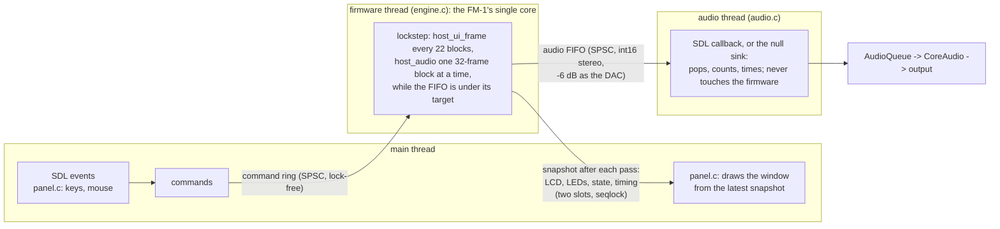

<!-- SPDX-License-Identifier: GPL-3.0-only -->
# The real-time simulator (`flowstate-sim`)

`build/host-bin/flowstate-sim` runs the FM-1 firmware in real time on a Mac. The firmware is SLOOP 2.1, the shared
core of Flowstate: its engines, sequencer, FX, UI and flash. The window shows the LCD and the panel, the computer
keyboard and the mouse play it, and the audio goes to the default output.

The simulator is the host layer of Phase 2: `host/core.c` and `host/hal_host.h`, used through `host/host.h`. Nothing in
`host/sim/` synthesises, sequences or draws the LCD itself. Phase 3 of the plan built it ([progress.md](progress.md),
design §1.7 and §12.1). The FLOWSTATE STUDIO window of the UI spec §12 comes in Phase 4, on top of this.

## Build and run

You need SDL2 (`brew install sdl2`). `tools/setup-macos.sh` checks for it but never installs it. Without SDL2,
`make -C host` prints a skip message and still builds the other host programs.

```
make -C host                                     # build/host-bin/flowstate-sim (with SDL2)
build/host-bin/flowstate-sim --demo              # groove.fun4 and four scenes of it: Option+Space plays
build/host-bin/flowstate-sim --project examples/projects/cinematic.fun4 --flash ~/fm1.nor
```

| Option | |
| --- | --- |
| `--project FILE.fun4` | Load this project at boot, as LOAD does. FUN1–3 are converted. |
| `--demo` | Load `examples/projects/groove.fun4`, and store four scenes of it in sections A–D. The scenes differ only in which tracks play (1 bass, 2 keys, 3 flute, 4 drums): A all, B keys + flute, C drums + bass, D drums + keys. Musical Worlds replace this in Phase 5. With `--flash`, this overwrites the image's sections. |
| `--flash FILE` | The 1 MiB NOR image. It is read at boot; the file need not exist yet. It is written 1 s after the firmware last wrote (while stopped) and at exit. SAVE, sections, the song, settings, user presets and the autosave (after its idle time, as on the device) all survive a restart. Without this option the flash lives in RAM. |
| `--buffer FRAMES` | The audio device's buffer, also the null sink's period. Default 672 (15.2 ms); see the measurements below. |
| `--fifo FRAMES` | The FIFO fill that the firmware thread keeps. Default: the buffer + 64, rounded up to whole 32-frame blocks. |
| `--headless SECONDS` | No window. The program plays exactly SECONDS of audio into the null sink, a wall-clocked device that takes one buffer per buffer's worth of time, and then stops. |
| `--device` | With `--headless`: use the SDL audio device instead of the null sink. `SDL_AUDIODRIVER=disk` writes a file (`SDL_DISKAUDIOFILE`); `dummy` discards. |
| `--fast` | With `--headless` and the null sink: run as fast as the firmware renders, not in real time (about 100× realtime). |
| `--mute-output` | The device plays silence; everything else runs and is measured as usual. |
| `--script TEXT\|FILE` | Timed commands; see [Scripts](#scripts). |
| `--stats` | Print the metrics once a second. They are also on the status line. |
| `--wav FILE` | Record what the sink played: everything in headless mode, at most 120 s with a window. |
| `--screen FILE.ppm`, `--shot FILE.bmp` | Save the LCD, or the whole window drawn offscreen, at the end. `--shot` needs no window. |

The exit status is 1 when a script expectation fails or a file cannot be read.

## Keys

Keys are mapped by **position** (scancode), so the layout does not matter. Their labels follow the keyboard's layout.
The program prints the mapping at start, and the window shows a legend.

| | Keys | Does |
| --- | --- | --- |
| The 27 keys, F3–G5 | white `Z X C V B N M , . / Q W E R T Y`, black `S D F H J L ; ' 3 4 6` | the FM-1's keys |
| Buttons (held while the key is down) | `U I O P` FX SCL ENV LFO · `7 8 9 0` EDIT GLO HOME SAVE · `[ ]` ARP SEQ · `Space` PLAY · `Return` REC · `- =` OCT− OCT+ | the panel's buttons, layers included (GLO + key 1–4 mutes, SAVE + key 1–4 plays a section, …) |
| Encoders (key repeat keeps turning) | `← →` PRESETS · `↓ ↑` ALGORITHM · `shift ← →` SELECT · `shift Z X`, `C V`, `B N`, `M ,` KNOB 1–4 · `shift ↓ ↑` MASTER | KNOB 1–4 stand in for COLOR, MOTION, SPACE and ENERGY until the macros exist (Phase 7) |
| Commands (Option held) | `Space` PLAY / STOP · `1`–`4` scene A–D · `5`–`8` mute track 1–4 · `← →` DJ filter −/+4 · `0` filter off · `↓ ↑` tempo −/+1 BPM | direct calls, below |
| | `Esc` | quit |

**Mouse.** Click or drag the keys (glissando). Click and hold a button. Use the wheel, or drag vertically, over a knob
(up is clockwise). Right-click, or ctrl-click, latches a button or a key, so that a layer can be held with the mouse.

**Taps.** A key or button pressed and released within one main-loop pass (16 ms) is still held for that pass, and
released on the next. The device's matrix scan never misses a press, and neither does the simulator.

**Commands.** These are what the panel's gestures do, as direct calls (`host/host.h`, "live control"). The screen shows
the firmware's own messages.

- **Scene A–D** (`host_scene`) does what SAVE + key 1–4 does. While a loop plays, the section starts on the next bar
  ("NEXT: B"); while stopped, it loads at once.
- **Mute** sets the track's MUTE, as GLO + key does. A scene brings its own mutes, as on the device.
- **The filter** is FX + KNOB 1's DJ filter (`G_FILT`). **The tempo** is SELECT's BPM.

## Scripts

`--script` takes steps separated by `;` or new lines. The full grammar is at the top of `host/sim/cmd.c`.

```
1 play; 2.6 scene B; +0.6 expect scene = B; 3.3 mute 4; 3.5 filter -20; 4 print; 4.9 expect rms < -45; 5 quit
```

- **Time** is seconds of audio since power-on (the logo takes 0.93 s), or `+S` after the step before. A step without a
  time runs at the same moment as the step before. Steps run before the audio block they fall in, so the same script
  always gives the same audio.
- **Commands:** `play`, `stop`, `scene A..D`, `store A..D`, `mute N [on|off]`, `level N V|±S`, `bpm|swing|filter|dust|duck V|±S`,
  `master V`, `key K [down|up]` (a tap without down / up), `button NAME [down|up]`, `turn ENC STEPS`, `print`, `quit`.
- **Expectations:** `expect FIELD OP VALUE`. The fields are `playing scene next bpm filter mute1..4 level1..4 rms peak
  time master`; `rms` and `peak` are the output's last 0.5 s, in dBFS.

## How it works



- **One firmware thread** makes every firmware call (`host.h`), in the device's lockstep: a main-loop pass
  (`host_ui_frame`) every 22 audio blocks (`host_audio`, 32 frames, 15.96 ms of audio), as `sloop-render --screen` and
  the UI tests run them. Time inside the firmware is the audio rendered so far.
  - It renders one block at a time while the FIFO is under its target, then sleeps for 0.5 ms. So the FIFO, not the
    pass, sets the latency.
  - Busy waits inside a pass (calibration, `fm1_delay_ms`) and the boot logo keep the audio and the panel inputs going,
    through `host_set_yield`.
  - On macOS the thread runs under the Mach time-constraint policy that CoreAudio's own IO thread uses. A default or
    QoS thread's 2 ms sleep overshoots by about 1 ms on average and 7 ms at worst (timer leeway); this one overshoots
    by about 20 µs. The null sink's thread uses the same policy.
- **Input** arrives through a lock-free single-producer ring and takes effect before the next block. The audio
  interrupt's `keyboard_block` therefore sees a key within 0.7 ms of rendering.
- **Output** is lowered 6 dB before the FIFO, as the device's DAC gets the mix (`audio.c`: `OUT_SHIFT` 7, Q15 into
  24 bits). The levels therefore match the hardware: the example projects peak at about −10 dBFS with the MASTER pot
  fully up, which is where it starts. `sloop-render` writes the raw mix, 6 dB hotter.
- **The sink** never waits and never locks. Until the FIFO first reaches its target, it plays silence and counts
  nothing. After that, a short FIFO is an underrun: it is padded with silence and counted.
- **The snapshot** is double-buffered with a sequence counter. The firmware thread alternates two slots, each a
  seqlock, and a reader copies the latest. The writer never waits.

## Metrics

They are on the status line and, with `--stats`, printed once a second; the run ends with a summary.

| Metric | What it is |
| --- | --- |
| latency | An estimate of the latency from the firmware's render to the speaker: FIFO (the average fill at each pull) + SDL's queue + CoreAudio HAL. For SDL's queue, SDL 2 on macOS plays through an AudioQueue with all its buffers in flight: 2 × ⌈15 ms / buffer⌉ under 15 ms, otherwise 2. The queue term counts the buffers ahead of the one the callback fills. The HAL term is read from the default output device: IO buffer + device latency + stream latency + safety offset. |
| fill | FIFO frames at each pull, before it: minimum / average / maximum. |
| underruns | Pulls that found the FIFO short, and the frames that were missing. Shown for the window and in total. |
| cpu | **Wall** time to render 256 frames (5.8 ms, the device's DMA half) with the passes that fall in them, as a percentage of 5.8 ms: average and maximum. Also the thread's **CPU** time over the window, which includes waking and publishing. |
| block, ui | One `host_audio` block, and one `host_ui_frame` pass, in µs: average and maximum. |
| pass | Wall time between passes. Each pass carries 15.96 ms of audio; the passes follow the sink's pulls, so they come in bursts. |
| drift | The device's clock against the wall clock, in ppm: a least-squares fit of frames played over time since the FIFO first filled. |
| window | With a window: frames shown each second, and the software drawing's cost. |

## Measurements

These were taken on an M1 Pro (MacBook Pro), macOS 26, SDL 2.30.3, on 5 October 2026. The output was the built-in
speakers, which run at **48 kHz**, so CoreAudio's AudioQueue converts from 44.1 kHz. The HAL reports 1,346 frames
(28.0 ms): IO buffer 512, device 70, stream 690, safety offset 74. Each real-device run used `--mute-output`, so nothing
was heard, and lasted 8–10 s. The test was `--demo`, playing, and scene changes.

**What the device does.** The AudioQueue pulls in bursts at the HAL's IO cycle: 512 frames at 48 kHz, or about 470
frames at 44.1 kHz every 10.7 ms, whatever the callback size. With small buffers, several callbacks arrive back to back
and then nothing comes for up to 14 ms, so the FIFO must hold a whole burst.

| Buffer (frames) | AudioQueue | Smallest FIFO without underruns | Too small | Latency: FIFO + queue | + HAL (speakers) |
| --- | --- | --- | --- | --- | --- |
| 128 (2.9 ms) | 12 buffers, 31.9 ms ahead | 640 (512 had none, but its fill touched 128) | 384: 413 underruns in 8 s | 42.9 ms | 70.9 ms |
| 256 (5.8 ms) | 6 buffers, 29.0 ms ahead | 512 | 448: 575 underruns | 38.3 ms | 66.3 ms |
| 331 (7.5 ms) | 4 buffers, 22.5 ms ahead | 704 | 448: 287 underruns | 36.1 ms | 64.1 ms |
| 512 (11.6 ms) | 4 buffers, 34.8 ms ahead | 544 | — | 47.2 ms | 75.2 ms |
| **672 (15.2 ms), the default** | **2 buffers, 15.2 ms ahead** | **736 (the default)** | — | **31.9 ms** | **59.9 ms** |
| 1024 (23.2 ms) | 2 buffers, 23.2 ms ahead | 1,088 | — | 47.9 ms | 75.9 ms |

**The default.** 672 frames is the smallest buffer of whole firmware blocks for which SDL 2 keeps only 2 AudioQueue
buffers. Its pulls never came closer than about 7 ms apart (the range was 7–25 ms). The FIFO was refilled completely
before every pull: the fill was 736 at every pull in every run. With the default:

- **Real device:** six silent 10 s runs (60 s in all) had **0 underruns**.
- **Null sink:** a continuous **60 s** run in real time played exactly 2,646,000 frames with **0 underruns**.
- **CPU:** **1.3–1.5 %** of realtime on average. The 5.8 ms maximum is usually 4–8 %; a single 33 % spike came from a
  1.5 ms preemption, which the FIFO absorbed. The thread's CPU time is 3–5 %.
- **Cost of the work:** a block takes 8–13 µs at the real-time cadence (2.5 µs when hot, in `--fast`). A UI pass takes
  20–25 µs on average and 100–950 µs at most.
- **Passes:** 15.96 ms apart on average, but in bursts: they ride on the pulls (7–33 ms on the device, 15.2 or 30.4 ms
  with the null sink).
- **Drift:** the speakers' clock ran 5–11 ppm slow against the Mac's clock (10 s fits). SDL's `dummy` and `disk` drivers
  pace themselves with `SDL_Delay` and run 36 % and 5 % slow; the drift figure shows it. Use the null sink for timing.
- **Window** (SDL dummy video): one frame per pass, about 63 per second. The software drawing takes 5–6 ms, and at
  most 12 ms, on the main thread.

**The floor.** With SDL's AudioQueue, the app's share of the latency cannot go much below **30 ms**: two 15 ms buffers
in flight, plus a FIFO of one buffer. The FIFO is needed because the callback asks for a whole buffer at once. This is
above the plan's 20–25 ms target. SDL 3's CoreAudio backend is an AudioQueue too (3 buffers, at least 30 ms). A
direct AUHAL output unit (AudioToolbox, without SDL's audio) would remove the queue term and leave about FIFO + HAL,
around 10 + HAL ms. That is a change of the decision to use SDL2, and is left to the owner. The HAL's own 28 ms belongs
to the built-in speakers (their stream latency is 690 frames); headphones and interfaces report less.

To measure on your Mac (silent):

```
build/host-bin/flowstate-sim --demo --headless 10 --device --mute-output --script '1 play' --stats
```

## Tests

`tests/run_tests.sh` (full and `--host-only`) has a simulator group. It is skipped with a message when `sdl2-config` is
missing. The group:

1. Runs `--demo --headless 5` through the null sink in real time, with no window and no sound. A script presses PLAY,
   switches to scene B on the next bar, changes mutes, tempo and filter, and checks 13 expectations: playing, the scene
   before and after the bar, B's mutes, a toggle, BPM and filter, the audio heard (rms above −30 dBFS), and then silenced
   (below −45 dBFS after everything is muted).
2. Checks that exactly 220,500 frames were played, that the rendered count is that plus at most one FIFO, that the WAV
   has the right size, and that the program exits cleanly.
3. Runs the same script twice with `--fast` and checks that the WAVs are the same bytes. When the real-time run had no
   underrun, it also checks that its WAV is the same bytes as `--fast`'s, so the threads dropped or doubled nothing.

The group takes about 6 s.

## Known differences from the device

- **Latency.** The device plays 5.8 ms DMA halves. The simulator measures about 32 ms of its own plus the output's HAL
  (above).
- **CPU.** There is no CPU model: no voice shedding, and `cpu_q8` stays 0, as in all host builds. The Mac renders
  about 70× faster than realtime.
- **Main loop.** A pass runs every 22 blocks of audio exactly. On the device it runs every 15 ms or more, and its
  length varies. Inputs act at block boundaries. The LCD costs nothing (there is no SPI time).
- **Panel.** No buttons are held at power-on, so there is no calibration at boot; the menu's calibration works. The
  battery reads full. Encoders turn one detent per key press or repeat, and the firmware's acceleration applies.
- **Not present.** USB (MIDI, the web editor, updates, console), TRS MIDI.
- **Output level.** The DAC's −6 dB is applied, and the MASTER pot starts fully up (on the device it is wherever the
  knob is). CoreAudio resamples when the output does not run at 44.1 kHz.
- **Scenes.** Scenes are SLOOP's sections A–D until the Worlds of Phase 5.

## For Phase 4

The FLOWSTATE STUDIO window (UI spec §12) replaces or extends `panel.c` and reuses the rest unchanged:

- the firmware thread and its lockstep (`engine.c`);
- the FIFO and the sinks (`audio.c`);
- commands and scripts (`cmd.c`);
- drawing and the firmware font (`canvas.c`);
- the snapshot, which carries what the STUDIO header needs (tempo, playing, scene and next scene, per-track mute and
  level, the filter);
- the host calls behind the controls: `host_scene`, `host_track_set` (mute, level), `host_global_set`, and
  `host_button` for PLAY, REC, ARP (PULSE), SEQ (BEAT) and FX.

The software drawing (5–6 ms a frame) should keep static layers apart once the window grows.
